# Auxilia - Architecture Overview

> **Status:** Draft v0.5
> **Stack:** C# / ASP.NET Core / Blazor Server

---

## Table of Contents

1. System Overview
2. Core Concepts
3. High-Level Architecture
4. Key Components
5. AI Integration Layer
6. Workflow Lifecycle
7. Security and Signing
8. Resource Access Model
9. Workspace Management
10. Network Isolation Model
11. Multi-Account Model
12. Deployment Modes
13. Open Questions and Concerns
14. Scaling
15. Live View Data and Pluggable Dashboards

---

## 1. System Overview

Auxilia is a **workflow-driven distributed system** where:

- **Work items** (from Jira, Azure DevOps, Trello, etc.) are the primary trigger for workflows.
- **Workflows** are stateful, signed programs that run to completion and communicate exclusively via the platform message bus.
- **AI agents** are first-class citizens - they can trigger, steer, observe, and complete workflows via the same interfaces as human users (MCP protocol).
- **Security is pluggable** - runs standalone out of the box, or integrates with corporate identity providers (AAD, LDAP, OIDC).

---

## 2. Core Concepts

| Concept | Description |
|---|---|
| **Work Item** | A unit of work from an external task source (Jira issue, ADO ticket, Trello card, etc.) |
| **Workflow** | A signed, stateful, isolated program that processes a work item through defined steps until completion or cancellation |
| **Steering Instance** | The backend mediator between the message bus, the frontend, and AI agents |
| **MCP Interface** | Model Context Protocol endpoint - gives AI agents full parity with the human UI |
| **Account Bundle** | A set of credentials grouped by purpose (e.g. user identity, AI service, source control) |
| **Resource Proxy** | A platform-managed, audited access point through which workflows reach external APIs and databases |
| **Trust Chain** | Signature chain ensuring a workflow is authorized to run in this environment |
| **Artifact Input** | A named artifact from a prior workflow run injected into a new WorkflowContext as input |
| **Artifact Store** | Pluggable persistent store (`IArtifactStore`) where named artifacts survive between runs — payloads plus a metadata index for lineage, versioning, and dispatch-time resolution |
| **Workspace Manager** | Platform component that manages persistent per-repo warm caches and per-run isolated CoW snapshots |
| **Network Policy** | Per-workflow declarative allowlist of permitted outbound endpoints, enforced at the kernel network namespace level |
| **Package Proxy** | Optional platform-managed mirror of public package registries (NuGet, npm, PyPI, etc.) providing caching and security scanning |
| **Work Item Index** | Optional background-indexed store of historical work items enabling similarity search (deferred) |

---

## 3. High-Level Architecture

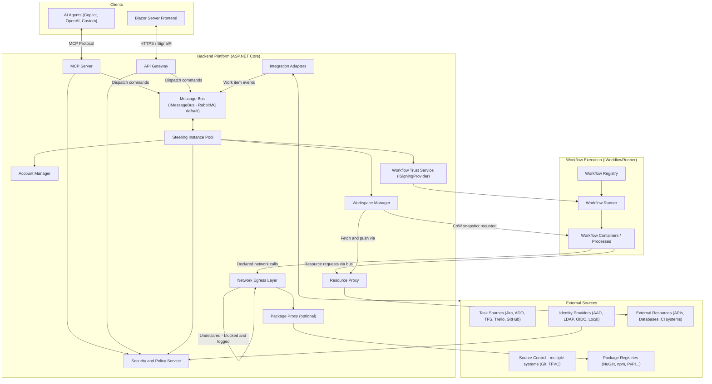

---

## 4. Key Components

### Frontend - Blazor Server
- Aggregated view of work items from all configured task sources
- Real-time workflow monitoring via SignalR
- Account bundle management and security policy configuration
- Workflow artifact configuration (where produced artifacts are routed)
- **Everything in the UI is also exposed via the MCP Server** - no hidden operations

### API Gateway - ASP.NET Core
- Single entry point for all external traffic (UI and MCP clients)
- Token validation delegated to the Security Service
- WebSocket / SignalR upgrade for real-time event streams

### Backend Service - Platform Host
- Hosts the API Gateway, the MCP Server, and the dashboard backend (SignalR fan-out via the Redis backplane)
- Hosts the **platform scheduler** for time-based workflow triggers
- Runs the **heartbeat monitor**: watches Steering Instance heartbeats in the ownership store, detects orphaned workflow instances, marks them Failed, and triggers cleanup and fresh re-dispatch per retry policy (see section 14.2)
- There is **no separate Orchestration Service**: earlier drafts showed one, but its responsibilities (work-item intake, pre-flight, dispatch, lifecycle management) belong to the Steering Instance — a standalone orchestrator would only forward decisions and add a failure mode without an isolation benefit

### Message Bus - IMessageBus
- **Default: RabbitMQ** (runs locally in Docker, zero-config)
- **Cloud swap: Azure Service Bus** (drop-in alternative via the same interface)
- All communication between Steering Instances and Workflow programs passes exclusively through here

### Steering Instance
- Bridges the message bus and the workflow runtime — and owns dispatch: consumes work-item events and dispatch commands (competing consumers), selects the appropriate workflow, runs the **pre-flight checks** (signature, required account bundles, resource availability, named artifact input resolution), and manages the full workflow instance lifecycle (see section 6)
- Delivers scoped credentials and resource endpoints **just-in-time per slot activation** — a workflow receives a slot's configuration (encrypted for that instance) only when it first needs the slot, never as an upfront bundle at startup
- Forwards AI assistance requests to the AI Integration Layer
- Streams live status to the frontend
- Notifies human / AI when a workflow is waiting for input due to resource unavailability

### Workspace Manager
- Manages **warm cache** entries for each repository — cloned once, kept current via background fetches via the Resource Proxy
- On workflow dispatch: checks repository access rights per repo per source system, then creates an **isolated CoW snapshot** per repository for that run
- Mounts all declared repository snapshots into the container under `/workspace/repos/<id>/` using Linux mount namespaces — the container sees only its own snapshots
- Mounts resolved artifact inputs read-only under `/workspace/artifacts/<input-name>/` and provides the declared artifact output location, persisted to the Artifact Store on run completion
- Supports **multiple repositories from different source systems** in a single workflow run (Git, TFVC, GitHub, ADO — each using the correct Account Bundle)
- Source-control writes (commits, pushes, PR creation) happen **mid-run, directly from the workflow** through its source-control slots with just-in-time scoped credentials. Post-exit output collection by the platform was rejected: it would duplicate traffic and block legitimate in-run operations such as reviewing git history. What a workflow may do is bounded by its **declared slot capabilities** (e.g. read-only vs. write) clamped by the **operator configuration** (e.g. allowed branch patterns, PR-only, no force-push). Enforcement is layered: the issued credential is scoped to the configured limits wherever the provider supports it (the hard backstop, valid even against a compromised process), and the slot handler enforces the same limits uniformly for all providers before executing an operation
- Enforces per-repo and per-tenant storage quotas
- Sensitive repositories can be marked `no-cache` in the workflow manifest — these are fetched fresh per run and deleted immediately after

### Artifact Store - IArtifactStore
- Persistent, pluggable store where named artifacts survive between runs — the producing run's CoW snapshot is destroyed at exit, so artifacts must be persisted by the platform
- **Production:** the workflow writes its declared artifacts to a dedicated output location in its workspace; on run completion the platform persists them into the store. What a workflow may produce is limited by its manifest declarations clamped by operator configuration
- **Consumption:** declared artifact inputs are resolved at dispatch time and mounted **read-only** into the container under `/workspace/artifacts/<input-name>/` — consumption is direct from the workflow's point of view, exactly like repository snapshots
- **References, not payloads, on the bus:** messages carry only artifact references (ID + content hash); payloads never travel through the message bus
- **Identity and lineage:** an artifact is identified by artifact type + producing workflow + work item + run + version. Versions of the same lineage are ordered, enabling "latest CodeReviewResult for work item X" resolution and trend comparison against prior versions (UC7)
- **Two concerns behind one interface:** the metadata index (lineage, versions, dispatch-time queries) and payload storage are separate concerns. Backends are pluggable per deployment: local filesystem (dev), Azure Blob / S3-compatible (cloud), or a database — a database backend can hold both payload and metadata for small structured artifacts, while blob backends pair with the platform database for metadata
- Retention periods and consumption access (which workflows/identities may read which artifact types) are operator configuration, enforced at dispatch-time resolution

### Platform Data Layer - Auxilia.UniversalDataAccess
- Durable storage for all platform state: workflow registry and schemas, slot configurations and account bundles (encrypted at rest), run lifecycle records, persisted view data, the artifact metadata index, and the audit log
- The Steering Instance's current in-memory stores (schema store, slot-configuration store, provider registry, seeded via the slot-configurations exchange) are an **interim dev simplification** — production platform state must survive restarts and be shared consistently across Steering Instance replicas
- Storage backend is pluggable behind the universal data access abstraction; Redis remains a separate concern (ephemeral ownership/heartbeat and SignalR backplane only, see section 14)

### Audit Log
- Immutable, append-only record of every action: human and AI operations, policy decisions (allow **and** deny), credential deliveries per slot activation, Resource Proxy calls, network traffic (allowed and blocked), and workflow lifecycle transitions including retries and failovers
- Written by platform components only — workflows can neither write nor read it directly
- Stored via the Platform Data Layer; retention period and read access are operator configuration
- Verifies every workflow artifact before execution - no unsigned execution path exists
- In dev mode signing can be disabled entirely; no dev CA ceremony required locally
- Three production implementations depending on deployment mode (see section 12)
- Private key never touches the application process - only hash-in / signature-out

### Workflow Runner - IWorkflowRunner
- Abstracts how workflows are launched
- Three implementations depending on deployment mode (see section 12)

### Workflow C# SDK - NuGet Package
- Reference SDK for authoring workflows in C#; other language SDKs follow the same message contract
- Workflows declare in their manifest: required bundle types, produced artifacts, named resource dependencies, accepted artifact inputs, repository references (single or multi, multi-source), baseline network endpoints (minimum required, `package-proxy` preference), and `no-cache` flags per repository
- The manifest does **not** declare `allow-all` — that is a run-time operator decision resolved by the Policy Resolver at dispatch
- WorkflowContext carries: the originating work item, resolved named artifact inputs, scoped credentials, and repository mount paths
- Workflows compile to a self-contained executable, then are signed and pushed to the registry

### AI Integration Layer
- Routes AIAssistanceRequest messages (published by workflows) to the configured model adapter
- Pluggable adapters: GitHub Copilot, Azure OpenAI, custom models
- AI bundles carry usage quotas and purpose restrictions; pre-flight verifies the required bundle is available before dispatch
- All AI decisions are written to the audit log with full context
- See **section 5** for the full AI integration design including the MCP interface, audit contract, and bundle scoping

### Resource Proxy
- Platform-managed gateway through which workflows access external APIs, databases, build systems, and scan tools
- Workflow declares named dependencies (e.g. "github-api", "customer-db", "ci-runner") at authoring time
- Workflows are **trusted by signature**: the signing authority is responsible for verifying that a workflow is correct and trustworthy before signing it. A verified workflow is therefore permitted to hold scoped credentials directly — the protection model is *who gets credentials and when*, not hiding credentials from the workflow process
- Credentials are delivered **just-in-time**: a workflow receives a slot's credentials only at the moment it activates that slot, encrypted for that specific workflow instance — never as a blanket grant at startup, and never for slots it does not use in that run
- Supports two call patterns: **synchronous** (request/response) and **async long-running** (submit job, receive handle, poll or await callback via message bus)
- All proxy calls are audited; rate limiting and access policy enforced per workflow identity

### Network Egress Layer
- Enforces the **effective network policy** for each run, resolved at dispatch time from manifest baseline + run configuration + platform policy ceiling
- Default mode: **default-deny** — only endpoints in the resolved allowlist are reachable; all other outbound traffic is blocked and logged
- Optional mode: **allow-all** — requested via run configuration or global tenant config; all traffic is still fully logged; platform policy can prohibit this mode entirely
- Build tools and package managers (`dotnet restore`, `npm install`, `pip install`, etc.) work transparently within allowed endpoints — no per-tool abstraction required
- All outbound traffic (allowed and blocked attempts) is written to the run audit log

### Package Proxy (optional)
- Platform-managed mirror of public package registries (NuGet, npm, PyPI, Cargo, Go modules, etc.)
- When enabled: the Network Egress Layer routes all package manager traffic through the proxy rather than directly to the public registry
- Provides: **caching** (packages fetched once, served locally on subsequent runs), **security scanning** (packages scanned before serving), and **air-gap support** (enterprise environments with no internet access)
- Can be configured per registry — e.g. route NuGet through the proxy but allow npm direct access
- Not required — workflows function without it as long as the registry endpoints are declared and reachable

### MCP Server
- Exposes every user-facing operation as an MCP tool
- AI agents authenticate with their own Account Bundle - subject to the same policy rules as humans
- Key tools: trigger_workflow, get_workflow_status, send_input, approve_step, cancel_workflow, list_work_items

### Integration Adapters
- **ITaskSourceAdapter** — read work items (full detail including linked items, history, attachments), update status, create work items, create sub-tasks, attach artifact references (`AttachArtifact`)
- **ISourceControlAdapter** — clone, diff, branch, commit, push, create PR; plus lightweight introspection: ListDirectory, GetFileContent, DetectFrameworks (no full clone required)

---

## 5. AI Integration Layer

AI agents are first-class citizens in Auxilia. They interact through the same interfaces as human users — via the MCP Server — and are subject to the same policy, audit, and identity rules.

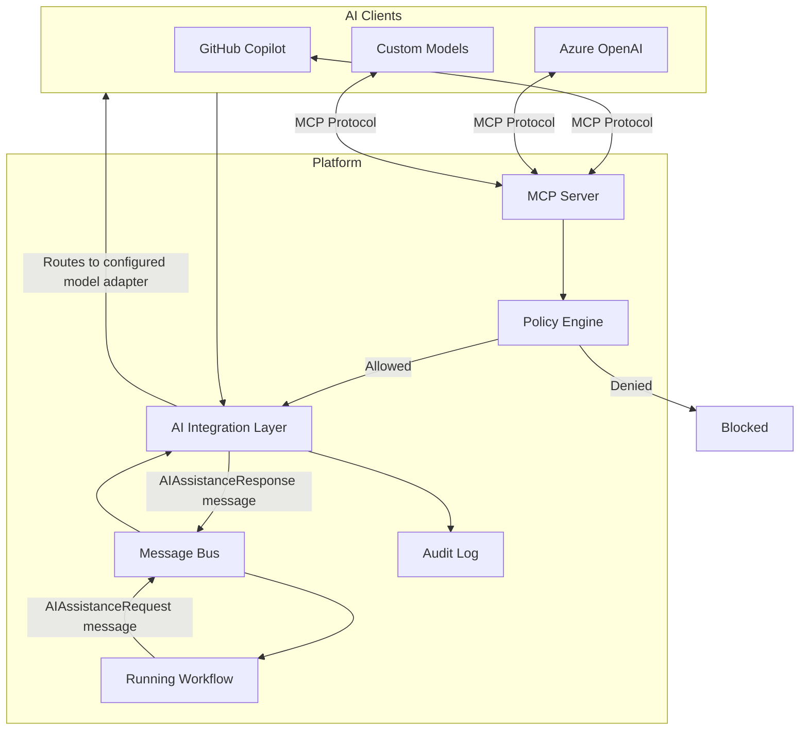

**Key properties:**
- AI agents authenticate with their own **Account Bundle** (AI bundle) — subject to the same policy checks as human users
- Workflows request AI assistance by publishing an `AIAssistanceRequest` message to the bus; they do not call the model directly
- The AI Integration Layer resolves the appropriate model adapter from the AI bundle, makes the call, and returns the response via the bus
- Multiple AI bundles of different types can be configured (e.g. Azure OpenAI for code generation, a custom model for security analysis)
- AI bundles carry **usage quotas** and **purpose restrictions** — a bundle scoped to code review cannot be used for arbitrary queries
- Every AI decision is written to the **immutable audit log** with full context: the request, the model used, the response, and the workflow step that requested it
- Pre-flight check verifies the required AI bundle is present and within quota before a workflow is dispatched
- **MCP tools** give AI agents the same operations as the human UI: trigger workflow, get status, send input, approve step, cancel, list work items — no hidden operations

---

## 6. Workflow Lifecycle

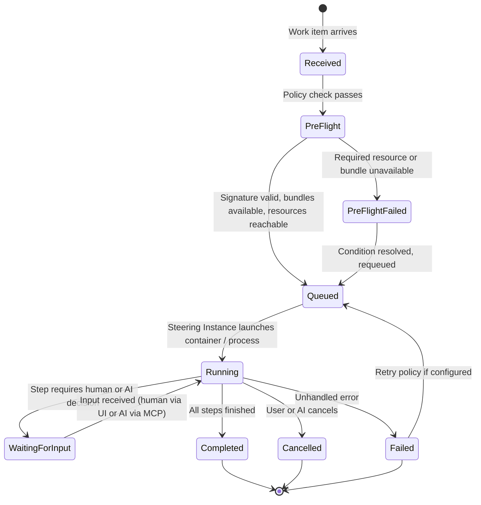

**Key lifecycle properties:**
- Workflows are **stateful and long-running** - once started they run until Completed, Failed, or explicitly Cancelled
- A **pre-flight check** runs before any workflow is dispatched, verifying that signature, required account bundles, resource proxies, and AI accounts are all available; it also fetches and verifies the signed `*.workflow.zip` package and pre-loads the workflow schema into the schema store
- If pre-flight fails the work item is held and the user/AI is notified; it can be requeued automatically when the condition resolves (configurable)
- **Schema pre-loading**: the `WorkflowAnnouncementHandler` reads `workflow-schema.json` from the extracted ZIP package and populates `WorkflowSchemaStore` before sending the `Run` directive — no `EmitSchema` round-trip is required
- **Workflow artifacts** are declared by the workflow and configured by the user - where they are stored and how they are linked back to the work item is a per-workflow configuration
- **Workflows are not resumable (v1)**: there is no checkpointing — a retry after `Failed`, and failover after an orphaned Steering Instance, always means *kill and restart from scratch*. Because a failed run may already have performed external writes, every external write a workflow performs must be **idempotent or guarded** (branch-exists check, find-or-create PR, deduplicated comments) — this is part of the workflow SDK contract
- **Failures and restarts are never silent**: every failure, retry, and orphan reassignment is published as a status event and shown in the dashboard (and via MCP), so the user always sees that a run was restarted and why

### Trigger model

A dispatch originates from one of four trigger sources; all of them converge on the same dispatch command queue consumed by the Steering Instance pool:

| Trigger | Source |
|---|---|
| **Work item event** | Integration Adapters detect work item changes (created, moved to a configured state) and publish dispatch commands |
| **Manual** | A human via the dashboard or an AI agent via the MCP `trigger_workflow` tool |
| **Schedule** | The platform scheduler (hosted in the Backend Service) for recurring runs, e.g. nightly security scans |
| **Artifact completion** | A finished run's persisted artifact triggers a configured follow-up workflow (e.g. CodeReviewResult → Selective Fixing) — workflow chaining without coupling the workflows to each other |

Which triggers are active for a workflow is operator configuration, subject to the Policy Engine.

### Workflow lifetime: one-shot vs. long-living

Workflows declare their **lifetime** in the manifest:

| Lifetime | Behaviour |
|---|---|
| **one-shot** (default) | Runs exactly once for a single trigger and always shuts down afterwards — minimises credential exposure and data retention |
| **long-living** | A service-style workflow that stays running and processes many work items / events over time (e.g. a standing review agent, a queue monitor) |

Long-living workflows keep every invariant of the platform, with these adaptations:

- **Credentials still arrive just-in-time per slot activation, but carry an expiry** — the SDK transparently re-requests a slot's configuration from the Steering Instance when it expires; long-lived processes never hold indefinitely valid secrets
- **Dirty-configuration handling**: when a stored configuration is changed or marked dirty, the Steering Instance signals the instance to **drain and shut down**; the replacement starts with the new configuration. Upgrade to a new workflow version works the same way (drain + replace)
- **Draining is a visible lifecycle state**: a draining instance finishes in-flight work but accepts no new triggers, and is shown as `Draining` in the dashboard until it exits
- **Still not resumable**: a crash or failover is a fresh restart that re-subscribes to its triggers; the idempotency obligations of section 6 apply unchanged
- **Operator opt-in**: because one-shot is the security default, deploying a long-living workflow requires explicit operator approval in the platform configuration

---

## 7. Security and Signing

```mermaid
graph TD
    subgraph Workflow Trust
        DEV["Developer submits *.workflow.zip"] --> SIGN_SVC["Trust Service signs ZIP package"]
        SIGN_SVC --> REG["Workflow Registry"]
        REG --> WR["Workflow Runner"]
        WR --> VERIFY["WorkflowPackageVerifier: RSA-PSS signature and manifest verified before execution"]
        VERIFY -->|Valid| LAUNCH["ZIP extracted; process launched from extracted content"]
        VERIFY -->|Invalid| REJECT["Execution rejected - always"]
        VERIFY -->|Dev mode - signing off| LAUNCH
    end
    subgraph Identity and Policy
        REQUEST["Any request - UI or MCP"] --> SEC["Security Service"]
        SEC --> IDP["Identity Provider (AAD / LDAP / OIDC / Local)"]
        IDP --> POLICY["Policy Engine"]
        POLICY -->|Allowed| DISPATCH["Dispatch (Steering Instance)"]
        POLICY -->|Denied| BLOCK["Blocked"]
    end
```

**Key principles:**
- Signing can be **fully disabled in dev mode** - there is no ceremony, no dev CA required locally
- In all non-dev modes signing is mandatory with no bypass; the signed artifact records what the workflow *is* — permissions and network policy are resolved at runtime, not locked into the artifact
- **The signature is the basis for credential delivery**: the signing authority is responsible for ensuring a workflow is correct and trustworthy. Only a signature-verified workflow may receive credentials, and it receives them just-in-time per slot activation — encrypted for the specific instance, scoped to the slot's declared capabilities, and never before the slot is actually needed
- **The registration handshake is authenticated**: channel encryption alone does not authenticate the requester. The platform injects a **one-time instance token** into the container/process at launch and pre-creates an **exclusive response queue** per instance; a registration or slot-activation request must present the token, and configurations are only ever delivered to that instance's queue. The current token-less handshake is an interim dev simplification (tracked as an implementation task)
- Workflows have **no arbitrary outbound network access** — effective network policy is resolved at dispatch from three layers (manifest baseline, run configuration, platform policy ceiling) and enforced at the kernel level; see section 10
- Structured API calls (task sources, source control, databases) go through the Resource Proxy; build toolchain calls (package restore, etc.) go through the Network Egress Layer
- Every action (human or AI) is written to an immutable audit log
- TFVC / TFS is explicitly supported as a source control target for enterprises that have not yet migrated

---

## 8. Resource Access Model

Workflows interact with external systems through two distinct channels depending on the nature of the call.

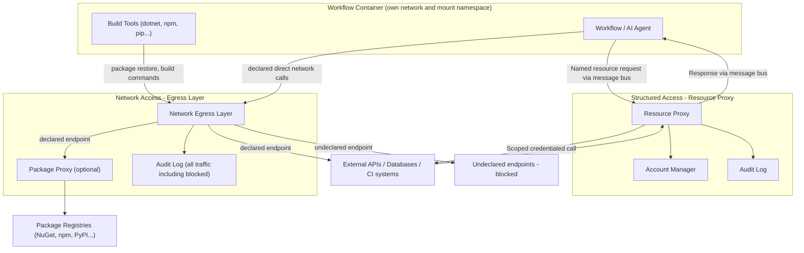

**Resource Proxy (structured calls):**
- Used for all calls where the platform mediates credentials: task sources, source control push, databases, CI triggers
- Workflow declares named dependencies in its manifest; at runtime the platform resolves the correct Account Bundle
- Supports synchronous and async long-running patterns (trigger + poll/callback via message bus)
- The workflow holds no credentials **prior to slot activation**. Because every workflow is signature-verified before launch, it is trusted to receive scoped credentials — but only just-in-time, per slot, encrypted for that workflow instance, and only for the slots it actually activates during the run

**Network Egress Layer (toolchain and direct calls):**
- Used for build tools, package managers, and any other direct network calls the workflow needs
- The manifest declares allowed endpoints and their purpose; enforcement is at the kernel network namespace level
- Build tools work transparently — `dotnet restore` hits the declared NuGet endpoint with no per-tool abstraction
- All traffic is logged; blocked attempts are flagged in the audit trail

**Network policy modes:**

| Mode | Behaviour | When to use |
|---|---|---|
| **default-deny** (default) | Only declared endpoints are reachable; all else blocked and logged | All production workflows |
| **allow-all** | All outbound traffic permitted; everything still logged | Requested via run configuration or global tenant config; platform policy can prohibit entirely |

---

## 9. Workspace Management

Workflows operate on local filesystem copies of repositories rather than streaming content through the message bus. The **Workspace Manager** manages this entirely on behalf of the workflow.

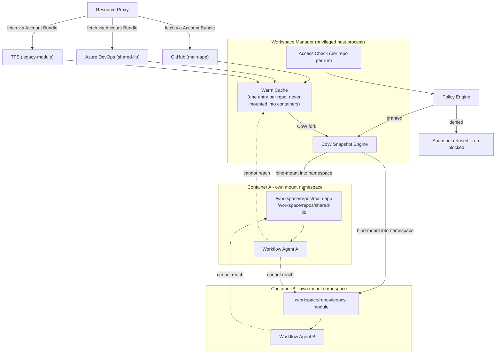

**Multi-source repository support:**
- A workflow manifest declares all required repositories with their source system and identifier
- Each repository is fetched and cached independently using the correct Account Bundle for its source
- All declared repos are mounted into the container under `/workspace/repos/<manifest-id>/`
- Access is checked independently per repository — a workflow only gets snapshots for repos it is authorised to access

**Isolation layers:**

| Layer | Mechanism |
|---|---|
| Run-to-run isolation | Each run gets its own CoW snapshot; writes do not affect other runs or the warm cache |
| Cross-run filesystem | Linux mount namespaces — a container can only see its own mounted snapshots |
| UID isolation | Each container runs as a distinct unprivileged UID; snapshot ownership prevents cross-run reads even if namespace fails |
| Warm cache protection | Cache directory is host-only, owned by the Workspace Manager, never bind-mounted into any container |
| Write-back control | Workflow pushes directly via its source-control slot mid-run; permitted operations are limited by the slot's declared capabilities (read/write) clamped by operator configuration (branch patterns, PR-only, no force-push) |

**Warm cache behaviour:**
- Cache entries are populated on first fetch and kept current by background `git fetch` / equivalent per source system
- A cache entry may only be used to create a snapshot if the requesting identity independently passes an access check for that repository
- Repositories marked `no-cache` in the manifest are fetched fresh per run and deleted immediately after — for high-sensitivity codebases
- Per-tenant cache storage is physically separate in multi-tenant deployments, encrypted at rest using tenant-specific keys

---

## 10. Network Isolation Model

The container network model separates three categories of outbound communication and handles each appropriately.

### Policy resolution

The effective network policy for a run is resolved from three independent layers at dispatch time — the signing record is not involved:

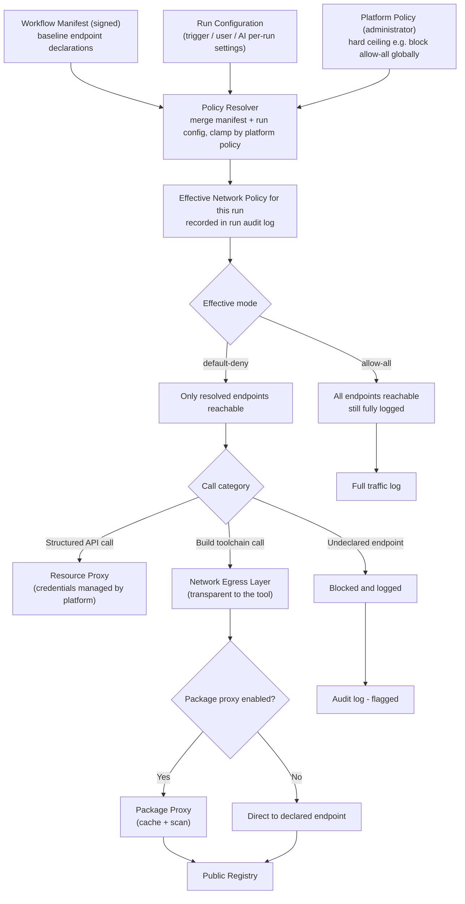

**Layer responsibilities:**

| Layer | Set by | Scope | Examples |
|---|---|---|---|
| **Workflow manifest** | Workflow author (signed) | Per workflow artifact | Minimum required endpoints, `no-cache` repo flags, `package-proxy` preference |
| **Run configuration** | Trigger, user, or AI at dispatch | Per run | Additional allowed endpoints for this invocation, `allow-all` for a sandbox run |
| **Platform policy** | Administrator | Global or per-tenant | Maximum permitted mode (e.g. deny `allow-all` entirely), mandatory endpoint blocklists |

The effective policy is `merge(manifest_baseline, run_config)` clamped by `platform_policy`. It is computed at dispatch and written to the run audit log — not stored in the signed artifact.

**Manifest declaration (baseline, signed with the workflow):**
```yaml
network:
  allow:
    - endpoint: api.nuget.org
      purpose: NuGet package restore
    - endpoint: registry.npmjs.org
      purpose: npm install
  package-proxy: true
```

**Run configuration (per-run, set at trigger time, not signed):**
```yaml
network:
  mode: allow-all           # operator opt-in for this run only
  allow:
    - endpoint: internal-api.corp.local
      purpose: integration test target
```

**allow-all mode:**
- Requested in the run configuration (per-run) or in platform configuration (global default for a tenant)
- Not part of the signed workflow artifact — the same binary can run in `default-deny` in production and `allow-all` in a sandbox without re-signing
- All traffic is still fully logged — the difference from `default-deny` is that nothing is blocked, not that nothing is observed
- Platform policy is the hard ceiling: administrators can prohibit `allow-all` entirely, regardless of what any run configuration requests
- The effective mode and the identity that requested it are always recorded in the run audit log

---

## 11. Multi-Account Model

A user or service principal holds multiple **Account Bundles**, each scoped to a purpose.

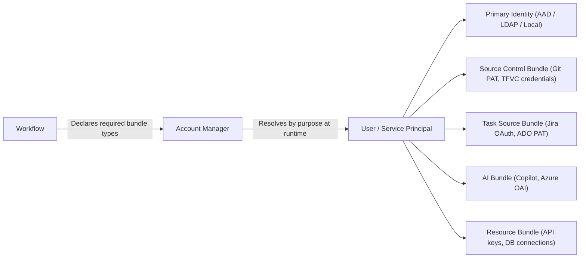

- Workflows declare *which bundle types* they need - never specific credentials
- Bundles are encrypted at rest; the Steering Instance decrypts and re-encrypts the relevant scoped subset for a specific workflow instance only at slot activation time — never earlier, and never more than the activated slot requires
- AI bundles carry usage quotas and purpose restrictions
- Multiple bundles of the same type are supported (e.g. two ADO instances, a GitHub and a Jira account)

---

## 12. Deployment Modes

All modes share the same codebase. Runtime behaviour is driven entirely by configuration and pluggable interface implementations.

| Mode | Message Bus | Workflow Runtime | Signing | Identity |
|---|---|---|---|---|
| **Local / Dev** | RabbitMQ in Docker or in-process | OS Process (fully debuggable) — signed `*.workflow.zip` extracted and bind-mounted | Disabled (no ceremony) | Local accounts |
| **On-premise** | RabbitMQ cluster | Docker / k3s — signed `*.workflow.zip` extracted and bind-mounted | HashiCorp Vault Transit | LDAP / AD / OIDC |
| **Cloud (Azure)** | Azure Service Bus | AKS — signed `*.workflow.zip` extracted and bind-mounted | Azure Key Vault | Entra ID |

Pluggable interfaces: **IMessageBus**, **IWorkflowRunner**, **ISigningProvider**, **IIdentityProvider**, **IResourceProxy**, **IArtifactStore**
The core platform has no hard dependency on RabbitMQ, Docker, Vault, AAD, or a specific artifact storage backend.

**Isolation guarantees are container-only.** The workspace isolation (mount namespaces, UID isolation, CoW snapshots — section 9) and kernel-level network policy enforcement (section 10) exist only in the container runtimes (Docker / k3s / AKS). In **Local / Dev** mode the workflow runs as a plain OS process — typically on the developer's own machine, including Windows — with **no isolation and no network enforcement**. Dev mode is therefore **trusted-operator-only**: it must never be exposed to untrusted workflows, untrusted users, or production credentials. The security guarantees this document describes apply to the container-based modes.

---

## 13. Open Questions and Concerns

### Resolved from use case analysis (USE-CASES.md)

| # | Decision |
|---|---|
| 1 | WorkflowContext carries: originating work item, named artifact inputs from prior runs, scoped credentials, and optional multi-repo references |
| 2 | ITaskSourceAdapter extended with GetWorkItemDetail (full graph), CreateWorkItem, CreateSubTask, and AttachArtifact |
| 3 | ISourceControlAdapter extended with ListDirectory, GetFileContent, DetectFrameworks for lightweight introspection |
| 4 | Resource Proxy supports both synchronous and async long-running call patterns (trigger + poll/callback) |
| 5 | WorkflowContext supports single or multi-repository references declared in the workflow manifest |
| 6 | Workspace Manager added: warm cache per repo, CoW snapshots per run, mount namespace isolation, multi-source repo support, no-cache flag; write-back happens mid-run via capability-limited source-control slots |
| 7 | Network Egress Layer added: layered policy resolution (manifest baseline + run config + platform ceiling), default-deny, allow-all opt-in, build tool transparency, full audit |
| 8 | Package Proxy added: optional platform mirror for package registries, caching, security scanning, air-gap support |

### Still open

| # | Question | Impact |
|---|---|---|
| 7 | **Pre-flight retry granularity** - Is retry-on-availability configured globally, per workflow type, or per work item? | UX, reliability |
| 8 | **TFVC version scope** - TFS 2015/2017 in scope or only TFS 2019+ / Azure DevOps Server? | Adapter effort |
| 9 | **Work Item Index (deferred)** - Optional similarity search service for refinement quality. Not required for v1. | Future use case quality |
| 10 | **Governance & RBAC model** — concrete account/role model (administrators, operators, users, AI principals), permission scheme unifying the Policy Engine, and dashboard/configuration administration. This is the declared **next implementation phase**: the platform foundation (governance, permissions, dashboard, accounts) is built before further use-case workflows. | Security, platform foundation |

### Intentional design decisions

| # | Decision |
|---|---|
| 10 | **Network policy is layered, not signing-time** — the manifest declares a baseline (minimum required endpoints); run configuration can extend it (e.g. `allow-all` for a sandbox run); platform policy is the hard ceiling (can prohibit `allow-all` entirely). Effective policy is resolved at dispatch and recorded in the run audit log — the signed artifact is unchanged |
| 11 | **AI has full parity with the human UI** - MCP tools are generated from the same API layer, not maintained separately |
| 12 | **Signing is mandatory with no bypass in non-dev modes** - dev mode can disable signing entirely |
| 13 | IMessageBus, IWorkflowRunner, ISigningProvider, IIdentityProvider, and IResourceProxy are all pluggable - no hard dependency on any specific technology |
| 14 | **Workflows are trusted via signature, credentials are delivered just-in-time** — the signing authority vouches for the workflow's correctness; a verified workflow may hold scoped credentials directly, but receives each slot's credentials only at slot activation, encrypted per instance, never as an upfront bundle |
| 15 | **Artifact persistence via pluggable `IArtifactStore`** — production is direct but manifest/config-limited; consumption is resolved at dispatch and mounted read-only into the container; the bus carries references (ID + hash), never payloads; backends (filesystem, blob, database) are a deployment choice |
| 16 | **No separate Orchestration Service** — dispatch, pre-flight, and lifecycle management live in the Steering Instance; the Backend Service hosts the API Gateway, MCP Server, dashboard fan-out, platform scheduler, and the heartbeat monitor for Steering Instance failover |

---

## 14. Scaling

The frontend and the steering layer have different scaling characteristics and are solved independently.

---

### 14.1 Blazor Server Scaling

Blazor Server holds a live SignalR circuit per browser client, tied to a specific server instance. Two mechanisms work together to scale out:

- **Sticky sessions** at the load balancer - a client always returns to the same instance for the lifetime of its circuit
- **Redis SignalR backplane** - backend events are published to Redis which fans them out to all Blazor Server instances; each instance delivers only to circuits subscribed to that workflow

Blazor Server instances are stateless from a data perspective. Instances can be added or removed at any time.

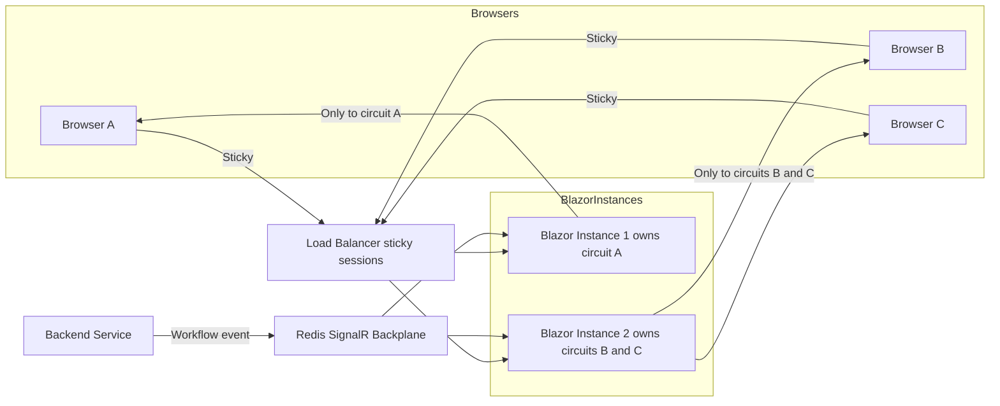

---

### 14.2 Steering Instance Scaling

Steering instances scale via **competing consumers** on the RabbitMQ command queue - adding instances increases dispatch throughput automatically.

Once a steering instance picks up a workflow it becomes the **owner** for its lifetime (it holds the container/process handle). Two concerns follow:

- **Ownership tracking** - Redis records which steering instance owns which workflow instance
- **Failover** - each steering instance emits a heartbeat; if it stops, the **Backend Service heartbeat monitor** detects the orphaned workflow instances, terminates them via `IWorkflowRunner`, and marks them Failed. Recovery is always a fresh restart from scratch (workflows are not resumable, see section 6) issued as a new dispatch command per retry policy; the failover event is surfaced in the dashboard so the user sees the run was restarted

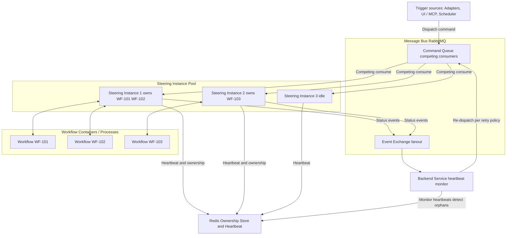

---

### 14.3 Full Scaled Event Flow

End-to-end path of a workflow status update from container to browser when fully scaled out:

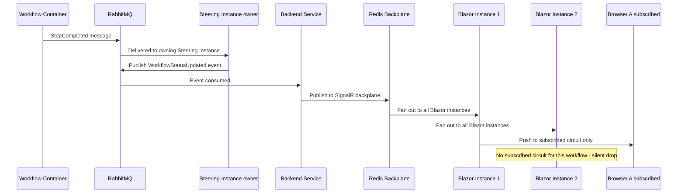

---

### 14.4 Infrastructure Summary per Mode

| Component | Local / Dev | On-premise | Cloud (Azure) |
|---|---|---|---|
| Blazor Server instances | 1 (no backplane needed) | N + sticky LB + Redis backplane | N + Azure Front Door + Azure Cache for Redis |
| Steering instances | 1 | Pool via competing consumers | Pool via competing consumers with auto-scale |
| Ownership and heartbeat store | Not needed | Redis | Azure Cache for Redis |
| Message bus | RabbitMQ single in Docker | RabbitMQ cluster | Azure Service Bus |
| Workflow runtime | OS Process | Docker / k3s | AKS node pool |

Redis serves a dual purpose in non-dev modes: **SignalR backplane** and **steering ownership store**. A single Redis instance or cluster covers both.

---

## 15. Live View Data and Pluggable Dashboards

Workflows expose data to the frontend through a single general mechanism: **named, schema-declared views**. A live agent conversation, a progress log, a findings table, and a finished run's result page are all the same concept — only the rendering hint and the data lifecycle differ.

### View declaration

The workflow schema (embedded in the signed package) declares the views a workflow provides:

```yaml
views:
  - name: agent-conversation
    schema: AgentMessage          # JSON schema of one data item
    rendering: stream             # hint: stream | log | table | chart | markdown | custom
    lifecycle: live+persisted     # live, persisted, or both
  - name: review-findings
    schema: CodeReviewFinding
    rendering: table
    lifecycle: persisted
```

### Data flow

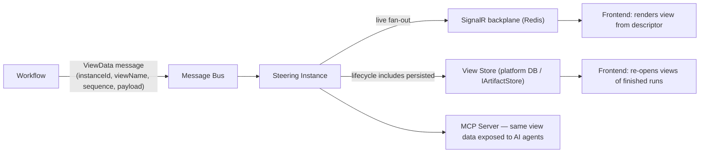

- Workflows publish `ViewData` messages: an envelope of `(instanceId, viewName, sequence, payload)` where the payload conforms to the declared view schema. The bus carries only view data items — large blobs belong in the Artifact Store, referenced from the payload
- **Live**: the Steering Instance fans view data out to subscribed frontend circuits via the existing SignalR backplane (section 14) — a live agent view is simply a view with `rendering: stream`
- **Persisted**: view data is stored so the dashboard can re-open the views of completed runs — viewing finished workflow results uses the identical rendering path as live data, replayed from the store
- **Generic rendering**: the frontend renders views purely from the descriptor (schema + rendering hint); adding a new workflow with new views requires **no frontend changes**. A `custom` rendering hint allows future pluggable visual components
- **AI parity**: the MCP server exposes the same views to AI agents — no hidden data channel

### Dashboard composition

Dashboards are composed of views: per-run dashboards come from the run's workflow schema automatically; operators can pin views from multiple workflows into shared dashboards. Access to a view follows the same permission model as the workflow it belongs to.

---

*Document maintained in ARCHITECTURE.md — update alongside major design decisions. See also USE-CASES.md.*