# Auxilia - Architecture Overview

> **Status:** Draft v0.5
> **Stack:** C# / ASP.NET Core / Blazor Server

---

## Table of Contents

1. System Overview
2. Core Concepts
3. High-Level Architecture
4. Key Components
5. AI Integration Layer
6. Workflow Lifecycle
7. Security and Signing
8. Resource Access Model
9. Workspace Management
10. Network Isolation Model
11. Multi-Account Model
12. Deployment Modes
13. Open Questions and Concerns
14. Scaling

---

## 1. System Overview

Auxilia is a **workflow-driven distributed system** where:

- **Work items** (from Jira, Azure DevOps, Trello, etc.) are the primary trigger for workflows.
- **Workflows** are stateful, signed programs that run to completion and communicate exclusively via the platform message bus.
- **AI agents** are first-class citizens - they can trigger, steer, observe, and complete workflows via the same interfaces as human users (MCP protocol).
- **Security is pluggable** - runs standalone out of the box, or integrates with corporate identity providers (AAD, LDAP, OIDC).

---

## 2. Core Concepts

| Concept | Description |
|---|---|
| **Work Item** | A unit of work from an external task source (Jira issue, ADO ticket, Trello card, etc.) |
| **Workflow** | A signed, stateful, isolated program that processes a work item through defined steps until completion or cancellation |
| **Steering Instance** | The backend mediator between the message bus, the frontend, and AI agents |
| **MCP Interface** | Model Context Protocol endpoint - gives AI agents full parity with the human UI |
| **Account Bundle** | A set of credentials grouped by purpose (e.g. user identity, AI service, source control) |
| **Resource Proxy** | A platform-managed, audited access point through which workflows reach external APIs and databases |
| **Trust Chain** | Signature chain ensuring a workflow is authorized to run in this environment |
| **Artifact Input** | A named artifact from a prior workflow run injected into a new WorkflowContext as input |
| **Workspace Manager** | Platform component that manages persistent per-repo warm caches and per-run isolated CoW snapshots |
| **Network Policy** | Per-workflow declarative allowlist of permitted outbound endpoints, enforced at the kernel network namespace level |
| **Package Proxy** | Optional platform-managed mirror of public package registries (NuGet, npm, PyPI, etc.) providing caching and security scanning |
| **Work Item Index** | Optional background-indexed store of historical work items enabling similarity search (deferred) |

---

## 3. High-Level Architecture

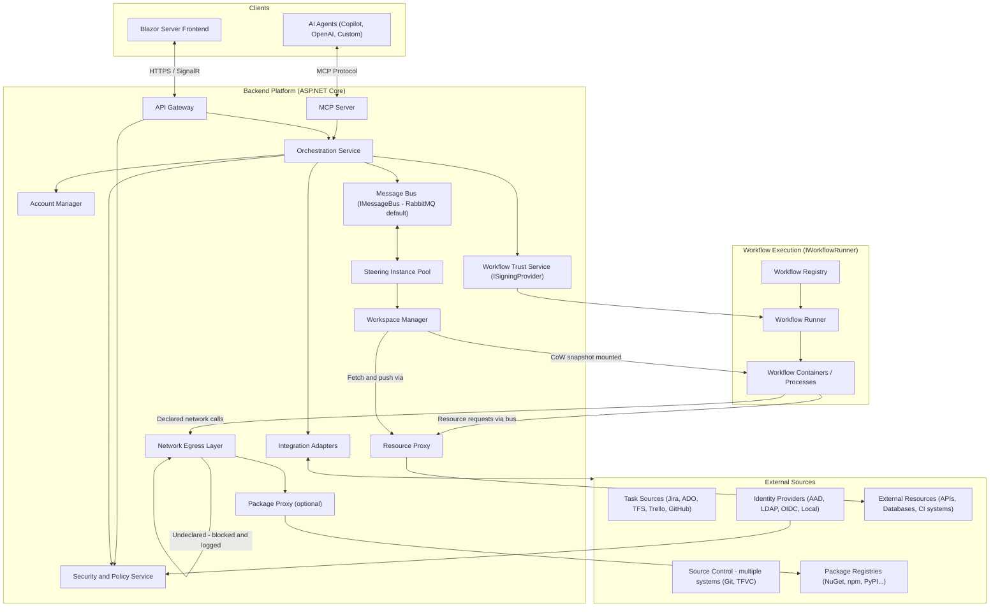

---

## 4. Key Components

### Frontend - Blazor Server
- Aggregated view of work items from all configured task sources
- Real-time workflow monitoring via SignalR
- Account bundle management and security policy configuration
- Workflow artifact configuration (where produced artifacts are routed)
- **Everything in the UI is also exposed via the MCP Server** - no hidden operations

### API Gateway - ASP.NET Core
- Single entry point for all external traffic (UI and MCP clients)
- Token validation delegated to the Security Service
- WebSocket / SignalR upgrade for real-time event streams

### Orchestration Service
- Receives work items from adapters and selects the appropriate workflow
- Pre-flight checks before dispatch: verifies signature, required account bundles, resource proxy availability, and resolves named artifact inputs
- Manages the full workflow instance lifecycle (see section 6)
- Publishes commands and consumes status updates via IMessageBus

### Message Bus - IMessageBus
- **Default: RabbitMQ** (runs locally in Docker, zero-config)
- **Cloud swap: Azure Service Bus** (drop-in alternative via the same interface)
- All communication between Steering Instances and Workflow programs passes exclusively through here

### Steering Instance
- Bridges the message bus and the workflow runtime
- Injects scoped credentials and resource proxy endpoints at workflow startup
- Forwards AI assistance requests to the AI Integration Layer
- Streams live status to the frontend
- Notifies human / AI when a workflow is waiting for input due to resource unavailability

### Workspace Manager
- Manages **warm cache** entries for each repository — cloned once, kept current via background fetches via the Resource Proxy
- On workflow dispatch: checks repository access rights per repo per source system, then creates an **isolated CoW snapshot** per repository for that run
- Mounts all declared repository snapshots into the container under `/workspace/repos/<id>/` using Linux mount namespaces — the container sees only its own snapshots
- Supports **multiple repositories from different source systems** in a single workflow run (Git, TFVC, GitHub, ADO — each using the correct Account Bundle)
- After container exit: collects outputs (commits, generated files) and pushes them back via the Resource Proxy using scoped credentials — the container never pushes directly
- Enforces per-repo and per-tenant storage quotas
- Sensitive repositories can be marked `no-cache` in the workflow manifest — these are fetched fresh per run and deleted immediately after

### Workflow Trust Service - ISigningProvider
- Verifies every workflow artifact before execution - no unsigned execution path exists
- In dev mode signing can be disabled entirely; no dev CA ceremony required locally
- Three production implementations depending on deployment mode (see section 12)
- Private key never touches the application process - only hash-in / signature-out

### Workflow Runner - IWorkflowRunner
- Abstracts how workflows are launched
- Three implementations depending on deployment mode (see section 12)

### Workflow C# SDK - NuGet Package
- Reference SDK for authoring workflows in C#; other language SDKs follow the same message contract
- Workflows declare in their manifest: required bundle types, produced artifacts, named resource dependencies, accepted artifact inputs, repository references (single or multi, multi-source), baseline network endpoints (minimum required, `package-proxy` preference), and `no-cache` flags per repository
- The manifest does **not** declare `allow-all` — that is a run-time operator decision resolved by the Policy Resolver at dispatch
- WorkflowContext carries: the originating work item, resolved named artifact inputs, scoped credentials, and repository mount paths
- Workflows compile to a self-contained executable, then are signed and pushed to the registry

### AI Integration Layer
- Routes AIAssistanceRequest messages (published by workflows) to the configured model adapter
- Pluggable adapters: GitHub Copilot, Azure OpenAI, custom models
- AI bundles carry usage quotas and purpose restrictions; pre-flight verifies the required bundle is available before dispatch
- All AI decisions are written to the audit log with full context
- See **section 5** for the full AI integration design including the MCP interface, audit contract, and bundle scoping

### Resource Proxy
- Platform-managed gateway through which workflows access external APIs, databases, build systems, and scan tools
- Workflow declares named dependencies (e.g. "github-api", "customer-db", "ci-runner") at authoring time
- At runtime the Steering Instance resolves, scopes, and injects proxy endpoints - the workflow never holds raw credentials
- Supports two call patterns: **synchronous** (request/response) and **async long-running** (submit job, receive handle, poll or await callback via message bus)
- All proxy calls are audited; rate limiting and access policy enforced per workflow identity

### Network Egress Layer
- Enforces the **effective network policy** for each run, resolved at dispatch time from manifest baseline + run configuration + platform policy ceiling
- Default mode: **default-deny** — only endpoints in the resolved allowlist are reachable; all other outbound traffic is blocked and logged
- Optional mode: **allow-all** — requested via run configuration or global tenant config; all traffic is still fully logged; platform policy can prohibit this mode entirely
- Build tools and package managers (`dotnet restore`, `npm install`, `pip install`, etc.) work transparently within allowed endpoints — no per-tool abstraction required
- All outbound traffic (allowed and blocked attempts) is written to the run audit log

### Package Proxy (optional)
- Platform-managed mirror of public package registries (NuGet, npm, PyPI, Cargo, Go modules, etc.)
- When enabled: the Network Egress Layer routes all package manager traffic through the proxy rather than directly to the public registry
- Provides: **caching** (packages fetched once, served locally on subsequent runs), **security scanning** (packages scanned before serving), and **air-gap support** (enterprise environments with no internet access)
- Can be configured per registry — e.g. route NuGet through the proxy but allow npm direct access
- Not required — workflows function without it as long as the registry endpoints are declared and reachable

### MCP Server
- Exposes every user-facing operation as an MCP tool
- AI agents authenticate with their own Account Bundle - subject to the same policy rules as humans
- Key tools: trigger_workflow, get_workflow_status, send_input, approve_step, cancel_workflow, list_work_items

### Integration Adapters
- **ITaskSourceAdapter** — read work items (full detail including linked items, history, attachments), update status, create work items, create sub-tasks, attach artifact references (`AttachArtifact`)
- **ISourceControlAdapter** — clone, diff, branch, commit, push, create PR; plus lightweight introspection: ListDirectory, GetFileContent, DetectFrameworks (no full clone required)

---

## 5. AI Integration Layer

AI agents are first-class citizens in Auxilia. They interact through the same interfaces as human users — via the MCP Server — and are subject to the same policy, audit, and identity rules.

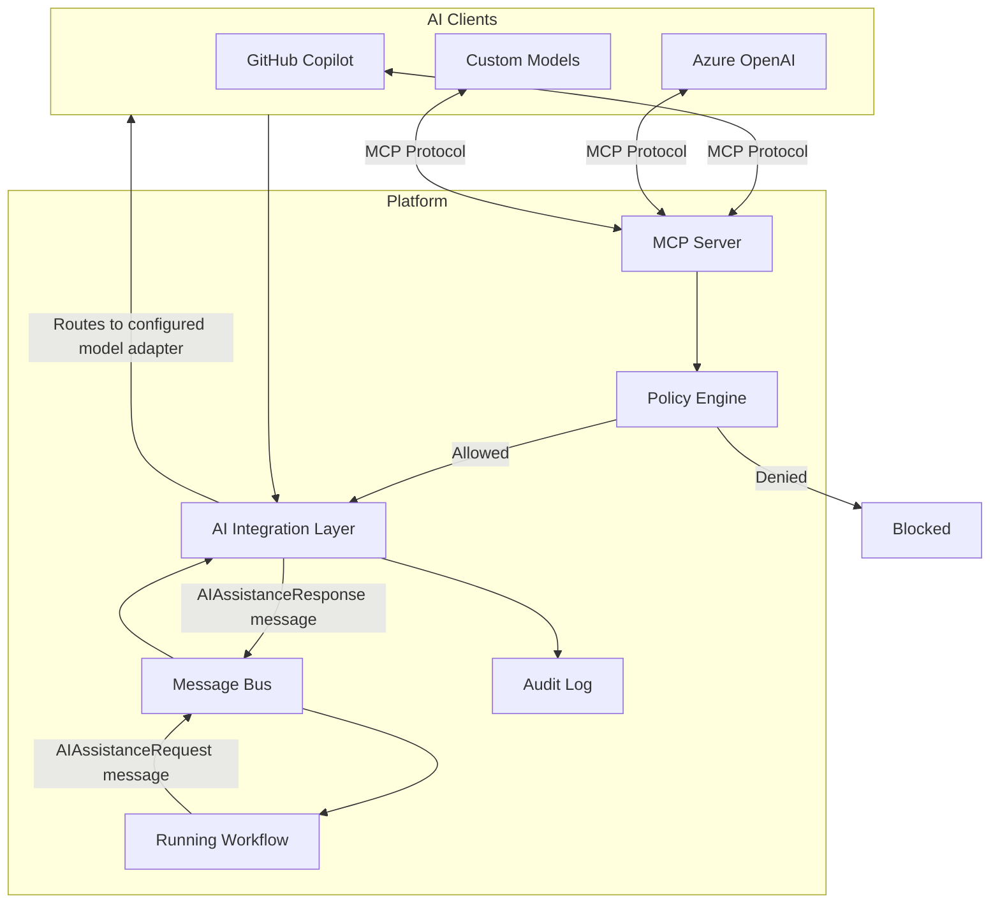

**Key properties:**
- AI agents authenticate with their own **Account Bundle** (AI bundle) — subject to the same policy checks as human users
- Workflows request AI assistance by publishing an `AIAssistanceRequest` message to the bus; they do not call the model directly
- The AI Integration Layer resolves the appropriate model adapter from the AI bundle, makes the call, and returns the response via the bus
- Multiple AI bundles of different types can be configured (e.g. Azure OpenAI for code generation, a custom model for security analysis)
- AI bundles carry **usage quotas** and **purpose restrictions** — a bundle scoped to code review cannot be used for arbitrary queries
- Every AI decision is written to the **immutable audit log** with full context: the request, the model used, the response, and the workflow step that requested it
- Pre-flight check verifies the required AI bundle is present and within quota before a workflow is dispatched
- **MCP tools** give AI agents the same operations as the human UI: trigger workflow, get status, send input, approve step, cancel, list work items — no hidden operations

---

## 6. Workflow Lifecycle

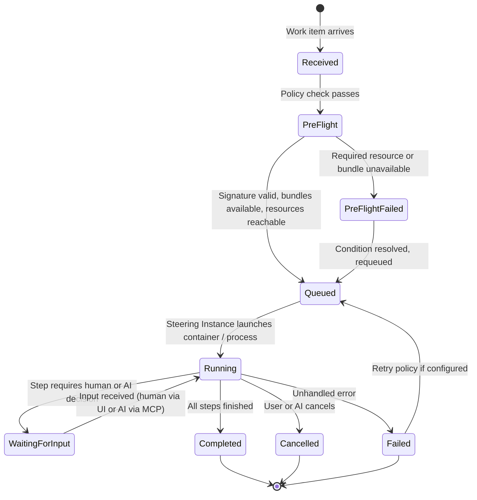

**Key lifecycle properties:**
- Workflows are **stateful and long-running** - once started they run until Completed, Failed, or explicitly Cancelled
- A **pre-flight check** runs before any workflow is dispatched, verifying that signature, required account bundles, resource proxies, and AI accounts are all available; it also fetches and verifies the signed `*.workflow.zip` package and pre-loads the workflow schema into the schema store
- If pre-flight fails the work item is held and the user/AI is notified; it can be requeued automatically when the condition resolves (configurable)
- **Schema pre-loading**: the `WorkflowAnnouncementHandler` reads `workflow-schema.json` from the extracted ZIP package and populates `WorkflowSchemaStore` before sending the `Run` directive — no `EmitSchema` round-trip is required
- **Workflow artifacts** are declared by the workflow and configured by the user - where they are stored and how they are linked back to the work item is a per-workflow configuration

---

## 7. Security and Signing

```mermaid
graph TD
    subgraph Workflow Trust
        DEV["Developer submits *.workflow.zip"] --> SIGN_SVC["Trust Service signs ZIP package"]
        SIGN_SVC --> REG["Workflow Registry"]
        REG --> WR["Workflow Runner"]
        WR --> VERIFY["WorkflowPackageVerifier: RSA-PSS signature and manifest verified before execution"]
        VERIFY -->|Valid| LAUNCH["ZIP extracted; process launched from extracted content"]
        VERIFY -->|Invalid| REJECT["Execution rejected - always"]
        VERIFY -->|Dev mode - signing off| LAUNCH
    end
    subgraph Identity and Policy
        REQUEST["Any request - UI or MCP"] --> SEC["Security Service"]
        SEC --> IDP["Identity Provider (AAD / LDAP / OIDC / Local)"]
        IDP --> POLICY["Policy Engine"]
        POLICY -->|Allowed| ORCH["Orchestration"]
        POLICY -->|Denied| BLOCK["Blocked"]
    end
```

**Key principles:**
- Signing can be **fully disabled in dev mode** - there is no ceremony, no dev CA required locally
- In all non-dev modes signing is mandatory with no bypass; the signed artifact records what the workflow *is* — permissions and network policy are resolved at runtime, not locked into the artifact
- Workflows have **no arbitrary outbound network access** — effective network policy is resolved at dispatch from three layers (manifest baseline, run configuration, platform policy ceiling) and enforced at the kernel level; see section 10
- Structured API calls (task sources, source control, databases) go through the Resource Proxy; build toolchain calls (package restore, etc.) go through the Network Egress Layer
- Every action (human or AI) is written to an immutable audit log
- TFVC / TFS is explicitly supported as a source control target for enterprises that have not yet migrated

---

## 8. Resource Access Model

Workflows interact with external systems through two distinct channels depending on the nature of the call.

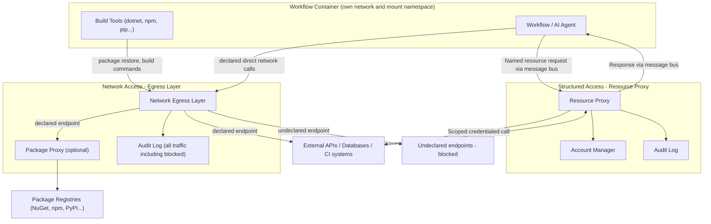

**Resource Proxy (structured calls):**
- Used for all calls where the platform mediates credentials: task sources, source control push, databases, CI triggers
- Workflow declares named dependencies in its manifest; at runtime the platform resolves the correct Account Bundle
- Supports synchronous and async long-running patterns (trigger + poll/callback via message bus)
- The workflow never holds raw credentials — it sends a request message and receives a response

**Network Egress Layer (toolchain and direct calls):**
- Used for build tools, package managers, and any other direct network calls the workflow needs
- The manifest declares allowed endpoints and their purpose; enforcement is at the kernel network namespace level
- Build tools work transparently — `dotnet restore` hits the declared NuGet endpoint with no per-tool abstraction
- All traffic is logged; blocked attempts are flagged in the audit trail

**Network policy modes:**

| Mode | Behaviour | When to use |
|---|---|---|
| **default-deny** (default) | Only declared endpoints are reachable; all else blocked and logged | All production workflows |
| **allow-all** | All outbound traffic permitted; everything still logged | Requested via run configuration or global tenant config; platform policy can prohibit entirely |

---

## 9. Workspace Management

Workflows operate on local filesystem copies of repositories rather than streaming content through the message bus. The **Workspace Manager** manages this entirely on behalf of the workflow.

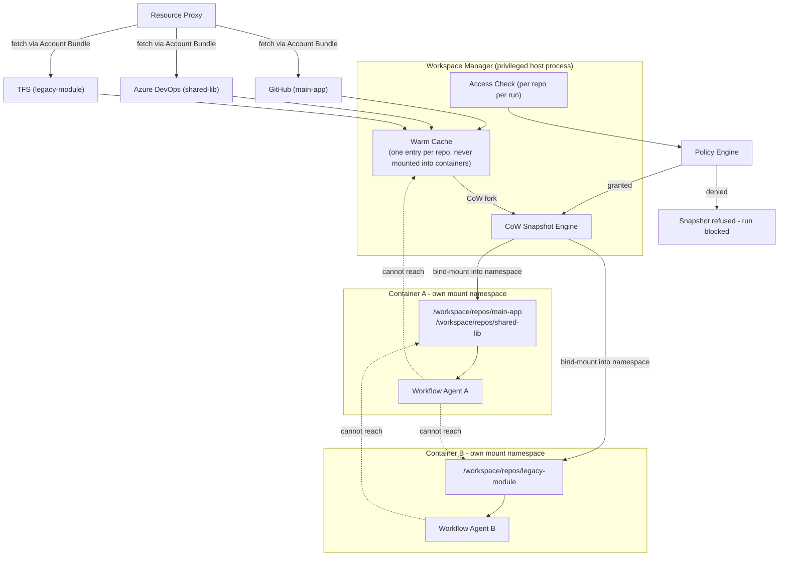

**Multi-source repository support:**
- A workflow manifest declares all required repositories with their source system and identifier
- Each repository is fetched and cached independently using the correct Account Bundle for its source
- All declared repos are mounted into the container under `/workspace/repos/<manifest-id>/`
- Access is checked independently per repository — a workflow only gets snapshots for repos it is authorised to access

**Isolation layers:**

| Layer | Mechanism |
|---|---|
| Run-to-run isolation | Each run gets its own CoW snapshot; writes do not affect other runs or the warm cache |
| Cross-run filesystem | Linux mount namespaces — a container can only see its own mounted snapshots |
| UID isolation | Each container runs as a distinct unprivileged UID; snapshot ownership prevents cross-run reads even if namespace fails |
| Warm cache protection | Cache directory is host-only, owned by the Workspace Manager, never bind-mounted into any container |
| Output collection | Container writes locally; Workspace Manager collects and pushes outputs after exit via Resource Proxy using scoped credentials |

**Warm cache behaviour:**
- Cache entries are populated on first fetch and kept current by background `git fetch` / equivalent per source system
- A cache entry may only be used to create a snapshot if the requesting identity independently passes an access check for that repository
- Repositories marked `no-cache` in the manifest are fetched fresh per run and deleted immediately after — for high-sensitivity codebases
- Per-tenant cache storage is physically separate in multi-tenant deployments, encrypted at rest using tenant-specific keys

---

## 10. Network Isolation Model

The container network model separates three categories of outbound communication and handles each appropriately.

### Policy resolution

The effective network policy for a run is resolved from three independent layers at dispatch time — the signing record is not involved:

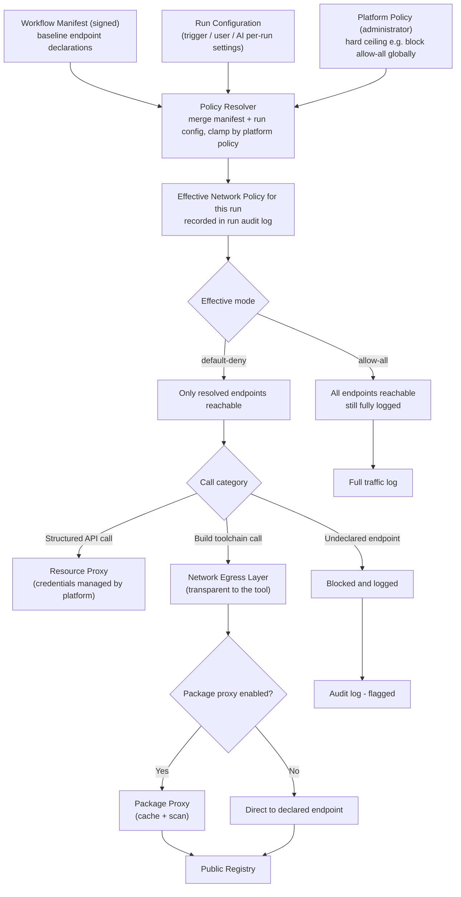

**Layer responsibilities:**

| Layer | Set by | Scope | Examples |
|---|---|---|---|
| **Workflow manifest** | Workflow author (signed) | Per workflow artifact | Minimum required endpoints, `no-cache` repo flags, `package-proxy` preference |
| **Run configuration** | Trigger, user, or AI at dispatch | Per run | Additional allowed endpoints for this invocation, `allow-all` for a sandbox run |
| **Platform policy** | Administrator | Global or per-tenant | Maximum permitted mode (e.g. deny `allow-all` entirely), mandatory endpoint blocklists |

The effective policy is `merge(manifest_baseline, run_config)` clamped by `platform_policy`. It is computed at dispatch and written to the run audit log — not stored in the signed artifact.

**Manifest declaration (baseline, signed with the workflow):**
```yaml
network:
  allow:
    - endpoint: api.nuget.org
      purpose: NuGet package restore
    - endpoint: registry.npmjs.org
      purpose: npm install
  package-proxy: true
```

**Run configuration (per-run, set at trigger time, not signed):**
```yaml
network:
  mode: allow-all           # operator opt-in for this run only
  allow:
    - endpoint: internal-api.corp.local
      purpose: integration test target
```

**allow-all mode:**
- Requested in the run configuration (per-run) or in platform configuration (global default for a tenant)
- Not part of the signed workflow artifact — the same binary can run in `default-deny` in production and `allow-all` in a sandbox without re-signing
- All traffic is still fully logged — the difference from `default-deny` is that nothing is blocked, not that nothing is observed
- Platform policy is the hard ceiling: administrators can prohibit `allow-all` entirely, regardless of what any run configuration requests
- The effective mode and the identity that requested it are always recorded in the run audit log

---

## 11. Multi-Account Model

A user or service principal holds multiple **Account Bundles**, each scoped to a purpose.

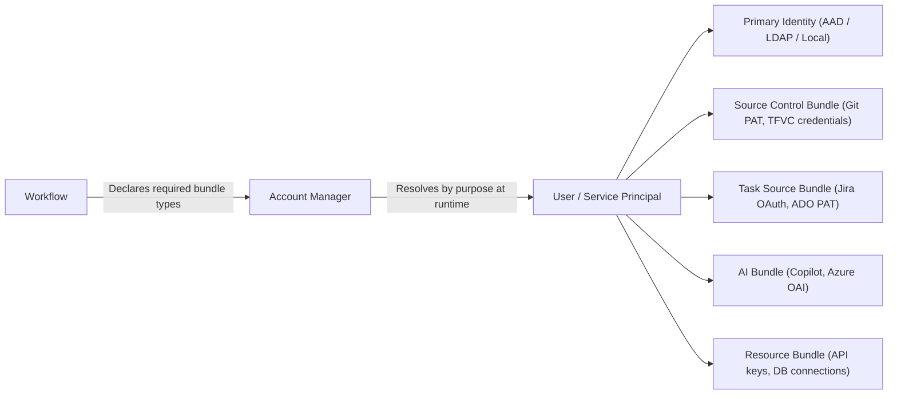

- Workflows declare *which bundle types* they need - never specific credentials
- Bundles are encrypted at rest, decrypted only when injected into a workflow run via the Resource Proxy or Steering Instance
- AI bundles carry usage quotas and purpose restrictions
- Multiple bundles of the same type are supported (e.g. two ADO instances, a GitHub and a Jira account)

---

## 12. Deployment Modes

All modes share the same codebase. Runtime behaviour is driven entirely by configuration and pluggable interface implementations.

| Mode | Message Bus | Workflow Runtime | Signing | Identity |
|---|---|---|---|---|
| **Local / Dev** | RabbitMQ in Docker or in-process | OS Process (fully debuggable) — signed `*.workflow.zip` extracted and bind-mounted | Disabled (no ceremony) | Local accounts |
| **On-premise** | RabbitMQ cluster | Docker / k3s — signed `*.workflow.zip` extracted and bind-mounted | HashiCorp Vault Transit | LDAP / AD / OIDC |
| **Cloud (Azure)** | Azure Service Bus | AKS — signed `*.workflow.zip` extracted and bind-mounted | Azure Key Vault | Entra ID |

Pluggable interfaces: **IMessageBus**, **IWorkflowRunner**, **ISigningProvider**, **IIdentityProvider**, **IResourceProxy**
The core platform has no hard dependency on RabbitMQ, Docker, Vault, or AAD.

---

## 13. Open Questions and Concerns

### Resolved from use case analysis (USE-CASES.md)

| # | Decision |
|---|---|
| 1 | WorkflowContext carries: originating work item, named artifact inputs from prior runs, scoped credentials, and optional multi-repo references |
| 2 | ITaskSourceAdapter extended with GetWorkItemDetail (full graph), CreateWorkItem, CreateSubTask, and AttachArtifact |
| 3 | ISourceControlAdapter extended with ListDirectory, GetFileContent, DetectFrameworks for lightweight introspection |
| 4 | Resource Proxy supports both synchronous and async long-running call patterns (trigger + poll/callback) |
| 5 | WorkflowContext supports single or multi-repository references declared in the workflow manifest |
| 6 | Workspace Manager added: warm cache per repo, CoW snapshots per run, mount namespace isolation, multi-source repo support, no-cache flag, output collection via Resource Proxy |
| 7 | Network Egress Layer added: layered policy resolution (manifest baseline + run config + platform ceiling), default-deny, allow-all opt-in, build tool transparency, full audit |
| 8 | Package Proxy added: optional platform mirror for package registries, caching, security scanning, air-gap support |

### Still open

| # | Question | Impact |
|---|---|---|
| 6 | **Artifact storage backend** - Where are workflow artifacts physically stored? Blob storage (Azure Blob, S3-compatible, local filesystem), configurable per deployment mode. | Workflow contract, ops |
| 7 | **Pre-flight retry granularity** - Is retry-on-availability configured globally, per workflow type, or per work item? | UX, reliability |
| 8 | **TFVC version scope** - TFS 2015/2017 in scope or only TFS 2019+ / Azure DevOps Server? | Adapter effort |
| 9 | **Work Item Index (deferred)** - Optional similarity search service for refinement quality. Not required for v1. | Future use case quality |

### Intentional design decisions

| # | Decision |
|---|---|
| 10 | **Network policy is layered, not signing-time** — the manifest declares a baseline (minimum required endpoints); run configuration can extend it (e.g. `allow-all` for a sandbox run); platform policy is the hard ceiling (can prohibit `allow-all` entirely). Effective policy is resolved at dispatch and recorded in the run audit log — the signed artifact is unchanged |
| 11 | **AI has full parity with the human UI** - MCP tools are generated from the same API layer, not maintained separately |
| 12 | **Signing is mandatory with no bypass in non-dev modes** - dev mode can disable signing entirely |
| 13 | IMessageBus, IWorkflowRunner, ISigningProvider, IIdentityProvider, and IResourceProxy are all pluggable - no hard dependency on any specific technology |

---

## 14. Scaling

The frontend and the steering layer have different scaling characteristics and are solved independently.

---

### 14.1 Blazor Server Scaling

Blazor Server holds a live SignalR circuit per browser client, tied to a specific server instance. Two mechanisms work together to scale out:

- **Sticky sessions** at the load balancer - a client always returns to the same instance for the lifetime of its circuit
- **Redis SignalR backplane** - backend events are published to Redis which fans them out to all Blazor Server instances; each instance delivers only to circuits subscribed to that workflow

Blazor Server instances are stateless from a data perspective. Instances can be added or removed at any time.

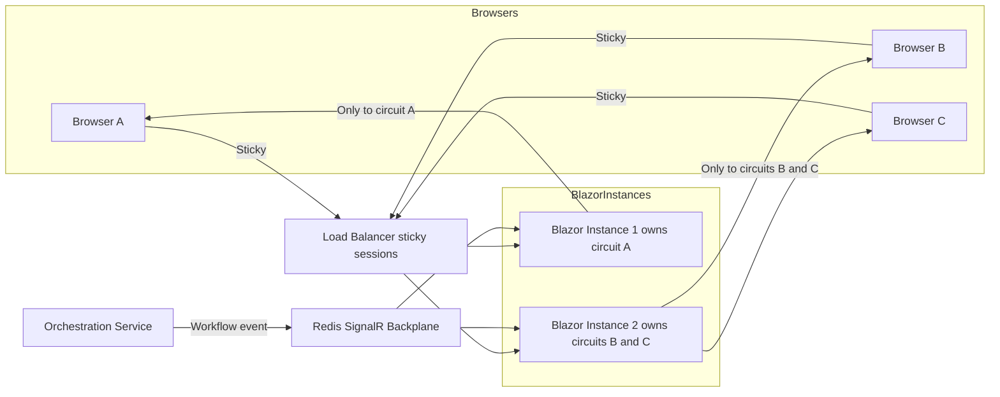

---

### 14.2 Steering Instance Scaling

Steering instances scale via **competing consumers** on the RabbitMQ command queue - adding instances increases dispatch throughput automatically.

Once a steering instance picks up a workflow it becomes the **owner** for its lifetime (it holds the container/process handle). Two concerns follow:

- **Ownership tracking** - Redis records which steering instance owns which workflow instance
- **Failover** - each steering instance emits a heartbeat; if it stops, the Orchestrator detects orphaned instances and reassigns them or marks them Failed with retry

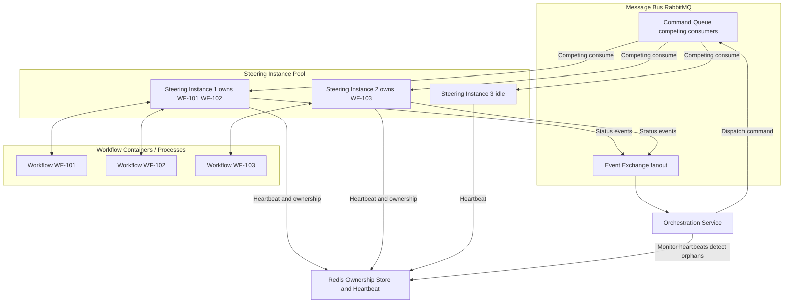

---

### 14.3 Full Scaled Event Flow

End-to-end path of a workflow status update from container to browser when fully scaled out:

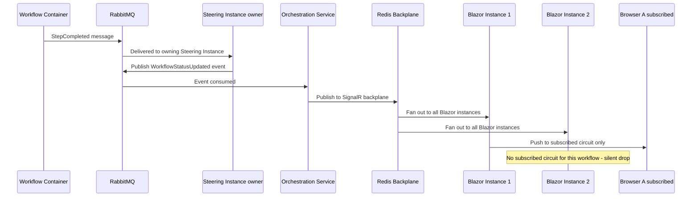

---

### 14.4 Infrastructure Summary per Mode

| Component | Local / Dev | On-premise | Cloud (Azure) |
|---|---|---|---|
| Blazor Server instances | 1 (no backplane needed) | N + sticky LB + Redis backplane | N + Azure Front Door + Azure Cache for Redis |
| Steering instances | 1 | Pool via competing consumers | Pool via competing consumers with auto-scale |
| Ownership and heartbeat store | Not needed | Redis | Azure Cache for Redis |
| Message bus | RabbitMQ single in Docker | RabbitMQ cluster | Azure Service Bus |
| Workflow runtime | OS Process | Docker / k3s | AKS node pool |

Redis serves a dual purpose in non-dev modes: **SignalR backplane** and **steering ownership store**. A single Redis instance or cluster covers both.

---

*Document maintained in ARCHITECTURE.md — update alongside major design decisions. See also USE-CASES.md.*