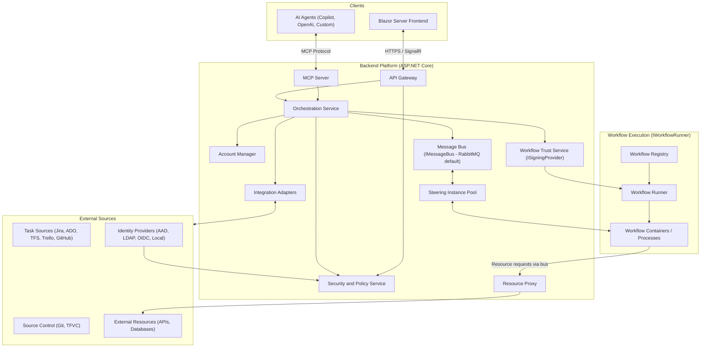
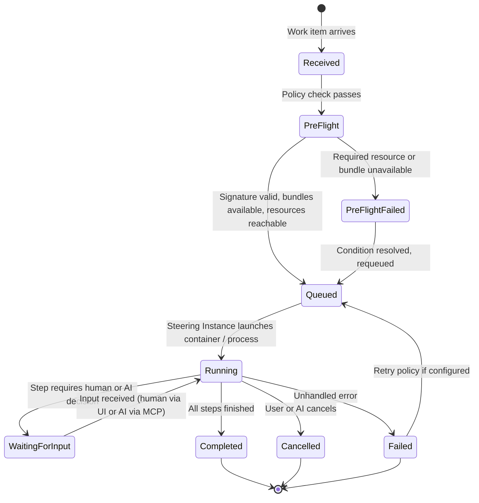
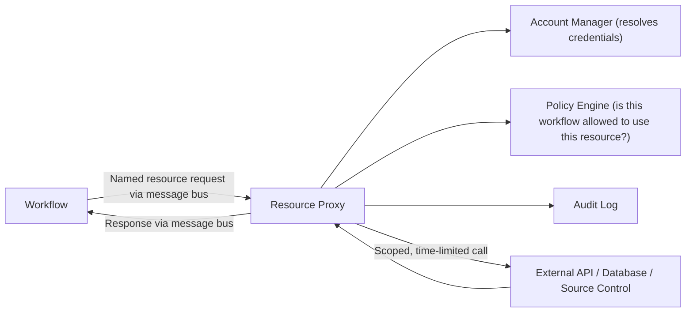
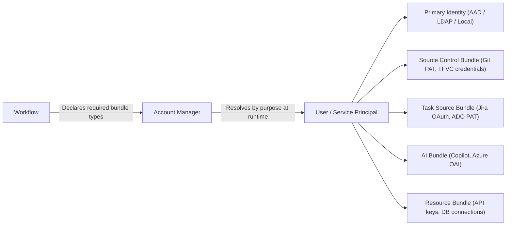
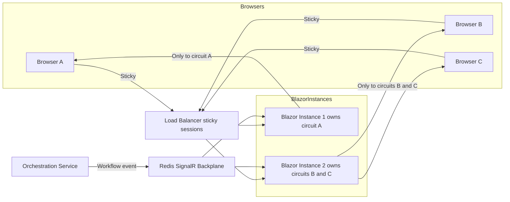
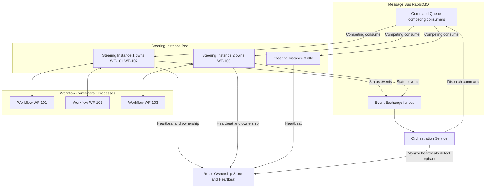
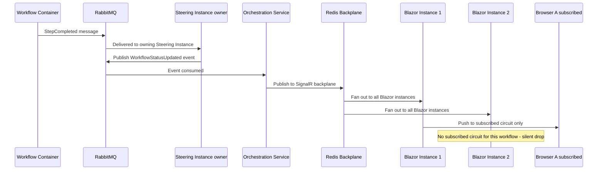

# Auxilia - Architecture Overview

> **Status:** Draft v0.3
> **Stack:** C# / ASP.NET Core / Blazor Server

---

## Table of Contents

1. System Overview
2. Core Concepts
3. High-Level Architecture
4. Key Components
5. Workflow Lifecycle
6. Security and Signing
7. Resource Access Model
8. Multi-Account Model
9. Deployment Modes
10. Open Questions and Concerns

---

## 1. System Overview

Auxilia is a **workflow-driven distributed system** where:

- **Work items** (from Jira, Azure DevOps, Trello, etc.) are the primary trigger for workflows.
- **Workflows** are stateful, signed programs that run to completion and communicate exclusively via the platform
  message bus.
- **AI agents** are first-class citizens - they can trigger, steer, observe, and complete workflows via the same
  interfaces as human users (MCP protocol).
- **Security is pluggable** - runs standalone out of the box, or integrates with corporate identity providers (AAD,
  LDAP, OIDC).

---

## 2. Core Concepts

| Concept               | Description                                                                                                            |
|-----------------------|------------------------------------------------------------------------------------------------------------------------|
| **Work Item**         | A unit of work from an external task source (Jira issue, ADO ticket, Trello card, etc.)                                |
| **Workflow**          | A signed, stateful, isolated program that processes a work item through defined steps until completion or cancellation |
| **Steering Instance** | The backend mediator between the message bus, the frontend, and AI agents                                              |
| **MCP Interface**     | Model Context Protocol endpoint - gives AI agents full parity with the human UI                                        |
| **Account Bundle**    | A set of credentials grouped by purpose (e.g. user identity, AI service, source control)                               |
| **Resource Proxy**    | A platform-managed, audited access point through which workflows reach external APIs and databases                     |
| **Trust Chain**       | Signature chain ensuring a workflow is authorized to run in this environment                                           |

---

## 3. High-Level Architecture

---

## 4. Key Components

### Frontend - Blazor Server

- Aggregated view of work items from all configured task sources
- Real-time workflow monitoring via SignalR
- Account bundle management and security policy configuration
- Workflow artifact configuration (where produced artifacts are routed)
- **Everything in the UI is also exposed via the MCP Server** - no hidden operations

### API Gateway - ASP.NET Core

- Single entry point for all external traffic (UI and MCP clients)
- Token validation delegated to the Security Service
- WebSocket / SignalR upgrade for real-time event streams

### Orchestration Service

- Receives work items from adapters and selects the appropriate workflow
- Pre-flight checks before dispatch: verifies signature, required account bundles, and resource proxy availability
- Manages the full workflow instance lifecycle (see section 5)
- Publishes commands and consumes status updates via IMessageBus

### Message Bus - IMessageBus

- **Default: RabbitMQ** (runs locally in Docker, zero-config)
- **Cloud swap: Azure Service Bus** (drop-in alternative via the same interface)
- All communication between Steering Instances and Workflow programs passes exclusively through here

### Steering Instance

- Bridges the message bus and the workflow runtime
- Injects scoped credentials and resource proxy endpoints at workflow startup
- Forwards AI assistance requests to the AI Integration Layer
- Streams live status to the frontend
- Notifies human / AI when a workflow is waiting for input due to resource unavailability

### Workflow Trust Service - ISigningProvider

- Verifies every workflow artifact before execution - no unsigned execution path exists
- In dev mode signing can be disabled entirely; no dev CA ceremony required locally
- Three production implementations depending on deployment mode (see section 9)
- Private key never touches the application process - only hash-in / signature-out

### Workflow Runner - IWorkflowRunner

- Abstracts how workflows are launched
- Three implementations depending on deployment mode (see section 9)

### Workflow C# SDK - NuGet Package

- Reference SDK for authoring workflows in C#; other language SDKs follow the same message contract
- Workflows declare: required bundle types, produced artifacts, and named resource dependencies
- Workflows compile to a self-contained executable, then are signed and pushed to the registry

### AI Integration Layer

- Routes AIAssistanceRequest messages (published by workflows) to the configured model
- Pluggable adapters: GitHub Copilot, Azure OpenAI, custom models
- Pre-flight check includes verifying the required AI bundle is available before dispatch
- All AI decisions are written to the audit log with full context

### Resource Proxy

- Platform-managed gateway through which workflows access external APIs and databases
- Workflow declares named dependencies (e.g. "github-api", "customer-db") at authoring time
- At runtime the Steering Instance resolves, scopes, and injects proxy endpoints - the workflow never holds raw
  credentials
- All proxy calls are audited; rate limiting and access policy enforced per workflow identity

### MCP Server

- Exposes every user-facing operation as an MCP tool
- AI agents authenticate with their own Account Bundle - subject to the same policy rules as humans
- Key tools: trigger_workflow, get_workflow_status, send_input, approve_step, cancel_workflow, list_work_items

---

## 5. Workflow Lifecycle

**Key lifecycle properties:**

- Workflows are **stateful and long-running** - once started they run until Completed, Failed, or explicitly Cancelled
- A **pre-flight check** runs before any workflow is dispatched, verifying that signature, required account bundles,
  resource proxies, and AI accounts are all available
- If pre-flight fails the work item is held and the user/AI is notified; it can be requeued automatically when the
  condition resolves (configurable)
- **Workflow artifacts** are declared by the workflow and configured by the user - where they are stored and how they
  are linked back to the work item is a per-workflow configuration

---

## 6. Security and Signing

```mermaid
graph TD
    subgraph Workflow Trust
        DEV["Developer submits workflow"] --> SIGN_SVC["Trust Service signs artifact"]
        SIGN_SVC --> REG["Workflow Registry"]
        REG --> WR["Workflow Runner"]
        WR --> VERIFY["Signature verified before execution"]
        VERIFY -->|Valid| LAUNCH["Container / Process launched"]
        VERIFY -->|Invalid| REJECT["Execution rejected - always"]
        VERIFY -->|Dev mode - signing off| LAUNCH
    end
    subgraph Identity and Policy
        REQUEST["Any request - UI or MCP"] --> SEC["Security Service"]
        SEC --> IDP["Identity Provider (AAD / LDAP / OIDC / Local)"]
        IDP --> POLICY["Policy Engine"]
        POLICY -->|Allowed| ORCH["Orchestration"]
        POLICY -->|Denied| BLOCK["Blocked"]
    end
```

**Key principles:**

- Signing can be **fully disabled in dev mode** - there is no ceremony, no dev CA required locally
- In all non-dev modes signing is mandatory with no bypass; permissions are declared at signing time and cannot be
  escalated at runtime
- Workflows have no outbound network access of their own - all external access goes through the Resource Proxy
- Every action (human or AI) is written to an immutable audit log
- TFVC / TFS is explicitly supported as a source control target for enterprises that have not yet migrated

---

## 7. Resource Access Model

Workflows often need to reach external systems (APIs, databases, source control). Direct access is not permitted - all
external access flows through the **Resource Proxy**.

**How it works:**

- The workflow declares named resource dependencies in its manifest (e.g. "github-api", "jira-instance", "customer-db")
- At runtime the platform resolves which Account Bundle and connection details map to that named resource for this
  user/context
- The workflow sends a resource request message and receives a response - it never holds a raw connection string, token,
  or API key
- The proxy enforces per-workflow rate limits and access policy; all calls are logged

---

## 8. Multi-Account Model

A user or service principal holds multiple **Account Bundles**, each scoped to a purpose.

- Workflows declare *which bundle types* they need - never specific credentials
- Bundles are encrypted at rest, decrypted only when injected into a workflow run via the Resource Proxy or Steering
  Instance
- AI bundles carry usage quotas and purpose restrictions
- Multiple bundles of the same type are supported (e.g. two ADO instances, a GitHub and a Jira account)

---

## 9. Deployment Modes

All modes share the same codebase. Runtime behaviour is driven entirely by configuration and pluggable interface
implementations.

| Mode              | Message Bus                      | Workflow Runtime              | Signing                 | Identity         |
|-------------------|----------------------------------|-------------------------------|-------------------------|------------------|
| **Local / Dev**   | RabbitMQ in Docker or in-process | OS Process (fully debuggable) | Disabled (no ceremony)  | Local accounts   |
| **On-premise**    | RabbitMQ cluster                 | Docker / k3s                  | HashiCorp Vault Transit | LDAP / AD / OIDC |
| **Cloud (Azure)** | Azure Service Bus                | AKS                           | Azure Key Vault         | Entra ID         |

Pluggable interfaces: **IMessageBus**, **IWorkflowRunner**, **ISigningProvider**, **IIdentityProvider**, *
*IResourceProxy**
The core platform has no hard dependency on RabbitMQ, Docker, Vault, or AAD.

---

## 10. Open Questions and Concerns

All previously raised architectural questions have been resolved and incorporated above.
The following minor points remain open for the detailed design phase:

| # | Question                                                                                                                                                                                                                              | Impact                        |
|---|---------------------------------------------------------------------------------------------------------------------------------------------------------------------------------------------------------------------------------------|-------------------------------|
| 1 | **Resource Proxy transport** - Should resource request/response go through the main message bus or a dedicated side-channel? Main bus is simpler; side-channel allows lower latency for high-frequency database calls.                | Performance, architecture     |
| 2 | **Workflow artifact storage backend** - Where are produced artifacts stored? Options: blob storage (Azure Blob, S3-compatible, local filesystem), linked back to work item on completion. Should be configurable per deployment mode. | Workflow contract             |
| 3 | **Pre-flight retry policy granularity** - Is retry-on-availability configured globally, per workflow, or per work item source?                                                                                                        | UX, reliability               |
| 4 | **TFVC scope** - Full branch/merge support confirmed as needed. Clarify whether TFS on-prem server versions down to TFS 2015/2017 are in scope or only TFS 2019+ / Azure DevOps Server.                                               | Adapter implementation effort |

| 5 | **State Management in Backend Services
** - Backend Services will have different state, even if there's no in memory state or local JSON files, the fact that different backend services have different repos checked out makes them stateful. This must be managed and load must be balanced accordingly, up and downscaling must also happen accordingly | State Management, Backend Scalability |
---

*Document maintained in ARCHITECTURE.md - update alongside major design decisions.*

## 11. Scaling

The frontend and the steering layer have different scaling characteristics and are solved independently.

---

### 11.1 Blazor Server Scaling

Blazor Server holds a live SignalR circuit per browser client, tied to a specific server instance. Two mechanisms work
together to scale out:

- **Sticky sessions** at the load balancer - a client always returns to the same instance for the lifetime of its
  circuit
- **Redis SignalR backplane** - backend events are published to Redis which fans them out to all Blazor Server
  instances; each instance delivers only to circuits subscribed to that workflow

Blazor Server instances are stateless from a data perspective. Instances can be added or removed at any time.

---

### 11.2 Steering Instance Scaling

Steering instances scale via **competing consumers** on the RabbitMQ command queue - adding instances increases dispatch
throughput automatically.

Once a steering instance picks up a workflow it becomes the **owner** for its lifetime (it holds the container/process
handle). Two concerns follow:

- **Ownership tracking** - Redis records which steering instance owns which workflow instance
- **Failover** - each steering instance emits a heartbeat; if it stops, the Orchestrator detects orphaned instances and
  reassigns them or marks them Failed with retry

---

### 11.3 Full Scaled Event Flow

End-to-end path of a workflow status update from container to browser when fully scaled out:

---

### 11.4 Infrastructure Summary per Mode

| Component                     | Local / Dev               | On-premise                      | Cloud (Azure)                                |
|-------------------------------|---------------------------|---------------------------------|----------------------------------------------|
| Blazor Server instances       | 1 (no backplane needed)   | N + sticky LB + Redis backplane | N + Azure Front Door + Azure Cache for Redis |
| Steering instances            | 1                         | Pool via competing consumers    | Pool via competing consumers with auto-scale |
| Ownership and heartbeat store | Not needed                | Redis                           | Azure Cache for Redis                        |
| Message bus                   | RabbitMQ single in Docker | RabbitMQ cluster                | Azure Service Bus                            |
| Workflow runtime              | OS Process                | Docker / k3s                    | AKS node pool                                |

Redis serves a dual purpose in non-dev modes: **SignalR backplane** and **steering ownership store**. A single Redis
instance or cluster covers both.

---

*Next step: Use Case document (USE-CASES.md)*

*Document maintained in ARCHITECTURE.md - update alongside major design decisions.*