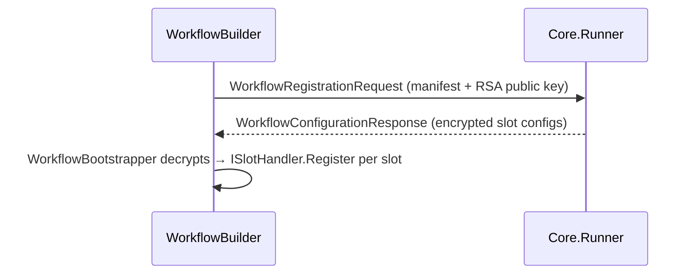

# Auxilia.Workflows

Workflow SDK consumed by every workflow binary. Declares slots and environment requirements, negotiates configuration with the Core.Runner over the message bus, and bootstraps the resolved slot providers into the DI container.

## Architecture

A workflow binary calls `WorkflowBuilder` at startup. When run normally it sends a `WorkflowRegistrationRequest` to the Core.Runner and waits for a `WorkflowConfigurationResponse` containing RSA-encrypted slot configs. `WorkflowBootstrapper` decrypts each config and calls the matching `ISlotHandler` to register the provider into `IServiceCollection`. When run with no args (schema-export mode) it serialises the `WorkflowSchema` to stdout and exits — used by tooling only.

Platform-launched instances read their identity from env vars (`WorkflowEnvironmentVariables`): `Workflow__InstanceId` + one-time `Workflow__InstanceToken` (carried in announcement and registration messages for authentication) and `Workflow__AnnouncementQueue`/`Workflow__RegistrationQueue` (the launching Core.Runner's queues). Without them the SDK self-generates an identity — accepted only by a runner running with `RequireInstanceToken=false` (dev mode). The response queue name is always `WorkflowQueues.ResponseQueueFor(instanceId)` — pre-created by the platform in authenticated mode.

`SlotHandlerRegistry` is a static map from provider-type string → `ISlotHandler`. Slot-package libraries register their handler into it; the core SDK does not know about any concrete provider.



## Special Rules
- `WorkflowManifest` (sent on the wire) and `WorkflowSchema` (stdout export) are distinct types — never conflate them.
- `EphemeralKeyPair` is `IDisposable`; always `using`.
- `WorkflowBuilder` is `sealed` — new capabilities go into `IWorkflowBuilder` extension methods.
- `SlotHandlerRegistry` is static; no instance state.

## File / Folder Map
```
Auxilia.Workflows/
├── IWorkflowBuilder.cs / WorkflowBuilder.cs   # Fluent builder + schema-export mode (RunAsync)
├── WorkflowBootstrapper.cs                    # Applies decrypted slot configs to IServiceCollection
├── WorkflowSchema.cs / WorkflowManifest.cs    # Schema = stdout export; Manifest = wire format
├── SlotHandlerRegistry.cs / ISlotHandler.cs   # Static registry: providerType string → ISlotHandler
├── Capabilities/                              # ICapability marker + NoCapabilities sentinel
├── Crypto/                                    # EphemeralKeyPair (RSA-4096) + SlotConfigurationCrypto (decrypt helper)
├── Environment/                               # IEnvironmentRequirement + Tool / Os / Port requirement records
├── Internal/EnvironmentBuilder.cs             # internal impl of IEnvironmentBuilder
└── Messaging/Messages/                        # Registration request, config response, encrypted slot config records
```