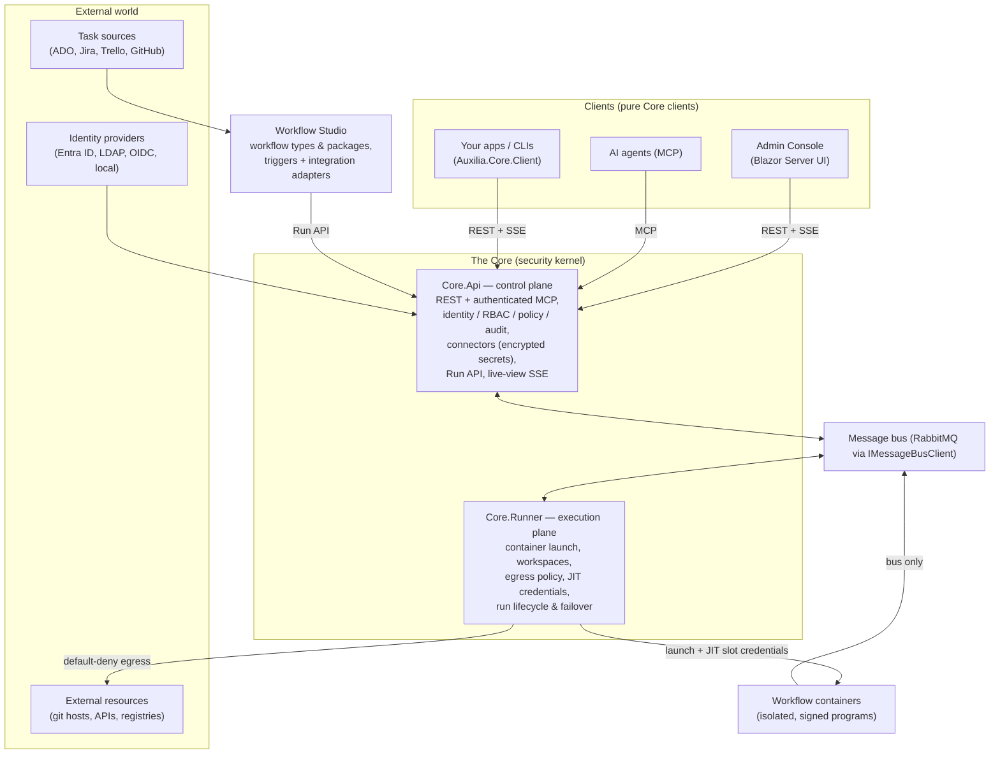

# Auxilia

Auxilia is a workflow-driven platform for **assisted software delivery**: work items from
external task sources (Azure DevOps, Jira, Trello, GitHub, …) trigger **signed, stateful
workflow programs** that run in isolated containers — including AI coding agents that take a
story from refinement through plan, implementation, review, and push, with a human steering
every gate. AI agents are first-class citizens: an authenticated MCP server gives them full
parity with the human UI, under the same identity, policy, and audit rules.

## Architecture at a glance



The platform is **four deployables** sharing the `Auxilia.Core.Contracts` /
`Auxilia.Core.Client` libraries; each service owns its own database, and **secrets live only
in the Core**:

- **`Auxilia.Core.Api`** — control plane: REST + authenticated MCP, identity/RBAC/groups,
  connector administration, audit, the Run API, live-view SSE stream, failover monitor,
  workflow-type registry.
- **`Auxilia.Core.Runner`** — execution plane: container launch, environment-image
  composition, workspace management, network-egress policy, just-in-time credential
  delivery, run lifecycle and failover heartbeats.
- **`Auxilia.WorkflowStudio`** — headless workflow-domain host: trigger scheduling,
  artifact-chaining triggers, and integration adapters (e.g. email work-item intake),
  dispatching runs through the Core Run API; a pure Core client.
- **`Auxilia.AdminConsole`** — operator/admin Blazor UI with live run views; a pure Core
  client with no database of its own.

Anything else integrates the same way the bundled clients do: over the Core REST + SSE
surface with `Auxilia.Core.Client`, or over MCP.

## Trust and credential model

Workflows are **trusted by signature** — the signing authority vouches for a workflow type
before it may run, and runs are started by registered type only. Credentials are stored
encrypted in the Core as **connectors** and delivered **just-in-time, per slot, encrypted
for the specific workflow instance** — never as an upfront bundle, and never for slots a run
does not use. Inside the container a **default-deny egress policy** bounds where those
credentials can go, and every delivery, policy decision, and lifecycle transition lands in
the immutable audit log. The protection model is *who gets a credential and when*, not
hiding it from a workflow that was already vetted. (One exception: the initial repository
clone happens Core-side and the token is stripped before the workspace is mounted.)

## Extensibility

The Core contains **no vendor- or workflow-specific logic** — it is a semantics-blind
broker. Everything specific is registered at runtime:

- **Slot-handler plugins** teach the runner how to activate a capability inside a container
  (a coding-agent CLI, a task-source connection, a git credential, …).
- The **provider catalog** describes available provider types, their settings, and connect
  flows — data, not code.
- **Environment layers** compose capability images (e.g. `dotnet-10`, `node-22`) onto a
  workflow's base image at dispatch, content-addressed and cached.
- The **workflow-type registry** signs and gates which workflow programs may run.
- Workflows themselves are authored against the **workflow SDK** and declare their slots,
  inputs, and gates in a schema the Core validates configurations against.

## Human-steered AI delivery

Runs stream live to every client over SSE — conversation views, plan views, decision cards,
and a full interactive terminal when a run allows it. Gates (plan approval, code review,
push) pause the workflow until a human — or a configured AI reviewer — answers. The bundled
**implementation workflow** drives a coding agent from work-item refinement to a reviewed,
pushed change while the operator steers from the Admin Console, a steering client app, or MCP.

## Getting started

Requires **.NET 10** and, for running workflows, **Docker**. Solution file: `Auxilia.slnx`.

```powershell
dotnet build Auxilia.slnx        # build everything
dotnet test  Auxilia.slnx        # full test suite (system tests need Docker)

./Start-DevStack.ps1 -Build      # local Core stack: Core.Api on :5280 + Core.Runner,
                                 # simulation-seeded; -Stop tears it down
```

## License

**Auxilia is source-available, not Open Source.**

| | |
|---|---|
| **Free, no license needed** | Evaluation, testing, development, CI, proof of concept, teaching, personal use |
| **Requires a commercial license** | Any production use, including internal business tools |
| **Becomes Apache-2.0 on** | 2030-07-28 (this version) |

Auxilia is licensed under the [Business Source License 1.1](LICENSE) — the
same model used by MariaDB, Sentry and HashiCorp. You may read, fork, modify
and redistribute the code freely. You may run it as much as you like for
anything that is not production.

Once you want to run Auxilia in production, [buy a commercial
license](LICENSE-COMMERCIAL.md). On the Change Date above, this version
converts automatically to Apache-2.0 and the restriction disappears for good.

I use the term *source-available* deliberately rather than *Open Source*: the
[Open Source Definition](https://opensource.org/osd) forbids restrictions on
the field of use, and this license has one. Calling it Open Source would be
inaccurate.

Questions about whether your use needs a license? Open an issue or
discussion on this repository — I would much rather answer a question than
send an invoice to someone who got it wrong by accident.

## Documentation

- **`docs/ARCHITECTURE.md`** — full architecture: credential/trust model, dispatch
  lifecycle, workspace management, network isolation, governance/RBAC, scaling.
- **`docs/implementation-workflow-design.md`** — the assisted-delivery workflow.
- **`docs/workflow-sdk-design.md`** — authoring workflows.
- **`docs/TestStrategy.md`** — the test pyramid.
- **`CLAUDE.md`** — working guidance and the full documentation map.
