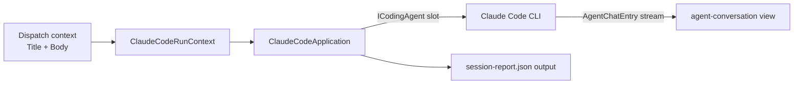

# Auxilia.ClaudeCode.Workflow

Workflow type `claude-code`: runs a coding agent (normally the Claude Code CLI, provided by
the `claude-code-cli` slot provider) against the run's workspace. The `view-mode` run input
decides the experience: **advanced** (default) parses stream-json and streams the agent's
conversation live to the chat renderer; **console** runs the REAL interactive CLI in
tmux+ttyd behind the platform's authenticated web terminal (`AgentConsoleApplication` —
the terminal is declared with an `InteractiveTerminalGate`, so only console runs expose it).

## Architecture

- **`ICodingAgent`** is the single slot contract (`coding-agent`): run one instruction in a
  workspace, stream `AgentChatEntry` items through a callback, return a `CodingAgentResult`.
  The provider implementation lives in `Auxilia.Slots.ClaudeCode`, fakes in the test project.
- **`ClaudeCodeRunContext`** assembles the instruction from `WORKFLOW_CONTEXT__TITLE` +
  `WORKFLOW_CONTEXT__BODY` (mail subject/body, manual dispatch, rerun — all the same shape)
  and resolves workspace/output directories from the SDK environment variables. A run
  without an instruction fails loudly.
- **`ClaudeCodeApplication`** publishes the instruction as the first chat entry, forwards
  every agent turn to the `agent-conversation` view (Custom, rendererKey `agent-chat`),
  tracks lifecycle on the `progress` log view, and writes `session-report.json` — also for
  failed runs, then throws so the run state is Failed.

## Docker image

`Dockerfile` bakes the real Claude Code CLI (native installer — `claude` on PATH), tmux+ttyd
for console-mode runs, and
`/usr/local/bin/claude-stub`, a `claude-stub.sh` stand-in that emits a canned stream-json
transcript. System tests select the stub via the provider's `CliPath` setting (cost rule:
never real AI in system tests); real runs keep the default `claude`.

## Special rules

- The workflow itself must stay CLI-agnostic: everything Claude-Code-CLI-specific
  (arguments, stream-json parsing, API key handling) belongs to `Auxilia.Slots.ClaudeCode`.
- `RequiresNetworkEndpoint` declares `api.anthropic.com` only — the provider disables all
  nonessential CLI traffic (`CLAUDE_CODE_DISABLE_NONESSENTIAL_TRAFFIC`), keeping the egress
  baseline minimal. Extend the declaration if that env contract ever changes.
- Never put an API key into the dispatch context, chat entries, the report, or logs.
