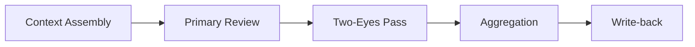

# Auxilia.CodeReview.Workflow

Automated pull-request code-review workflow. Assembles diff context, runs a per-file primary AI review
pass, optionally validates findings through an independent secondary reviewer (two-eyes pass), aggregates
surviving findings, and writes them back as PR comments.

## Architecture

Five phases run in sequence:



**Context Assembly** — `ContextAssembler` builds a `ReviewContext` containing the list of
`ReviewableFile` records (diff hunks, criticality, work-item summary).

**Primary Review** — `PrimaryReviewOrchestrator` holds a **single** `IAiSession` for the entire file
loop. It registers `CodeReviewResultSinkMcpTools` (from `Mcp/`) in `AiSessionOptions.CapabilityTools`
so the model calls typed tools to report findings and the file verdict. After each `ExecuteAsync` call,
`DrainFindings()` and `TakeFileVerdict()` read the accumulated results. `ContextCompactionService` is
called between files when the session grows large; it compacts the session **in-place** via
`CompactAsync(session, description, ct)` — `PrimaryReviewOrchestrator` does **not** reassign the
session variable after compaction.

**Two-Eyes Pass** — `TwoEyesPassService` opens **one** `IAiSession` per finding and registers a fresh
`CodeReviewResultSinkMcpTools` each time. After `ExecuteAsync`, `TakeSecondaryVerdict()` reads the
verdict. If the model makes no tool call, the finding is treated as `Approved` and a Warning is logged;
no bare `catch` is used.

**Aggregation** — `FindingsAggregator` filters staged findings by their `SecondaryVerdict`.

**Write-back** — `WriteBackService` posts surviving findings as PR comments via the SCM adapter.

## File / Folder Map

```
Source/Auxilia.CodeReview.Workflow/
├── PullRequestReviewWorkflow.cs        # Workflow entry point; wires orchestrators in order
├── PrimaryReview/                      # PrimaryReviewOrchestrator — per-file AI review loop
├── TwoEyesPassService.cs               # Per-finding secondary reviewer
├── FindingsAggregator.cs               # Filters staged findings by SecondaryVerdict
├── Findings/                           # StagedFinding, FindingSeverity, IStagedFindingsStore
├── Verdicts/                           # VerdictMap, FileVerdict, SkipReason
├── Context/                            # ReviewContext assembly (ContextAssembler, ReviewableFile)
├── Compaction/                         # ContextCompactionService — in-session context compaction
├── Mcp/                                # CodeReviewResultSinkMcpTools — result-sink for findings/verdicts
├── ReviewFinding.cs                    # Aggregated finding: StagedFinding + SecondaryVerdict
├── SecondaryVerdict.cs                 # Enum: Approved, Rejected, NotReviewed
├── CodeReviewResult.cs                 # Final output record
├── WriteBackService.cs                 # Posts findings as PR comments
└── ServiceCollectionExtensions.cs      # AddCodeReviewWorkflow() DI registration
```

## Special rules

- `CodeReviewResultSinkMcpTools` (`Mcp/`) is the **only mechanism** for the primary and secondary
  reviewers to report findings and verdicts. Never parse `IAiSession.ExecuteAsync` return values for
  structured data.
- The result-sink server must be started before `IAiAgent.OpenSessionAsync` and stopped in the `finally`
  block, after `session.DisposeAsync()`.
- Do not keep `ParseReviewResponse`, `ParseVerdict`, or any `catch { return default; }` guard — these
  are regressions.
