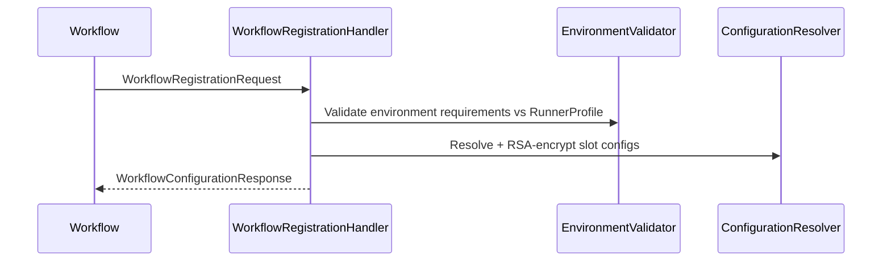

# Auxilia.SteeringInstance

Central control-plane service. Receives workflow registration requests, validates the runner environment, resolves and encrypts slot configurations, and returns them to the registering workflow. Also detects when a new schema version would make existing slot configs stale (dirty).

## Architecture

All workflow state is held in three in-memory stores keyed by workflow-type name. No database is used.



Schema drift: `DirtyConfigurationDetector` JSON-diffs an incoming `WorkflowSchema` against the stored one. If new required capability fields appear, all slot configs for that workflow type are marked `Dirty` and will be rejected until reconfigured.

`WorkflowRegistrationHandler` is started manually in `ApplicationStarted`, not as an `IHostedService`.

Slot configurations and slot-provider plugin registrations are seeded at runtime via the `slot-configurations` fanout exchange (messages: `UpsertSlotConfigurationCommand`, `RemoveSlotConfigurationCommand`, `RegisterSlotProviderCommand`, `RemoveSlotProviderCommand`). A `SlotConfigurationSeedHandler` subscribes to this exchange on startup. Multiple Steering Instance replicas each receive their own copy of every broadcast. Each instance also exposes per-instance typed seed queues (`{CommandQueueName}-slot-seed.upsert|.remove|.register|.remove-provider`) for targeted configuration delivery that bypasses the fanout.

The registration handshake is **authenticated by default** (`WorkflowDispatcherSettings.RequireInstanceToken`): the dispatcher issues a one-time instance token per launch (`WorkflowInstanceTokenRegistry`), injects it via `Workflow__InstanceId`/`Workflow__InstanceToken` env vars, and pre-creates the per-instance response queue. Announcement and registration handlers validate the token and answer only on that canonical queue, ignoring the message's self-declared response topic. When several instances share a broker, `AnnouncementQueueName` (and `RegistrationQueueName`) must be unique per instance — the launching instance holds the token, the pending package, and the slot configs.

## File / Folder Map
```
Source/Auxilia.SteeringInstance/
├── Program.cs                           # Host wiring (messaging, OTEL, Serilog, RunnerProfile config)
└── Workflows/
    ├── WorkflowRegistrationHandler.cs   # Subscribes "workflow-registration"; orchestrates validate + resolve
    ├── SlotConfigurationSeedHandler.cs  # Subscribes slot-configurations exchange + per-instance seed queue
    ├── EnvironmentValidator.cs          # Checks manifest requirements against RunnerProfile
    ├── ConfigurationResolver.cs         # Loads stored configs, RSA-OAEP-encrypts per slot
    ├── DirtyConfigurationDetector.cs    # Schema diff → marks slot configs dirty when required fields added
    ├── RunnerProfile.cs                 # Config POCO: AvailableTools, OperatingSystem, OpenPorts
    ├── ResolverResult.cs / ValidationResult.cs / SchemaDiffResult.cs  # Result types
    └── Storage/
        ├── WorkflowInstanceTokenRegistry.cs  # One-time launch tokens: issue / validate / consume
        ├── WorkflowSchemaStore.cs        # ConcurrentDictionary: workflowType → WorkflowSchema
        ├── SlotConfigurationStore.cs     # ConcurrentDictionary: workflowType → List<StoredSlotConfiguration>
        ├── SlotProviderRegistry.cs       # ConcurrentDictionary: providerType → DLL path
        ├── StoredSlotConfiguration.cs    # SlotName + ProviderType + Settings + ConfigurationStatus
        └── ConfigurationStatus.cs        # enum Active | Dirty
```