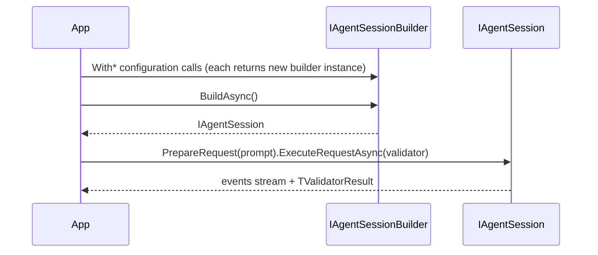

# Auxilia.AI

Framework-agnostic agentic AI abstraction. Consumers use `IAgentSessionBuilder` / `IAgentSession` / `IAgentRequest` without depending on any AI SDK. Currently backed by Microsoft Agent Framework (MAF) + Ollama.

## Architecture

`MafAgentSessionBuilder` is immutable — every `With*` call returns a new instance via a private `Clone`, so the injected builder is always a pristine baseline safe to reuse. `BuildAsync` connects to configured MCP servers, applies tool whitelist/blacklist filtering, and wires them into a fresh `ChatClientAgent`.

Events (request started, streaming chunks, tool calls, errors, response complete) are published to a `Subject<AgentEvent>` on the session and exposed as `IObservable<AgentEvent>`.



## Special Rules
- `IAgentSession` is `IDisposable`, not `IAsyncDisposable` — `Dispose` blocks on `McpClient` async teardown intentionally.
- A fresh `IChatClient` is created per `BuildAsync()` call so `WithDefaultModel` takes effect.
- `IAgentResultValidator<T>` is consumer-defined; the library must not constrain its shape.

## File / Folder Map
```
Source/Libraries/Auxilia.AI/
├── IAgentSession.cs / IAgentSessionBuilder.cs / IAgentRequest.cs / IAgentResultValidator.cs  # Public contracts
├── ExampleAiSessionConsumer.cs              # Scratch/example consumer — not part of the public API
├── AgenticFramework/Events/AgentEvents.cs   # AgentEvent hierarchy (started, chunk, toolcall, error, complete)
├── AgenticFramework/DependencyInjection/    # AddAuxiliaAi() extension
└── AgenticFramework/Maf/
    ├── MafAgentSessionBuilder.cs            # Immutable MAF builder; Clone() on every With*
    ├── MafAgentSession.cs                   # Holds ChatClientAgent + Subject<AgentEvent>
    ├── MafAgentRequest.cs                   # Executes one request; publishes events; calls validator
    ├── MafSettings.cs                       # OllamaEndpoint, DefaultModel
    └── McpServerConfig.cs                   # record(Url, Name, Whitelist?, Blacklist?)
```