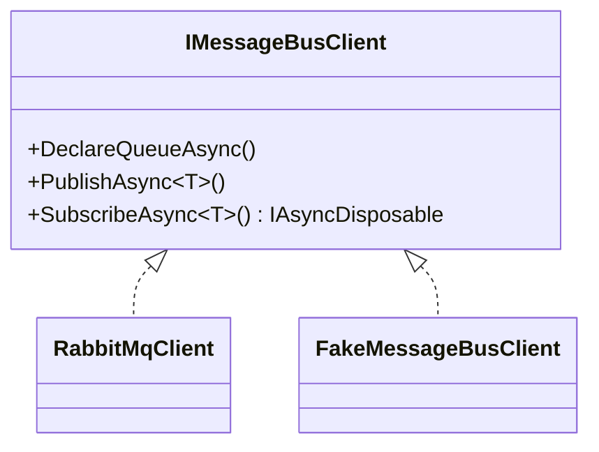

# Auxilia.Messaging

Thin transport abstraction over RabbitMQ. All other projects depend on `IMessageBusClient`, never on RabbitMQ types directly, so tests can inject `FakeMessageBusClient`.

## Architecture

`RabbitMqClient` uses one shared channel for publishing and creates a dedicated channel per `SubscribeAsync` call. W3C trace context is injected into message headers on publish and extracted on receive, keeping distributed traces connected across process boundaries. The `IAsyncDisposable` returned by `SubscribeAsync` tears down that channel.

Consumer semantics (all subscription variants share one pipeline):
- Every delivery is explicitly acked or nacked. A throwing handler nacks the delivery: a first delivery is requeued for one retry, an already-redelivered message is dropped as poison — resilience lives inside the client (repo rule), never in callers or decorators. A body that deserializes to `null` is nacked without requeue instead of being acked as handled. Failures are logged via the optional `ILogger` passed to `CreateAsync`.
- Every consumer channel sets a per-consumer prefetch bound (`BasicQosAsync`, 32, non-global) so one node cannot pull an entire backlog into memory and defeat the competing-consumer shared-queue pattern.
- Topic subscriptions (`SubscribeToTopicExchangeAsync`) use CLIENT-generated queue names (non-exclusive, auto-delete): automatic topology recovery re-declares a client-named queue under the same name after a connection blip, so late `Add`/`RemoveBindingAsync` calls keep working — a server-named queue would come back renamed and every later bind would 404. The handle's dedicated bind channel is created lazily and replaced if recovery closed it.



## File / Folder Map
```
Source/Libraries/Auxilia.Messaging/
├── IMessageBusClient.cs    # The only type consumers should depend on
├── RabbitMqClient.cs       # Production impl; created via CreateAsync() factory, never new
├── MessagingTelemetry.cs   # Shared ActivitySource + metrics instruments
└── Messages/               # IdentificationRequestMessage / IdentificationResponseMessage
```