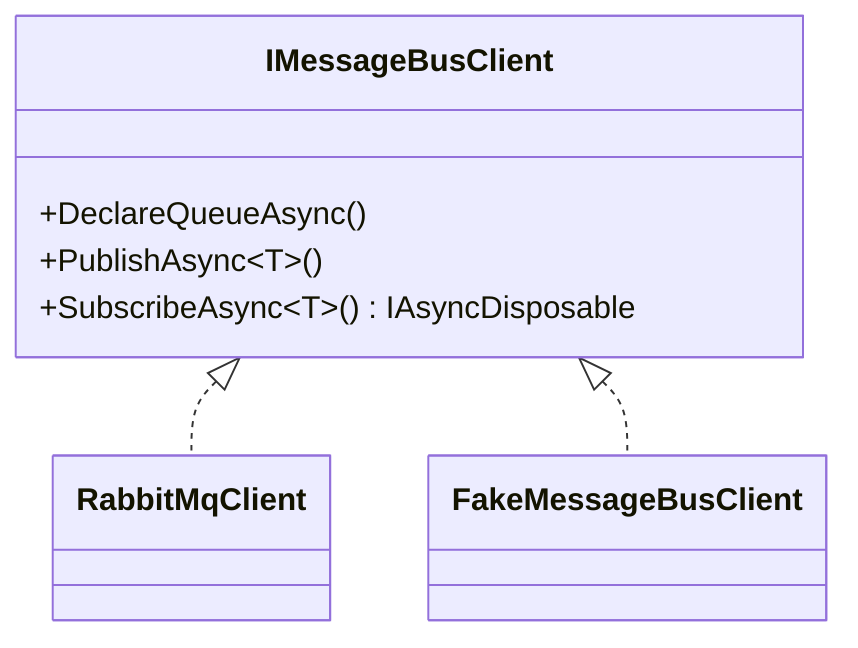

# Auxilia.Messaging

Thin transport abstraction over RabbitMQ. All other projects depend on `IMessageBusClient`, never on RabbitMQ types directly, so tests can inject `FakeMessageBusClient`.

## Architecture

`RabbitMqClient` uses one shared channel for publishing and creates a dedicated channel per `SubscribeAsync` call. W3C trace context is injected into message headers on publish and extracted on receive, keeping distributed traces connected across process boundaries. The `IAsyncDisposable` returned by `SubscribeAsync` tears down that channel.



## File / Folder Map
```
Source/Libraries/Auxilia.Messaging/
├── IMessageBusClient.cs    # The only type consumers should depend on
├── RabbitMqClient.cs       # Production impl; created via CreateAsync() factory, never new
├── MessagingTelemetry.cs   # Shared ActivitySource + metrics instruments
└── Messages/               # IdentificationRequestMessage / IdentificationResponseMessage
```