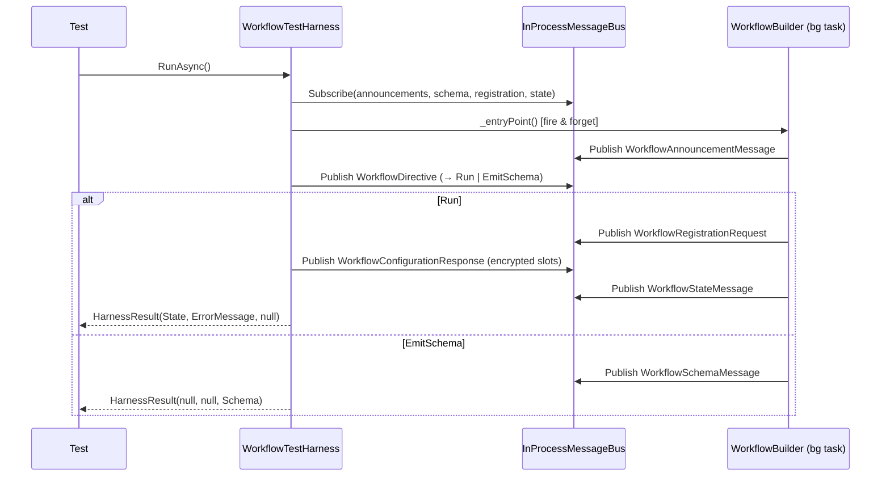

# Auxilia.Workflows.Testing

In-process test harness for workflow binaries. Allows component tests to run a `WorkflowBuilder`-based entry point without a real message bus or Core.Runner, asserting on the resulting `HarnessResult`.

## Architecture

`WorkflowTestHarness` wires an `InProcessMessageBus` into `WorkflowBuilder.TestContext`, fires the workflow entry point in a background `Task`, and orchestrates the full registration/configuration handshake in-process. Slot configurations supplied via `FakeSlotConfiguration` are RSA-encrypted with the workflow's own ephemeral public key before being sent, so the normal `WorkflowBootstrapper` decryption path executes unchanged.



## File / Folder Map
```
Tests/System/Auxilia.Workflows.Testing/
├── WorkflowTestHarness.cs          # Entry point + inner WorkflowTestHarnessBuilder (fluent API)
├── HarnessResult.cs                # Result record: State, ErrorMessage, Schema
├── HarnessWorkflowRunContext.cs    # IWorkflowRunContext backed by InProcessMessageBus + NullLogger
├── InProcessMessageBus.cs          # IMessageBusClient with ConcurrentDictionary-backed pub/sub
├── FakeSlotConfiguration.cs        # ProviderType + Settings for a single slot
└── WorkflowHarnessTimeoutException.cs  # Thrown when WaitAsync exceeds the configured timeout
```

## Special Rules
- `WorkflowBuilder.TestContext` is set before the entry point fires and cleared in the `finally` block; never leave it set between tests.
- RSA encryption uses the workflow's own ephemeral public key so the normal decryption path is exercised — do not bypass it.
- Missing slots cause an immediate `WorkflowState.Failed` response rather than an exception, mirroring real Core.Runner behaviour.
