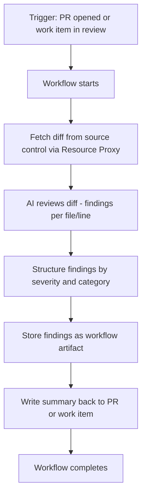
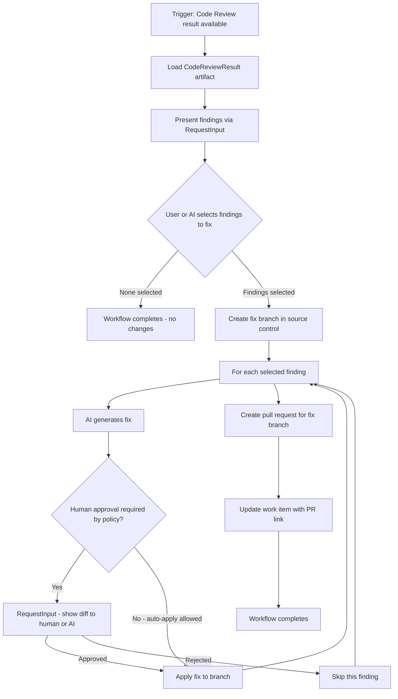
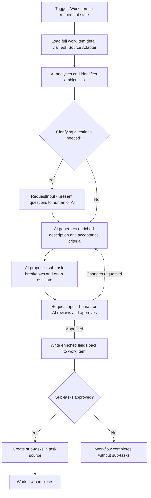
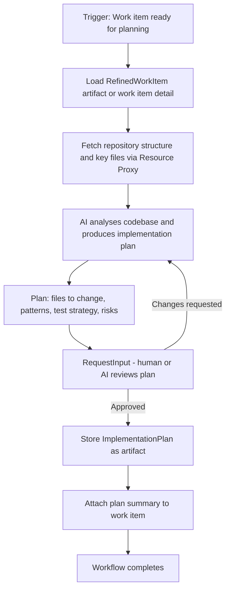
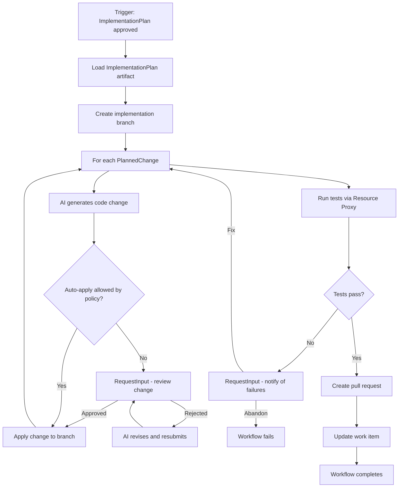
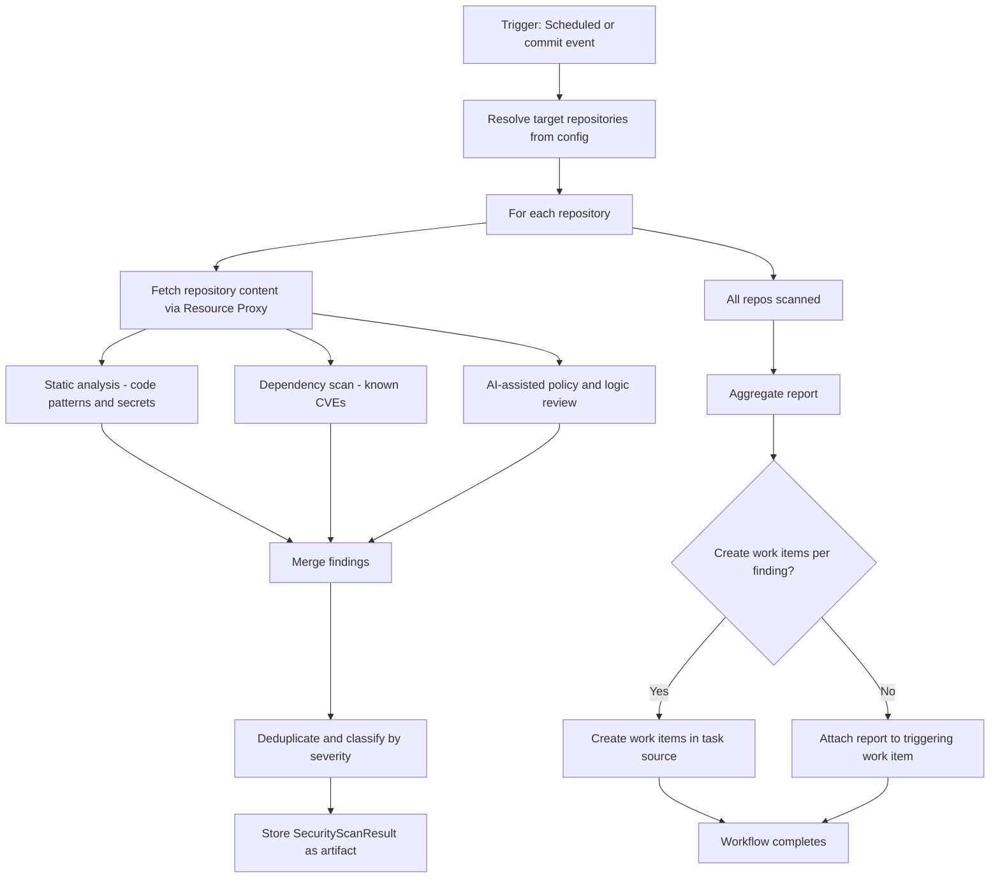
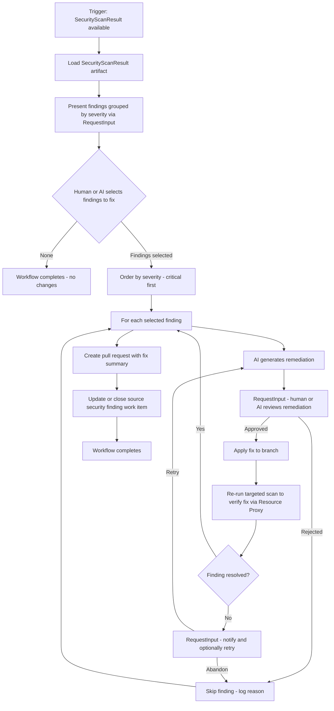


# Auxilia - Use Cases

> **Status:** Draft v0.1
> Cross-reference: ARCHITECTURE.md

This document describes the initial use cases, evaluates whether the current architecture covers each one, and records any gaps found. Architecture gaps are also reflected in ARCHITECTURE.md.

---

## Table of Contents

1. Architectural Preconditions
2. Use Case: Code Review
3. Use Case: Selective Fixing based on Code Review Findings
4. Use Case: Refinement of Work Items
5. Use Case: Planning of Work Item Implementation
6. Use Case: Implementation of Planned Work Items
7. Use Case: Security Scan of Repositories
8. Use Case: Security Fixing of Repositories
9. Cross-Cutting Gaps and Additions

---

## 1. Architectural Preconditions

All use cases below assume the following architectural capabilities are in place:

| Capability | Provided by |
|---|---|
| Trigger from work item (Jira, ADO, TFS, Trello) | Task Source Adapters |
| Read and write source control (Git, TFVC) | Source Control Adapters via Resource Proxy |
| Multiple repositories from different source systems in one run | Workspace Manager + multi-source Account Bundles |
| Local filesystem access to repositories without re-downloading each run | Workspace Manager (warm cache + CoW snapshots) |
| Isolation between concurrent workflow runs accessing the same repos | Workspace Manager (mount namespaces + UID isolation) |
| Controlled outbound network access for build tools and package managers | Network Egress Layer (default-deny; layered policy resolution) |
| AI assistance during workflow execution | AI Integration Layer |
| Human input mid-workflow | RequestInput message + Steering Instance + UI/MCP |
| Workflow produces and stores artifacts | Artifact contract in workflow manifest |
| Update work item status and attach results | Task Source Adapters (write-back) |
| Audit log of all actions including AI decisions and network traffic | Audit Log (immutable) |
| Policy control over who can trigger what | Policy Engine + Account Bundles |

---

## 2. Use Case: Code Review

**Summary:** Automatically review code changes (a PR, branch diff, or commit range) using AI, produce structured findings, and write results back to the work item or pull request.

**Typical trigger:** A pull request is opened or a work item transitions to a review state.

**Data and structures required:**

| Item | Description |
|---|---|
| Diff / file content | Fetched from source control via Resource Proxy |
| CodeReviewFinding | file, line range, severity (info/warning/error/critical), category, message, AI suggestion |
| CodeReviewResult artifact | collection of findings, overall verdict, model used, timestamp |
| Work item write-back | comment or field update via Task Source Adapter |

**Architecture coverage:** Full. Trigger, source control read, AI call, artifact store, and write-back are all covered.

**No gaps.**

---

## 3. Use Case: Selective Fixing based on Code Review Findings

**Summary:** Given a set of Code Review findings, present them to a human or AI, allow selective approval of which to fix, then apply the fixes to the repository.

**Typical trigger:** A completed Code Review result artifact, triggered manually or automatically after review.

**Data and structures required:**

| Item | Description |
|---|---|
| CodeReviewResult artifact | Input artifact from the Code Review workflow — collection of CodeReviewFindings |
| SelectionInput |
| FilePatch | Per-finding: file path, original lines, replacement lines |
| ApprovalInput | Per-finding human or AI approval of the generated patch |
| FixSummary artifact | Which findings were fixed, skipped, or rejected; PR reference |

**Key architectural points:**

- This workflow consumes the artifact of a previous workflow. The architecture supports this through the artifact store, but a workflow must be able to reference artifacts from a prior run as named inputs. This needs to be explicit in the WorkflowContext contract.
- Per-finding approval loops require multiple sequential RequestInput messages in a single run. The architecture supports this as workflows are stateful and long-running.
- The auto-apply policy must be a configurable per-workflow setting enforced by the Policy Engine.

**Gap identified:** WorkflowContext currently only carries the originating work item. It needs to support referencing prior workflow artifacts as named inputs. See section 9.

---

## 4. Use Case: Refinement

**Summary:** Take a raw or vague work item and enrich it with acceptance criteria, clarifying questions, effort estimates, and sub-task breakdown using AI with optional human review.

**Typical trigger:** A work item is created or moved to a Refinement state.

**Data and structures required:**

| Item | Description |
|---|---|
| WorkItemDetail | Full work item graph including linked items, parent/child, history, attachments |
| RelatedContext |
| ClarifyingQuestion | Question text and context reference |
| ClarifyingAnswer | Answer provided by human or AI |
| RefinedWorkItem | Enriched description, acceptance criteria, definition of done |
| SubTaskProposal | List of proposed sub-tasks with title, description, and effort estimate |
| EffortEstimate | Story points or T-shirt size, confidence level |

**Gaps identified:**
- Task Source Adapter needs a richer read model including linked items and history - not just basic fields.
- Sub-task creation is a distinct write operation that must be explicitly in the adapter contract.
- Related context from prior similar items implies either task source search or a local indexed store of past work items - not yet in the architecture.

See section 9.

---

## 5. Use Case: Planning

**Summary:** Given a refined work item produce a concrete implementation plan: which files to change, patterns to follow, tests to write, and dependencies to consider - reviewed and approved before any code is written.

**Typical trigger:** Work item transitions to Planning or Ready-for-Development state, or automatically after refinement.

**Data and structures required:**

| Item | Description |
|---|---|
| RefinedWorkItem | Enriched work item from the Refinement workflow, or raw work item if planning is triggered directly |
| RepositoryContext |
| ImplementationPlan | List of planned changes per file, pattern references, test strategy, risk flags |
| PlannedChange | File path, change type add/modify/delete, description, rationale |
| TestStrategy | Which tests to add or modify and testing approach |

**Gap identified:** Resource Proxy and Source Control Adapter need lightweight repository introspection (directory listing, selective file fetch, framework detection) without requiring a full clone. See section 9.

---

## 6. Use Case: Implementation of Planned Work Items

**Summary:** Execute an approved ImplementationPlan - generate code, apply to branch, run tests, open PR. Approval gates configurable per policy.

**Typical trigger:** ImplementationPlan artifact approved or work item moves to In-Development.

**Data and structures required:**

| Item | Description |
|---|---|
| ImplementationPlan artifact | Input from the Planning workflow |
| GeneratedChange | File path, patch content, AI rationale |
| TestRunResult | Pass/fail counts, failure details |
| PullRequestReference | PR URL, ID, branches, title |
| ImplementationSummary artifact | Changes applied, test results, PR reference |

**Key architectural points:**
- The `REVISE --> INPUT` loop is bounded by a configurable per-workflow **max-revision-attempts** policy. When the limit is reached the finding is escalated: a RequestInput asks the human or AI whether to abandon the change, skip it, or override and apply the last revision as-is. This policy is enforced by the Steering Instance and is declared in the workflow manifest.

**Gap identified:** Resource Proxy needs async long-running call support - trigger CI build and poll for result. See section 9.

---

## 7. Use Case: Security Scan

**Summary:** Scan one or more repositories for security vulnerabilities, exposed secrets, dependency issues, and policy violations. Produce a structured report and attach it to a work item or create new work items per finding.

**Typical trigger:** Scheduled, triggered by a commit/PR, or manually triggered via UI or MCP.

**Data and structures required:**

| Item | Description |
|---|---|
| ScanTarget | Repository reference, branch, scope (full or changed files only) |
| SecurityFinding | type (secret/CVE/pattern/policy), file, line, severity, CVE ID if applicable, remediation hint |
| SecurityScanResult artifact | All findings, scan tools used, timestamp, repository and commit reference |
| AggregateSecurityReport artifact | Cross-repository summary, severity breakdown, trend vs prior scan |
| PriorScanReference | Reference to previous SecurityScanResult for trend comparison |

**Key architectural points:**
- Scanning tools (SAST, dependency scanners) are external resources reached via the Resource Proxy. They may be long-running - async call support is required (same gap as UC6).
- The workflow may target multiple repositories in one run. The Source Control Adapter must support multi-repo operations within one workflow context.
- Creating work items as output (not just updating an existing one) is a write operation on the task source. The Task Source Adapter must support work item creation, not only update.
- Trend comparison requires access to prior scan artifacts. This reinforces the artifact input reference gap from UC3.

**Gaps identified:**
- Task Source Adapter must support **work item creation** (not only read and update).
- Workflow needs to operate across **multiple repositories** in a single run - multi-repo context must be supported.

See section 9.

---

## 8. Use Case: Security Fixing of Repositories

**Summary:** Given a SecurityScanResult artifact, allow a human or AI to selectively choose which findings to remediate, apply fixes, validate that the fix resolves the finding, and open a pull request. Mirrors UC3 but scoped to security findings with stricter approval requirements.

**Typical trigger:** A SecurityScanResult artifact is available, triggered manually or automatically after a security scan.

**Data and structures required:**

| Item | Description |
|---|---|
| SecurityScanResult artifact | Input - produced by the Security Scan workflow |
| RemediationSelection | List of finding IDs selected for fixing by human or AI |
| SecurityRemediation | Finding ID, file path, patch, remediation description, AI rationale |
| VerificationResult | Whether the targeted re-scan confirms the finding is resolved |
| SecurityFixSummary artifact | Findings fixed, skipped, or abandoned; verification status per fix; PR reference |

**Key architectural points:**
- Approval for security fixes should default to mandatory human or AI sign-off regardless of auto-apply policy, unless explicitly overridden. This is a security-specific policy flag.
- The `RETRY --> AIGEN` loop is bounded by a configurable **max-remediation-attempts** policy (same mechanism as UC6). When the limit is reached the finding is escalated via RequestInput: human or AI chooses to abandon, skip, or manually supply a fix. Enforced by the Steering Instance, declared in the workflow manifest.
- Targeted re-scanning after each fix requires async Resource Proxy support (same gap as UC6 and UC7).
- Closing or updating the source security work item requires write-back via the Task Source Adapter.
- This workflow is a natural consumer of UC7 artifacts, reinforcing the need for cross-workflow artifact references.

**No new gaps beyond those already identified in UC3, UC6, and UC7.**

---

## 9. Cross-Cutting Gaps and Additions

The following gaps were identified across the use cases above. Each requires a corresponding update to the architecture.

---

### Gap 1 — Cross-Workflow Artifact References in WorkflowContext

**Identified in:** UC3, UC6, UC7, UC8

**Problem:** WorkflowContext currently carries only the originating work item. Several use cases require a workflow to consume artifacts produced by a prior run (e.g. Selective Fixing consuming a CodeReviewResult, Implementation consuming an ImplementationPlan).

**Resolution:** WorkflowContext must support named artifact inputs alongside the work item. A workflow manifest declares which artifact types it accepts as inputs. The platform resolves and injects the latest matching artifact at dispatch time, or the triggering event explicitly references one.

---

### Gap 2 — Task Source Adapter: Richer Read Model

**Identified in:** UC4

**Problem:** The Task Source Adapter supports basic work item read and status update. Refinement and Planning workflows need the full work item including linked items, parent/child relationships, comments, history, and attachments.

**Resolution:** The adapter interface must expose a `GetWorkItemDetail` operation returning the full graph of a work item, not just its top-level fields.

---

### Gap 3 — Task Source Adapter: Work Item and Sub-Task Creation

**Identified in:** UC4, UC7

**Problem:** Some workflows need to create new work items (security findings as tickets) or create sub-tasks under an existing item (refinement breakdown).

**Resolution:** The adapter interface must include `CreateWorkItem` and `CreateSubTask` operations alongside the existing read and update operations.

---

### Gap 4 — Resource Proxy: Async Long-Running Calls

**Identified in:** UC6, UC7, UC8

**Problem:** The Resource Proxy currently implies synchronous request/response. CI build runs and SAST scans are long-running and need a trigger-and-poll or callback model.

**Resolution:** The Resource Proxy must support an async call pattern: submit a job, receive a handle, poll for completion or receive a callback message via the message bus. This is a first-class operation type in the proxy protocol.

---

### Gap 5 — Source Control Adapter: Lightweight Repository Introspection

**Identified in:** UC5

**Problem:** Implementation Planning needs to understand repository structure without performing a full clone, which is expensive for large repositories.

**Resolution:** The Source Control Adapter must expose `ListDirectory`, `GetFileContent`, and `DetectFrameworks` operations. The Resource Proxy routes these as lightweight calls.

---

### Gap 6 — Multi-Repository Workflow Context

**Identified in:** UC7

**Problem:** Security Scan operates across multiple repositories in a single workflow run. The current WorkflowContext implies a single repository reference.

**Resolution:** WorkflowContext must support a list of repository references as an optional input alongside the primary work item. The workflow manifest declares whether it expects single or multi-repo context.

---

### Gap 7 — Work Item Similarity Search (Deferred)

**Identified in:** UC4

**Problem:** Refinement quality improves if the AI can reference prior similar work items. This requires full-text search on the task source or a local indexed store.

**Resolution (deferred):** Not required for the first implementation. When prioritised, an optional **Work Item Index** service can be added, populated by the Task Source Adapters in the background.

---

### Addition 8 — Workspace Manager

**Introduced by:** workspace isolation and large-repo design decisions (post use-case analysis)

**Summary:** Workflows need persistent local access to repositories without re-downloading on every run, with strict isolation between concurrent runs and between repos with different access rights. The Workspace Manager provides warm caches, CoW snapshots, mount namespace isolation, multi-source repo support, and a `no-cache` flag per repo. Write-back is not collected post-run: workflows push directly mid-run through their source-control slots, limited by declared slot capabilities and operator configuration. See ARCHITECTURE.md §8.

---

### Addition 9 — Network Egress Layer and Layered Policy Resolution

**Introduced by:** build tooling and network policy design decisions (post use-case analysis)

**Summary:** Workflows need to run build tools and package managers without arbitrary network access. The Network Egress Layer enforces a default-deny policy derived from three layers: manifest baseline (signed), run configuration (per-run operator decision), and platform policy ceiling (administrator). `allow-all` is a non-default operator opt-in, fully logged, and blockable by platform policy. See ARCHITECTURE.md §9.

---

### Addition 10 — Package Proxy

**Introduced by:** network isolation design decisions (post use-case analysis)

**Summary:** An optional platform-managed mirror for public package registries (NuGet, npm, PyPI, etc.) providing caching, security scanning, and air-gap support. Routing is configurable per registry. See ARCHITECTURE.md §4 and §9.

---

### Addition 11 — Bounded Revision and Retry Loops

**Identified in:** UC6, UC8

**Summary:** AI revision and remediation retry loops must be bounded to prevent runaway runs. A configurable `max-revision-attempts` / `max-remediation-attempts` policy is declared in the workflow manifest and enforced by the Steering Instance. When the limit is reached the run escalates via RequestInput rather than looping indefinitely.

---

### Architecture Updates Required

The following must be reflected in ARCHITECTURE.md:

| # | Gap / Addition | Status |
|---|---|---|
| 1 | WorkflowContext extended with named artifact inputs and optional multi-repo references | ✅ Resolved |
| 2 | Task Source Adapter interface extended: GetWorkItemDetail, CreateWorkItem, CreateSubTask, AttachArtifact | ✅ Resolved |
| 3 | Resource Proxy extended with async long-running call pattern | ✅ Resolved |
| 4 | Source Control Adapter extended with lightweight introspection operations | ✅ Resolved |
| 5 | Optional Work Item Index service added to the component map (deferred) | ✅ Resolved (deferred) |
| 6 | Multi-repo WorkflowContext — manifest declares single or multi-repo; WorkspaceManager mounts all | ✅ Resolved |
| 7 | Work Item Similarity Search — deferred to a future Work Item Index service | ✅ Resolved (deferred) |
| 8 | Workspace Manager — warm cache, CoW snapshots, mount namespace isolation, multi-source, no-cache; capability-limited mid-run write-back | ✅ Resolved — ARCHITECTURE.md §8 |
| 9 | Network Egress Layer — layered policy (manifest + run config + platform ceiling), default-deny, allow-all opt-in | ✅ Resolved — ARCHITECTURE.md §9 |
| 10 | Package Proxy — optional registry mirror, caching, scanning, air-gap support | ✅ Resolved — ARCHITECTURE.md §4 & §9 |
| 11 | Bounded revision/retry loops — max-attempts policy in manifest, enforced by Steering Instance, escalates via RequestInput | ✅ Resolved — UC6 & UC8 key points |

---

*Document maintained in USE-CASES.md — update as new use cases are defined.*
