# Auxilia - Architecture Overview

> **Status:** v1.0 — Current (three-deployable platform: Core.Api / Core.Runner / Workflow Studio)
> **Stack:** C# / ASP.NET Core / Blazor Server

---

> **This document describes the three-deployable architecture** delivered by the Core platform separation (branch `feature/core-platform-separation`; migration plan and delivery status in **`docs/delivered/core-platform-separation-plan.md`**). The platform is:
> - **`Auxilia.Core.Api`** — the secure **control plane**: REST + OpenAPI, authenticated MCP, the identity / RBAC / groups / policy / audit authority, connector administration (secrets encrypted at rest), and the Run API.
> - **`Auxilia.Core.Runner`** — the **execution plane** (formerly the *Steering Instance*): container launch, the authenticated JIT-credential handshake, workspace / network / resource mediation, and run lifecycle.
> - **`Auxilia.WorkflowStudio`** — the workflow-domain **product**: types, packages, the configuration editor, triggers, and view rendering — a pure `Auxilia.Core.Client` consumer that reads workflow **schemas from the Core registry**.
>
> Each service owns its **own database**; secrets live only in the Core; audit is centralised in the Core. The original `Auxilia.BackendService` monolith has been **fully retired** (see `docs/backend-service-retirement-plan.md`): its backend services moved into Core.Api / Workflow Studio and its UI is rehomed as **`Auxilia.AdminConsole`** (a pure `Auxilia.Core.Client` app). A short list of tracked gap-fills remains as follow-ups (see the retirement plan), but the split platform is now the only path.

---

## Table of Contents

1. System Overview
2. Core Concepts
3. High-Level Architecture
4. Key Components
5. AI Integration Layer
6. Workflow Lifecycle
7. Security and Signing
8. Resource Access Model
9. Workspace Management
10. Network Isolation Model
11. Multi-Account Model
12. Deployment Modes
13. Open Questions and Concerns
14. Scaling
15. Live View Data and Pluggable Dashboards
16. Governance and RBAC

---

## 1. System Overview

Auxilia is a **workflow-driven distributed system** where:

- **Work items** (from Jira, Azure DevOps, Trello, etc.) are the primary trigger for workflows.
- **Workflows** are stateful, signed programs that run to completion and communicate exclusively via the platform message bus.
- **AI agents** are first-class citizens - they can trigger, steer, observe, and complete workflows via the same interfaces as human users (MCP protocol).
- **Security is pluggable** - runs standalone out of the box, or integrates with corporate identity providers (AAD, LDAP, OIDC).
- **The platform is three deployables** - a secure **Core** (`Core.Api` control plane + `Core.Runner` execution plane) that owns identity, secrets, and container execution, and a **Workflow Studio** product that owns the workflow domain and is a pure client of the Core Web API. Each has its own database; they meet only over the Core API and the message bus.

---

## 2. Core Concepts

| Concept | Description |
|---|---|
| **Work Item** | A unit of work from an external task source (Jira issue, ADO ticket, Trello card, etc.) |
| **Workflow** | A signed, stateful, isolated program that processes a work item through defined steps until completion or cancellation |
| **Core.Api** | The secure control plane — REST + OpenAPI, authenticated MCP, the identity / RBAC / groups / policy / audit authority, connector administration, and the Run API |
| **Core.Runner** | The execution plane (formerly the *Steering Instance*) — launches and configures workload containers, performs the just-in-time credential handshake, and owns run lifecycle, ownership, and failover heartbeats |
| **Workflow Studio** | The workflow-domain product — types, packages, the configuration editor, triggers/adapters, and view rendering; a pure client of the Core API (reads workflow **schemas from the Core registry**) on its own database |
| **Connector** | A stored, named set of credentials/settings for an external system, administered in the Core and **encrypted at rest**. Workflow configurations reference connectors by ID and never carry secret material (this is the concrete mechanism behind the *Account Bundle* concept used below) |
| **MCP Interface** | Model Context Protocol endpoint - gives AI agents full parity with the human UI; on the Core it is authenticated against the same policy authority as REST |
| **Account Bundle** | A set of credentials grouped by purpose (e.g. user identity, AI service, source control) |
| **Resource Proxy** | A platform-managed, audited access point through which workflows reach external APIs and databases |
| **Trust Chain** | Signature chain ensuring a workflow is authorized to run in this environment |
| **Artifact Input** | A named artifact from a prior workflow run injected into a new WorkflowContext as input |
| **Artifact Store** | Pluggable persistent store (`IArtifactStore`) where named artifacts survive between runs — payloads plus a metadata index for lineage, versioning, and dispatch-time resolution |
| **Workspace Manager** | Platform component that manages persistent per-repo warm caches and per-run isolated CoW snapshots |
| **Network Policy** | Per-workflow declarative allowlist of permitted outbound endpoints, enforced at the kernel network namespace level |
| **Package Proxy** | Optional platform-managed mirror of public package registries (NuGet, npm, PyPI, etc.) providing caching and security scanning |
| **Work Item Index** | Optional background-indexed store of historical work items enabling similarity search (deferred) |

---

## 3. High-Level Architecture

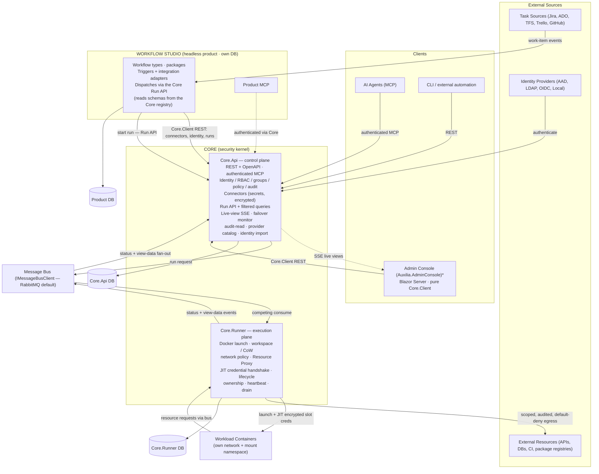

<sub>\* The original `BackendService` monolith has been **retired** (`docs/backend-service-retirement-plan.md`). Its backend capabilities moved into Core.Api (live-view SSE, failover/heartbeat monitor, audit-read, provider catalog, identity import); its triggers (scheduler + artifact-chaining) and integration adapters moved to Workflow Studio; and its UI is rehomed as `Auxilia.AdminConsole` (a pure `Auxilia.Core.Client` app). Core.Api and Core.Runner currently keep **separate** databases; consolidating them into one shared Core DB tier is planned — see §12 and the migration plan.</sub>

---

## 4. Key Components

### Core.Api — Control Plane
- The single **authentication + authorization authority**: hosts Governance (identity, principals, RBAC, **first-class groups**, the Policy Engine) and the audit authority. Every REST call and every MCP tool authenticates (API-key bearer) and is policy-checked per action — there is no unauthenticated or unauthorized path.
- **Connector administration**: stores connectors (credentials/settings for external systems) **encrypted at rest**; reads return setting *keys*, never values; secrets are decrypted only just-in-time at dispatch. Secrets live here and nowhere else.
- **Run API**: start a run inline ("on the fly"), from a stored configuration, or from a startup static seed; query runs with typed filters; cancel a run. It authorizes the caller, then dispatches a **self-contained `RunWorkflowCommand`** to Core.Runner over the bus (the runner has a different database and cannot resolve a Core principal, so it trusts Core-dispatched commands rather than re-authorizing).
- **Authenticated MCP** twin of the REST surface (`/mcp`), subject to the same policy authority — AI/service parity without a hand-maintained mirror.
- Stateless → scales horizontally behind a load balancer. Owns its own database.
- **Delivered** (BackendService retirement — `docs/backend-service-retirement-plan.md`): the **failover/heartbeat monitor** (bus-based liveness via `RunnerHeartbeat` + run-ownership carried on `WorkflowStatusEvent`), the **live-view SSE stream** (`GET /api/runs/{id}/stream`), **audit read** (`/api/audit`), the **provider catalog**, **identity-source import**, and **`run.on-behalf-of`** delegation on the Run API. Operator/admin UI is rehomed in `Auxilia.AdminConsole`.

### Core.Runner — Execution Plane
- The renamed, dissolved *Steering Instance*. Consumes run requests from Core.Api (competing consumers), **launches and configures the workload container correctly** — credentials, network policy, mounts, capability clamps, resource limits — and owns the full run lifecycle (see section 6). This is the single audited "configure the container correctly" chokepoint.
- Performs the **authenticated registration handshake**: injects a one-time instance token at launch, pre-creates the instance's exclusive response queue, and delivers each slot's configuration **just-in-time per slot activation**, encrypted for that instance — never an upfront bundle, never before the slot is used.
- Hosts the execution-side platform capabilities: the **Workspace Manager** (warm cache + per-run CoW snapshots), the **Network Egress Layer**, the **Resource Proxy**, artifact persistence, live view-data fan-out, and the drain coordinator for long-living workflows.
- Holds the **workflow schema registry** (`WorkflowSchemaStore`): at registration it stores each workflow type's embedded schema. The Core keeps the schema because it **validates every client-submitted configuration against it** — the client cannot self-certify — and so clients can fetch a schema to build a valid configuration.
- Emits ownership **heartbeats** for failover detection and publishes **status events** back to Core.Api (and to the dashboard).
- Scales via competing consumers on the run queue. Owns its own database.
- **Transition state:** Core.Runner still resolves credentialed slots from its own slot-configuration stores (seeded via the `slot-configurations` exchange); moving that resolution onto **Core connectors** and folding the runner's lifecycle store into a shared Core DB tier are the remaining consolidation steps.

### Workflow Studio — the Product
- A **headless** product host owning the **workflow-domain**: workflow types, packages, **triggers** (scheduler + artifact-chaining) and **integration adapters** (e.g. email) — dispatching runs through the **Core Run API** (`RunConfigurationAsync`/`RunAsync`, with `run.on-behalf-of` for the configured principal). Workflow **schemas live in the Core registry** (`WorkflowSchemaStore`); Studio **reads** them from the Core. The **configuration-editor UI and view rendering live in `Auxilia.AdminConsole`**, not here.
- A **client of the Core API** (`Auxilia.Core.Client`): it holds no credentials and touches no Core database. It keeps one **inbound bus subscription** (`workflow.artifact-events`, feeding artifact-chaining triggers) but publishes **no** dispatch commands to the bus — dispatch goes through the Run API.
- Exposes its own **authenticated Product MCP** for the workflow-authoring surface, which authenticates via the Core. Owns its own database.

### Admin Console — Operator/Admin UI
- `Auxilia.AdminConsole` is the Blazor Server operator/admin UI and a **pure `Auxilia.Core.Client` consumer** (REST + SSE): dashboard, run surfaces, connectors, provider catalog, identity sources, audit, and **view rendering** for run outputs. It holds **no database** and no secrets — every read/write goes through the Core API. Live views arrive over the Core.Api SSE stream, so there is no view backplane.
- There is **no separate Orchestration Service**: work-item intake and trigger decisions live in the Product; pre-flight, dispatch authority, and lifecycle live in the Core (Api + Runner). A standalone orchestrator would only forward decisions and add a failure mode without an isolation benefit.

### Message Bus - IMessageBusClient
- **Default: RabbitMQ** (runs locally in Docker, zero-config)
- **Cloud swap: Azure Service Bus** (drop-in alternative via the same interface)
- Carries run requests (Core.Api → Core.Runner), status/view events, Resource-Proxy traffic, and AI-assistance requests. Workload containers reach the platform **only** through here — never a direct call.

### Workspace Manager
- Manages **warm cache** entries for each repository — cloned once, kept current via background fetches via the Resource Proxy
- On workflow dispatch: checks repository access rights per repo per source system, then creates an **isolated CoW snapshot** per repository for that run
- Mounts all declared repository snapshots into the container under `/workspace/repos/<id>/` using Linux mount namespaces — the container sees only its own snapshots
- Mounts resolved artifact inputs read-only under `/workspace/artifacts/<input-name>/` and provides the declared artifact output location, persisted to the Artifact Store on run completion
- Supports **multiple repositories from different source systems** in a single workflow run (Git, TFVC, GitHub, ADO — each using the correct Account Bundle)
- Source-control writes (commits, pushes, PR creation) happen **mid-run, directly from the workflow** through its source-control slots with just-in-time scoped credentials. Post-exit output collection by the platform was rejected: it would duplicate traffic and block legitimate in-run operations such as reviewing git history. What a workflow may do is bounded by its **declared slot capabilities** (e.g. read-only vs. write) clamped by the **operator configuration** (e.g. allowed branch patterns, PR-only, no force-push). Enforcement is layered: the issued credential is scoped to the configured limits wherever the provider supports it (the hard backstop, valid even against a compromised process), and the slot handler enforces the same limits uniformly for all providers before executing an operation
- Enforces per-repo and per-tenant storage quotas
- Sensitive repositories can be marked `no-cache` in the workflow manifest — these are fetched fresh per run and deleted immediately after

### Artifact Store - IArtifactStore
- Persistent, pluggable store where named artifacts survive between runs — the producing run's CoW snapshot is destroyed at exit, so artifacts must be persisted by the platform
- **Production:** the workflow writes its declared artifacts to a dedicated output location in its workspace; on run completion the platform persists them into the store. What a workflow may produce is limited by its manifest declarations clamped by operator configuration
- **Consumption:** declared artifact inputs are resolved at dispatch time and mounted **read-only** into the container under `/workspace/artifacts/<input-name>/` — consumption is direct from the workflow's point of view, exactly like repository snapshots
- **References, not payloads, on the bus:** messages carry only artifact references (ID + content hash); payloads never travel through the message bus
- **Identity and lineage:** an artifact is identified by artifact type + producing workflow + work item + run + version. Versions of the same lineage are ordered, enabling "latest CodeReviewResult for work item X" resolution and trend comparison against prior versions (UC7)
- **Two concerns behind one interface:** the metadata index (lineage, versions, dispatch-time queries) and payload storage are separate concerns. Backends are pluggable per deployment: local filesystem (dev), Azure Blob / S3-compatible (cloud), or a database — a database backend can hold both payload and metadata for small structured artifacts, while blob backends pair with the platform database for metadata
- Retention periods and consumption access (which workflows/identities may read which artifact types) are operator configuration, enforced at dispatch-time resolution

### Platform Data Layer - Auxilia.UniversalDataAccess
- The same `IDataAccess` / `PlatformData` abstraction backs every service, but each points it at a **separate backend instance** (distinct Mongo database / JSON root): the **Core.Api DB** (principals, roles, groups, connectors + provider catalog with secrets encrypted at rest, the audit log), the **Core.Runner DB** (run lifecycle / ownership, schemas, slot configurations, provider registrations), and the **Product DB** (workflow types, configurations, signal handlers, view data, dashboards, triggers). No service reads another's store.
- Storage backend is pluggable behind the abstraction (InMemory for tests, JSON for dev, MongoDB for replicated production). There is **no Redis/SignalR view backplane**: live views fan out over the **Core.Api SSE stream** (see sections 14–15), and runner liveness rides the `RunnerHeartbeat` bus beat plus the runner's own `ServiceHeartbeatRecord` store.
- **Transition state:** consolidating the Core.Api and Core.Runner stores into a single **shared Core DB tier** (the two Core tiers are one family) is planned; today they are separate, and Core.Api hands the runner a self-contained run spec so no shared store is required.

### Audit Log
- Immutable, append-only record of every action: human and AI operations, policy decisions (allow **and** deny), credential deliveries per slot activation, Resource Proxy calls, network traffic (allowed and blocked), and workflow lifecycle transitions including retries and failovers
- Written by platform components only — workflows can neither write nor read it directly
- **Centralised in the Core** as the single immutable security trail (a deliberate exception to per-service databases: audit must not fragment); stored via the Platform Data Layer. Retention period and read access are operator configuration
- Verifies every workflow artifact before execution - no unsigned execution path exists
- In dev mode signing can be disabled entirely; no dev CA ceremony required locally
- Three production implementations depending on deployment mode (see section 12)
- Private key never touches the application process - only hash-in / signature-out

### Workflow Runner - IWorkflowRunner
- Abstracts how workflows are launched
- Three implementations depending on deployment mode (see section 12)

### Workflow C# SDK - NuGet Package
- Reference SDK for authoring workflows in C#; other language SDKs follow the same message contract
- Workflows declare in their manifest: required bundle types, produced artifacts, named resource dependencies, accepted artifact inputs, repository references (single or multi, multi-source), baseline network endpoints (minimum required, `package-proxy` preference), and `no-cache` flags per repository
- The manifest does **not** declare `allow-all` — that is a run-time operator decision resolved by the Policy Resolver at dispatch
- WorkflowContext carries: the originating work item, resolved named artifact inputs, scoped credentials, and repository mount paths
- Workflows compile to a self-contained executable, then are signed and pushed to the registry

### AI Integration Layer
- Routes AIAssistanceRequest messages (published by workflows) to the configured model adapter
- Pluggable adapters: GitHub Copilot, Azure OpenAI, custom models
- AI bundles carry usage quotas and purpose restrictions; pre-flight verifies the required bundle is available before dispatch
- All AI decisions are written to the audit log with full context
- See **section 5** for the full AI integration design including the MCP interface, audit contract, and bundle scoping

### Resource Proxy
- Platform-managed gateway through which workflows access external APIs, databases, build systems, and scan tools
- Workflow declares named dependencies (e.g. "github-api", "customer-db", "ci-runner") at authoring time
- Workflows are **trusted by signature**: the signing authority is responsible for verifying that a workflow is correct and trustworthy before signing it. A verified workflow is therefore permitted to hold scoped credentials directly — the protection model is *who gets credentials and when*, not hiding credentials from the workflow process
- Credentials are delivered **just-in-time**: a workflow receives a slot's credentials only at the moment it activates that slot, encrypted for that specific workflow instance — never as a blanket grant at startup, and never for slots it does not use in that run
- Supports two call patterns: **synchronous** (request/response) and **async long-running** (submit job, receive handle, poll or await callback via message bus)
- All proxy calls are audited; rate limiting and access policy enforced per workflow identity

### Network Egress Layer
- Enforces the **effective network policy** for each run, resolved at dispatch time from manifest baseline + run configuration + platform policy ceiling
- Default mode: **default-deny** — only endpoints in the resolved allowlist are reachable; all other outbound traffic is blocked and logged
- Optional mode: **allow-all** — requested via run configuration or global tenant config; all traffic is still fully logged; platform policy can prohibit this mode entirely
- Build tools and package managers (`dotnet restore`, `npm install`, `pip install`, etc.) work transparently within allowed endpoints — no per-tool abstraction required
- All outbound traffic (allowed and blocked attempts) is written to the run audit log

### Package Proxy (optional)
- Platform-managed mirror of public package registries (NuGet, npm, PyPI, Cargo, Go modules, etc.)
- When enabled: the Network Egress Layer routes all package manager traffic through the proxy rather than directly to the public registry
- Provides: **caching** (packages fetched once, served locally on subsequent runs), **security scanning** (packages scanned before serving), and **air-gap support** (enterprise environments with no internet access)
- Can be configured per registry — e.g. route NuGet through the proxy but allow npm direct access
- Not required — workflows function without it as long as the registry endpoints are declared and reachable

### MCP Server
- MCP is a **first-class, authenticated** surface, split to match the two products: the **Core MCP** (on Core.Api) exposes runtime / connector / identity / group tools; the **Product MCP** (on Workflow Studio) exposes workflow-authoring tools and authenticates via the Core.
- Every tool authenticates (API-key bearer, principal-bound) and is policy-checked against the **same authority as REST** — AI and service principals get UI parity with no hidden operations and no separately maintained mirror.
- Representative Core tools: `run_workflow`, `run_configuration`, `list_runs`, `get_run`, `cancel_run`, `list_connectors`, `create_connector`, `create_group`, `assign_group_role`.

### Integration Adapters
- Integration adapters live in **Workflow Studio** — the product owns *which* workflow a work item should run — and they start it by calling the Core **Run API**, never by publishing to the bus directly. Two adapter contracts:
- **ITaskSourceAdapter** — read work items (full detail including linked items, history, attachments), update status, create work items, create sub-tasks, attach artifact references (`AttachArtifact`)
- **ISourceControlAdapter** — clone, diff, branch, commit, push, create PR; plus lightweight introspection: ListDirectory, GetFileContent, DetectFrameworks (no full clone required)

---

## 5. AI Integration Layer

AI agents are first-class citizens in Auxilia. They interact through the same interfaces as human users — via the MCP Server — and are subject to the same policy, audit, and identity rules.

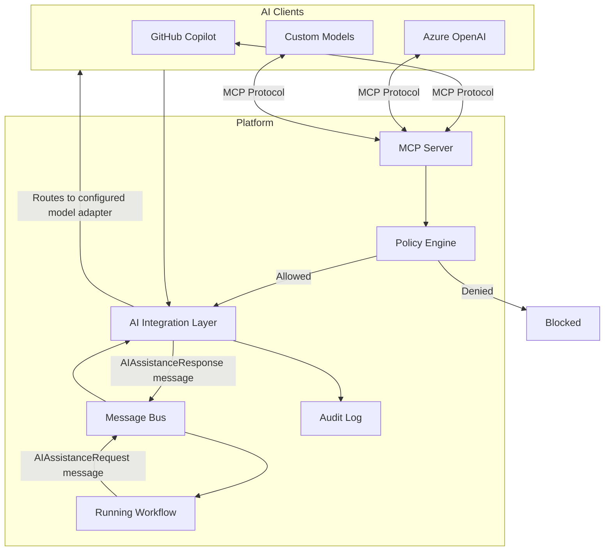

**Key properties:**
- AI agents authenticate with their own **Account Bundle** (AI bundle) — subject to the same policy checks as human users
- Workflows request AI assistance by publishing an `AIAssistanceRequest` message to the bus; they do not call the model directly
- The AI Integration Layer resolves the appropriate model adapter from the AI bundle, makes the call, and returns the response via the bus
- Multiple AI bundles of different types can be configured (e.g. Azure OpenAI for code generation, a custom model for security analysis)
- AI bundles carry **usage quotas** and **purpose restrictions** — a bundle scoped to code review cannot be used for arbitrary queries
- Every AI decision is written to the **immutable audit log** with full context: the request, the model used, the response, and the workflow step that requested it
- Pre-flight check verifies the required AI bundle is present and within quota before a workflow is dispatched
- **MCP tools** give AI agents the same operations as the human UI: trigger workflow, get status, send input, approve step, cancel, list work items — no hidden operations

---

## 6. Workflow Lifecycle

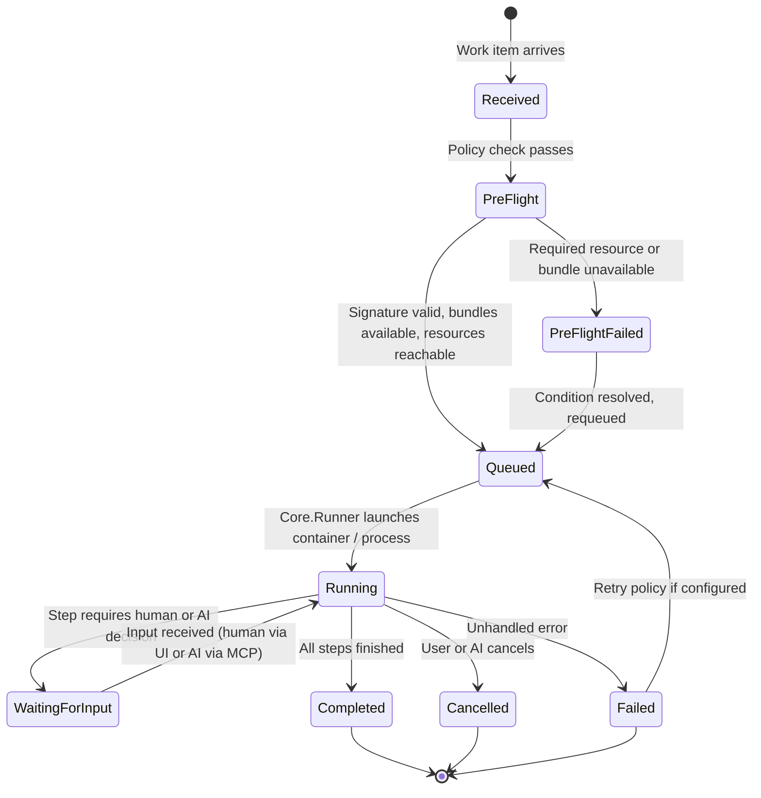

**Key lifecycle properties:**
- Workflows are **stateful and long-running** - once started they run until Completed, Failed, or explicitly Cancelled
- A **pre-flight check** runs before any workflow is dispatched, verifying that signature, required account bundles, resource proxies, and AI accounts are all available; it also fetches and verifies the signed `*.workflow.zip` package and pre-loads the workflow schema into the schema store
- If pre-flight fails the work item is held and the user/AI is notified; it can be requeued automatically when the condition resolves (configurable)
- **Schema pre-loading**: the `WorkflowAnnouncementHandler` reads `workflow-schema.json` from the extracted ZIP package and populates `WorkflowSchemaStore` before sending the `Run` directive — no `EmitSchema` round-trip is required
- **Workflow artifacts** are declared by the workflow and configured by the user - where they are stored and how they are linked back to the work item is a per-workflow configuration
- **Workflows are not resumable (v1)**: there is no checkpointing — a retry after `Failed`, and failover after an orphaned Core.Runner, always means *kill and restart from scratch*. Because a failed run may already have performed external writes, every external write a workflow performs must be **idempotent or guarded** (branch-exists check, find-or-create PR, deduplicated comments) — this is part of the workflow SDK contract
- **Failures and restarts are never silent**: every failure, retry, and orphan reassignment is published as a status event and shown in the dashboard (and via MCP), so the user always sees that a run was restarted and why

### Trigger model

A dispatch originates from one of four trigger sources; all of them converge on the Core **Run API**, which authorizes the request and dispatches it to the Core.Runner pool:

| Trigger | Source |
|---|---|
| **Work item event** | Integration Adapters detect work item changes (created, moved to a configured state) and publish dispatch commands |
| **Manual** | A human via the dashboard/Studio or an AI agent via the Core MCP `run_workflow` tool — both resolve to a Core Run API call |
| **Schedule** | The platform scheduler (in Workflow Studio) for recurring runs, e.g. nightly security scans — dispatched through the Core Run API |
| **Artifact completion** | A finished run's persisted artifact triggers a configured follow-up workflow (e.g. CodeReviewResult → Selective Fixing) — workflow chaining without coupling the workflows to each other |

Which triggers are active for a workflow is operator configuration, subject to the Policy Engine.

### Workflow lifetime: one-shot vs. long-living

Workflows declare their **lifetime** in the manifest:

| Lifetime | Behaviour |
|---|---|
| **one-shot** (default) | Runs exactly once for a single trigger and always shuts down afterwards — minimises credential exposure and data retention |
| **long-living** | A service-style workflow that stays running and processes many work items / events over time (e.g. a standing review agent, a queue monitor) |

Long-living workflows keep every invariant of the platform, with these adaptations:

- **Credentials still arrive just-in-time per slot activation, but carry an expiry** — the SDK transparently re-requests a slot's configuration from Core.Runner when it expires; long-lived processes never hold indefinitely valid secrets
- **Dirty-configuration handling**: when a stored configuration is changed or marked dirty, Core.Runner signals the instance to **drain and shut down**; the replacement starts with the new configuration. Upgrade to a new workflow version works the same way (drain + replace)
- **Draining is a visible lifecycle state**: a draining instance finishes in-flight work but accepts no new triggers, and is shown as `Draining` in the dashboard until it exits
- **Still not resumable**: a crash or failover is a fresh restart that re-subscribes to its triggers; the idempotency obligations of section 6 apply unchanged
- **Operator opt-in**: because one-shot is the security default, deploying a long-living workflow requires explicit operator approval in the platform configuration

---

## 7. Security and Signing

```mermaid
graph TD
    subgraph Workflow Trust
        DEV["Developer submits *.workflow.zip"] --> SIGN_SVC["Trust Service signs ZIP package"]
        SIGN_SVC --> REG["Workflow Registry"]
        REG --> WR["Workflow Runner"]
        WR --> VERIFY["WorkflowPackageVerifier: RSA-PSS signature and manifest verified before execution"]
        VERIFY -->|Valid| LAUNCH["ZIP extracted; process launched from extracted content"]
        VERIFY -->|Invalid| REJECT["Execution rejected - always"]
        VERIFY -->|Dev mode - signing off| LAUNCH
    end
    subgraph Identity and Policy
        REQUEST["Any request - UI or MCP"] --> SEC["Security Service"]
        SEC --> IDP["Identity Provider (AAD / LDAP / OIDC / Local)"]
        IDP --> POLICY["Policy Engine"]
        POLICY -->|Allowed| DISPATCH["Dispatch (Core.Api → Core.Runner)"]
        POLICY -->|Denied| BLOCK["Blocked"]
    end
```

**The Workflow Registry and Trust Service above are implemented in Core.Api** (delivered 2026-07-26): workflow types are registered **permanently** (until unregistered) via `POST /api/workflow-types` with their signed package coordinate, and **runs reference the type only** — `RunRequest`/configurations carry no package URI; `RunService` resolves the coordinate from the registry and refuses non-Active types. Trust decides the status: a package signed by a **trusted publisher key** (`CoreApi:TrustedPublisherKeys`, or the platform signing key) activates immediately; anything else — an untrusted signature, or a `docker://` image with no verifiable signature — enters **Pending** until the signing authority (`workflow-type.sign`, Administrator-only; operators only register) approves or **denies with a recorded reason**. A package may also be **transferred to the Core** (base64 upload): it is stored Core-side, served to the runner via a per-dispatch token-authorized URL (`core://` coordinate), and on approval **re-signed with the platform signing key** (`CoreApi:SigningKeyPemFile`) so the platform becomes the publisher of record. Pending registrations run through a **pluggable approval pipeline** (`CoreApi:ApprovalHandlers`, a DI-bound name-keyed handler catalog — e.g. the email notifier today, an AI safety-check workflow later); all-defer leaves the decision to a human. Operator-controlled deployments seed Active types from host configuration (`CoreApi:StaticWorkflowTypes`). Runtime schema announcements from the runner **refresh** a registered type's schema but never create catalog entries — registration is the only way in. Everything is audited (`workflow-type.register` / `workflow-type.sign`).

**Key principles:**
- Signing can be **fully disabled in dev mode** - there is no ceremony, no dev CA required locally
- In all non-dev modes signing is mandatory with no bypass; the signed artifact records what the workflow *is* — permissions and network policy are resolved at runtime, not locked into the artifact
- **The signature is the basis for credential delivery**: the signing authority is responsible for ensuring a workflow is correct and trustworthy. Only a signature-verified workflow may receive credentials, and it receives them just-in-time per slot activation — encrypted for the specific instance, scoped to the slot's declared capabilities, and never before the slot is actually needed
- **The registration handshake is authenticated**: channel encryption alone does not authenticate the requester. Core.Runner injects a **one-time instance token** into the container/process at launch and pre-creates an **exclusive response queue** per instance; announcements and registration requests must present the token (validated, single-use, time-limited), and directives/configurations are only ever delivered to that pre-created queue — the request's self-declared response topic is ignored. Token-less operation exists only behind the `RequireInstanceToken=false` setting for trusted-operator dev scenarios
- Workflows have **no arbitrary outbound network access** — effective network policy is resolved at dispatch from three layers (manifest baseline, run configuration, platform policy ceiling) and enforced at the kernel level; see section 10
- Structured API calls (task sources, source control, databases) go through the Resource Proxy; build toolchain calls (package restore, etc.) go through the Network Egress Layer
- Every action (human or AI) is written to an immutable audit log
- TFVC / TFS is explicitly supported as a source control target for enterprises that have not yet migrated

---

## 8. Resource Access Model

Workflows interact with external systems through two distinct channels depending on the nature of the call.

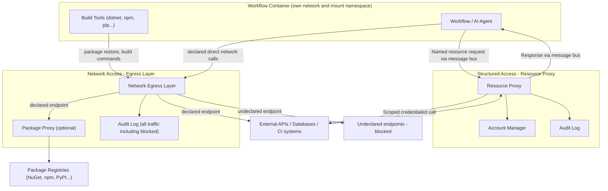

**Resource Proxy (structured calls):**
- Used for all calls where the platform mediates credentials: task sources, source control push, databases, CI triggers
- Workflow declares named dependencies in its manifest; at runtime the platform resolves the correct Account Bundle
- Supports synchronous and async long-running patterns (trigger + poll/callback via message bus)
- The workflow holds no credentials **prior to slot activation**. Because every workflow is signature-verified before launch, it is trusted to receive scoped credentials — but only just-in-time, per slot, encrypted for that workflow instance, and only for the slots it actually activates during the run

**Network Egress Layer (toolchain and direct calls):**
- Used for build tools, package managers, and any other direct network calls the workflow needs
- The manifest declares allowed endpoints and their purpose; enforcement is at the kernel network namespace level
- Build tools work transparently — `dotnet restore` hits the declared NuGet endpoint with no per-tool abstraction
- All traffic is logged; blocked attempts are flagged in the audit trail

**Network policy modes:**

| Mode | Behaviour | When to use |
|---|---|---|
| **default-deny** (default) | Only declared endpoints are reachable; all else blocked and logged | All production workflows |
| **allow-all** | All outbound traffic permitted; everything still logged | Requested via run configuration or global tenant config; platform policy can prohibit entirely |

---

## 9. Workspace Management

Workflows operate on local filesystem copies of repositories rather than streaming content through the message bus. The **Workspace Manager** manages this entirely on behalf of the workflow.

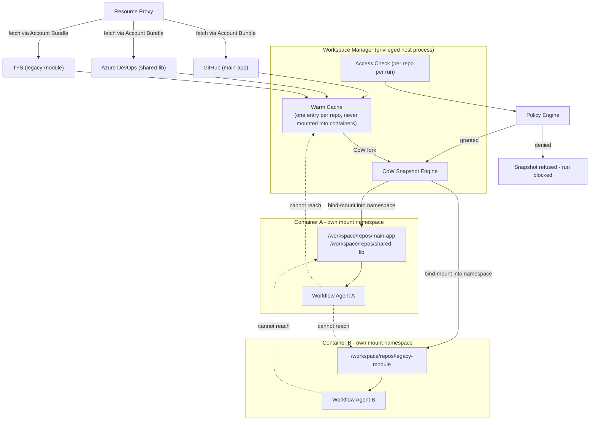

**Multi-source repository support:**
- A workflow manifest declares all required repositories with their source system and identifier
- Each repository is fetched and cached independently using the correct Account Bundle for its source
- All declared repos are mounted into the container under `/workspace/repos/<manifest-id>/`
- Access is checked independently per repository — a workflow only gets snapshots for repos it is authorised to access

**Isolation layers:**

| Layer | Mechanism |
|---|---|
| Run-to-run isolation | Each run gets its own CoW snapshot; writes do not affect other runs or the warm cache |
| Cross-run filesystem | Linux mount namespaces — a container can only see its own mounted snapshots |
| UID isolation | Each container runs as a distinct unprivileged UID; snapshot ownership prevents cross-run reads even if namespace fails |
| Warm cache protection | Cache directory is host-only, owned by the Workspace Manager, never bind-mounted into any container |
| Write-back control | Workflow pushes directly via its source-control slot mid-run; permitted operations are limited by the slot's declared capabilities (read/write) clamped by operator configuration (branch patterns, PR-only, no force-push) |

**Warm cache behaviour:**
- Cache entries are populated on first fetch and kept current by background `git fetch` / equivalent per source system
- A cache entry may only be used to create a snapshot if the requesting identity independently passes an access check for that repository
- Repositories marked `no-cache` in the manifest are fetched fresh per run and deleted immediately after — for high-sensitivity codebases
- Per-tenant cache storage is physically separate in multi-tenant deployments, encrypted at rest using tenant-specific keys

---

## 10. Network Isolation Model

The container network model separates three categories of outbound communication and handles each appropriately.

### Policy resolution

The effective network policy for a run is resolved from three independent layers at dispatch time — the signing record is not involved:

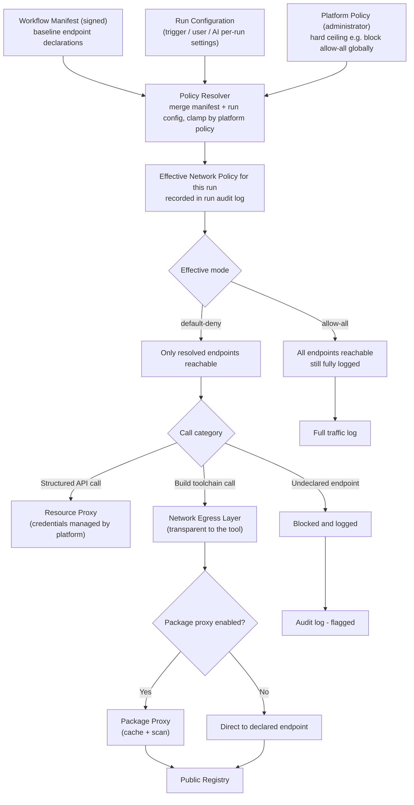

**Layer responsibilities:**

| Layer | Set by | Scope | Examples |
|---|---|---|---|
| **Workflow manifest** | Workflow author (signed) | Per workflow artifact | Minimum required endpoints, `no-cache` repo flags, `package-proxy` preference |
| **Run configuration** | Trigger, user, or AI at dispatch | Per run | Additional allowed endpoints for this invocation, `allow-all` for a sandbox run |
| **Platform policy** | Administrator | Global or per-tenant | Maximum permitted mode (e.g. deny `allow-all` entirely), mandatory endpoint blocklists |

The effective policy is `merge(manifest_baseline, run_config)` clamped by `platform_policy`. It is computed at dispatch and written to the run audit log — not stored in the signed artifact.

**Manifest declaration (baseline, signed with the workflow):**
```yaml
network:
  allow:
    - endpoint: api.nuget.org
      purpose: NuGet package restore
    - endpoint: registry.npmjs.org
      purpose: npm install
  package-proxy: true
```

**Run configuration (per-run, set at trigger time, not signed):**
```yaml
network:
  mode: allow-all           # operator opt-in for this run only
  allow:
    - endpoint: internal-api.corp.local
      purpose: integration test target
```

**allow-all mode:**
- Requested in the run configuration (per-run) or in platform configuration (global default for a tenant)
- Not part of the signed workflow artifact — the same binary can run in `default-deny` in production and `allow-all` in a sandbox without re-signing
- All traffic is still fully logged — the difference from `default-deny` is that nothing is blocked, not that nothing is observed
- Platform policy is the hard ceiling: administrators can prohibit `allow-all` entirely, regardless of what any run configuration requests
- The effective mode and the identity that requested it are always recorded in the run audit log

---

## 11. Multi-Account Model

A user or service principal holds multiple **Account Bundles**, each scoped to a purpose.

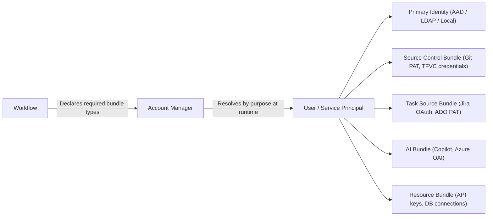

- Workflows declare *which bundle types* they need - never specific credentials
- Bundles are encrypted at rest **in the Core** (as connectors); Core.Runner decrypts and re-encrypts the relevant scoped subset for a specific workflow instance only at slot activation time — never earlier, and never more than the activated slot requires
- AI bundles carry usage quotas and purpose restrictions
- Multiple bundles of the same type are supported (e.g. two ADO instances, a GitHub and a Jira account)

---

## 12. Deployment Modes

All modes share the same codebase. Runtime behaviour is driven entirely by configuration and pluggable interface implementations.

**Deployment topology.** A deployment runs three platform services (each with its own database) plus the admin console UI:

| Service | Role | Database | Scaling |
|---|---|---|---|
| `Auxilia.Core.Api` | Control plane (auth authority, connectors, Run API, Core MCP, live-view SSE, failover monitor, audit-read, provider catalog, identity import) | Core.Api DB | Stateless behind a load balancer |
| `Auxilia.Core.Runner` | Execution plane (launch, JIT creds, lifecycle, heartbeat-emit) — needs the Docker socket / a container runtime | Core.Runner DB | Competing consumers on the run queue |
| `Auxilia.WorkflowStudio` | Headless workflow product (types/packages, triggers + integration adapters, Product MCP) — dispatches via the Core Run API | Product DB | Stateless client of the Core |
| `Auxilia.AdminConsole` | Operator/admin UI (Blazor Server) — a pure `Auxilia.Core.Client` consumer (REST + SSE); holds no database | — (pure Core client) | Sticky sessions (Blazor circuit); no view backplane |

Platform services (RabbitMQ, MongoDB) are deployed by Compose / k8s as they are today — the Core runs **workload containers only**, it is not a platform supervisor. There is **no Redis/SignalR view backplane**: live views fan out over the Core.Api SSE stream (see §14–§15).

| Mode | Message Bus | Workflow Runtime | Signing | Identity |
|---|---|---|---|---|
| **Local / Dev** | RabbitMQ in Docker or in-process | OS Process (fully debuggable) — signed `*.workflow.zip` extracted and bind-mounted | Disabled (no ceremony) | Local accounts |
| **On-premise** | RabbitMQ cluster | Docker / k3s — signed `*.workflow.zip` extracted and bind-mounted | HashiCorp Vault Transit | LDAP / AD / OIDC |
| **Cloud (Azure)** | Azure Service Bus | AKS — signed `*.workflow.zip` extracted and bind-mounted | Azure Key Vault | Entra ID |

Pluggable interfaces: **IMessageBusClient**, **IWorkflowRunner**, **ISigningProvider**, **IIdentityProvider**, **IResourceProxy**, **IArtifactStore**
The core platform has no hard dependency on RabbitMQ, Docker, Vault, AAD, or a specific artifact storage backend.

**Isolation guarantees are container-only.** The workspace isolation (mount namespaces, UID isolation, CoW snapshots — section 9) and kernel-level network policy enforcement (section 10) exist only in the container runtimes (Docker / k3s / AKS). In **Local / Dev** mode the workflow runs as a plain OS process — typically on the developer's own machine, including Windows — with **no isolation and no network enforcement**. Dev mode is therefore **trusted-operator-only**: it must never be exposed to untrusted workflows, untrusted users, or production credentials. The security guarantees this document describes apply to the container-based modes.

The execution isolation layer v1 realizes default-deny only as full internal-network isolation for runs declaring no endpoints; endpoint-granular egress enforcement and mount-namespace/UID hardening beyond Docker defaults are tracked follow-ups.

---

## 13. Open Questions and Concerns

### Resolved from use case analysis (docs/USE-CASES.md)

| # | Decision |
|---|---|
| 1 | WorkflowContext carries: originating work item, named artifact inputs from prior runs, scoped credentials, and optional multi-repo references |
| 2 | ITaskSourceAdapter extended with GetWorkItemDetail (full graph), CreateWorkItem, CreateSubTask, and AttachArtifact |
| 3 | ISourceControlAdapter extended with ListDirectory, GetFileContent, DetectFrameworks for lightweight introspection |
| 4 | Resource Proxy supports both synchronous and async long-running call patterns (trigger + poll/callback) |
| 5 | WorkflowContext supports single or multi-repository references declared in the workflow manifest |
| 6 | Workspace Manager added: warm cache per repo, CoW snapshots per run, mount namespace isolation, multi-source repo support, no-cache flag; write-back happens mid-run via capability-limited source-control slots |
| 7 | Network Egress Layer added: layered policy resolution (manifest baseline + run config + platform ceiling), default-deny, allow-all opt-in, build tool transparency, full audit |
| 8 | Package Proxy added: optional platform mirror for package registries, caching, security scanning, air-gap support |

### Still open

| # | Question | Impact |
|---|---|---|
| 7 | **Pre-flight retry granularity** - Is retry-on-availability configured globally, per workflow type, or per work item? | UX, reliability |
| 8 | **TFVC version scope** - TFS 2015/2017 in scope or only TFS 2019+ / Azure DevOps Server? | Adapter effort |
| 9 | **Work Item Index (deferred)** - Optional similarity search service for refinement quality. Not required for v1. | Future use case quality |

### Intentional design decisions

| # | Decision |
|---|---|
| 10 | **Network policy is layered, not signing-time** — the manifest declares a baseline (minimum required endpoints); run configuration can extend it (e.g. `allow-all` for a sandbox run); platform policy is the hard ceiling (can prohibit `allow-all` entirely). Effective policy is resolved at dispatch and recorded in the run audit log — the signed artifact is unchanged |
| 11 | **AI has full parity with the human UI** - MCP tools are generated from the same API layer, not maintained separately |
| 12 | **Signing is mandatory with no bypass in non-dev modes** - dev mode can disable signing entirely |
| 13 | IMessageBusClient, IWorkflowRunner, ISigningProvider, IIdentityProvider, and IResourceProxy are all pluggable - no hard dependency on any specific technology |
| 14 | **Workflows are trusted via signature, credentials are delivered just-in-time** — the signing authority vouches for the workflow's correctness; a verified workflow may hold scoped credentials directly, but receives each slot's credentials only at slot activation, encrypted per instance, never as an upfront bundle |
| 15 | **Artifact persistence via pluggable `IArtifactStore`** — production is direct but manifest/config-limited; consumption is resolved at dispatch and mounted read-only into the container; the bus carries references (ID + hash), never payloads; backends (filesystem, blob, database) are a deployment choice |
| 16 | **No separate Orchestration Service** — trigger decisions live in the Product; the dispatch authority lives in **Core.Api** (the Run API); container launch, pre-flight, and lifecycle live in **Core.Runner**. A standalone orchestrator would only forward decisions and add a failure mode without an isolation benefit |
| 17 | **Unified principal model with deny-by-default RBAC** — humans, AI agents, and services are all principals through the same Policy Engine (hosted in Core.Api); four built-in roles (Administrator, Operator, User, Auditor) plus **first-class groups** (a principal's effective roles are the union of its direct assignments and its groups'); workflow-type access lists as the primary instrument; single-tenant v1 with `TenantId` on every resource (see section 16) |

---

## 14. Scaling

The admin console UI, the control plane (Core.Api), and the execution layer (Core.Runner) have different scaling characteristics and are solved independently.

---

### 14.1 Admin Console (Blazor Server) Scaling

The Admin Console (`Auxilia.AdminConsole`) is a Blazor Server app, so each browser holds a live circuit pinned to one console instance:

- **Sticky sessions** at the load balancer — a client always returns to the same console instance for the lifetime of its circuit
- **Live views over the Core.Api SSE stream, not a backplane** — when a circuit opens a run's live view the console opens a `GET /api/runs/{id}/stream` SSE subscription to Core.Api; Core.Api's `RunStreamPublisher` consumes the bus status/view-data fanouts and its `RunStreamBroker` fans each event to every open SSE subscription for that run. Each console instance subscribes independently, so **no Redis/SignalR backplane is needed between console instances** — the fan-out point is Core.Api, not the Blazor tier

Console instances are stateless from a data perspective (pure Core clients). Instances can be added or removed at any time.

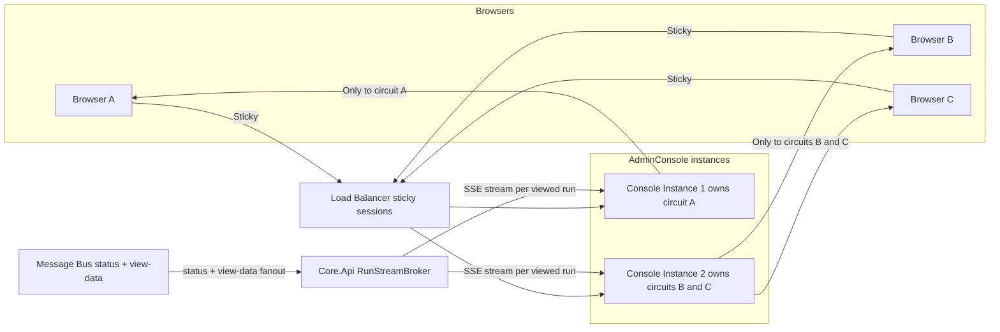

---

### 14.2 Core.Runner Scaling

Core.Runner instances scale via **competing consumers** on the RabbitMQ run-request queue — adding instances increases dispatch throughput automatically.

Once a Core.Runner picks up a run it becomes the **owner** for its lifetime (it holds the container/process handle). Two concerns follow:

- **Ownership tracking** — each run's lifecycle record carries the owning runner's service ID (also propagated on `WorkflowStatusEvent.OwnerServiceId` / `CommandId`); each runner writes liveness heartbeats. The runner keeps both in its own **platform data layer** (`ServiceHeartbeatRecord`) and additionally publishes a `RunnerHeartbeat` on the bus. There is **no Redis** in this path; moving the hot heartbeat path onto a cache is a possible later optimization, not a semantic change
- **Failover** — each Core.Runner publishes a `RunnerHeartbeat` (`platform.runner-heartbeats`); the **failover monitor now runs in Core.Api** (`FailoverMonitor` + `RunnerLivenessTracker`), tracking liveness purely from the bus beat so it never reads the runner's database (the Core/Runner DB split holds). When a beat goes stale it finds the dead runner's non-terminal runs in the **Core's own** store, terminates each gracefully via its per-run cancel queue (no Docker access required), marks it Failed, and re-dispatches the stored dispatch command **once** (guarded so a re-failed run is not re-dispatched again). Recovery is always a fresh restart from scratch (workflows are not resumable, see section 6) — exactly once per orphaned run, so failovers never cascade; the failover event is surfaced in the UI so the user sees the run was restarted

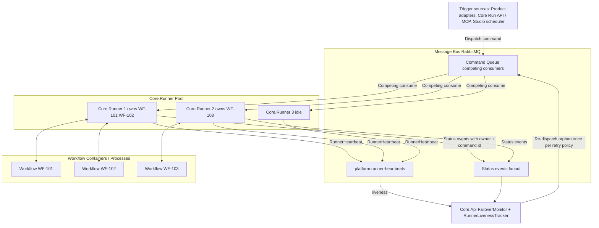

---

### 14.3 Full Scaled Event Flow

End-to-end path of a workflow status update from container to browser when fully scaled out:

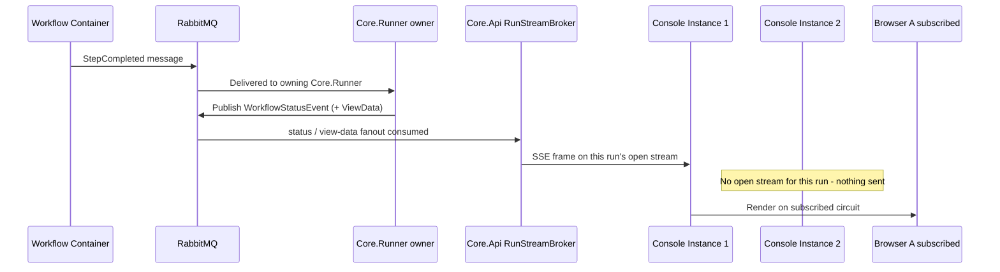

---

### 14.4 Infrastructure Summary per Mode

| Component | Local / Dev | On-premise | Cloud (Azure) |
|---|---|---|---|
| Admin Console instances | 1 | N + sticky LB (live views via Core.Api SSE) | N + Azure Front Door (live views via Core.Api SSE) |
| Core.Runner instances | 1 | Pool via competing consumers | Pool via competing consumers with auto-scale |
| Ownership and heartbeat store | Not needed | Runner platform data layer (MongoDB) + `RunnerHeartbeat` on the bus | Runner platform data layer + `RunnerHeartbeat` on the bus |
| Message bus | RabbitMQ single in Docker | RabbitMQ cluster | Azure Service Bus |
| Workflow runtime | OS Process | Docker / k3s | AKS node pool |

Live-view fan-out uses the **Core.Api SSE stream**, not a Blazor/SignalR backplane, so **no Redis is required for the UI tier**. Runner ownership and liveness live in the runner's platform data layer plus the `RunnerHeartbeat` bus beat — also no Redis. (Moving the hot heartbeat path onto a cache such as Redis remains an optional later optimization.)

---

## 15. Live View Data and Pluggable Dashboards

Workflows expose data to the frontend through a single general mechanism: **named, schema-declared views**. A live agent conversation, a progress log, a findings table, and a finished run's result page are all the same concept — only the rendering hint and the data lifecycle differ.

### View declaration

The workflow schema (embedded in the signed package) declares the views a workflow provides:

```yaml
views:
  - name: agent-conversation
    schema: AgentMessage          # JSON schema of one data item
    rendering: stream             # hint: stream | log | table | chart | markdown | custom
    lifecycle: live+persisted     # live, persisted, or both
  - name: review-findings
    schema: CodeReviewFinding
    rendering: table
    lifecycle: persisted
```

### Data flow

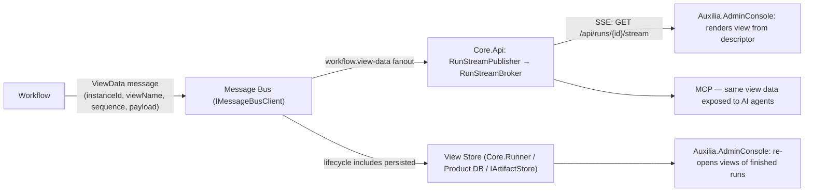

- Workflows publish `ViewData` messages: an envelope of `(instanceId, viewName, sequence, payload)` where the payload conforms to the declared view schema. The bus carries only view data items — large blobs belong in the Artifact Store, referenced from the payload
- **Live**: Core.Api's `RunStreamPublisher` consumes the `workflow.view-data` fanout and its `RunStreamBroker` re-emits each item over the SSE stream (`GET /api/runs/{id}/stream`, section 14); the Admin Console consumes that SSE on its Blazor circuit and renders from the descriptor — a live agent view is simply a view with `rendering: stream`. There is **no SignalR/Redis backplane**
- **Persisted**: view data is stored so the Admin Console can re-open the views of completed runs — viewing finished workflow results uses the identical rendering path as live data, replayed from the store
- **Generic rendering**: the frontend renders views purely from the descriptor (schema + rendering hint); adding a new workflow with new views requires **no frontend changes**. A `custom` rendering hint allows future pluggable visual components
- **AI parity**: the MCP server exposes the same views to AI agents — no hidden data channel

### Dashboard composition

Dashboards are composed of views: per-run dashboards come from the run's workflow schema automatically; operators can pin views from multiple workflows into shared dashboards. Access to a view follows the same permission model as the workflow it belongs to.

---

## 16. Governance and RBAC

Every operation in Auxilia — human, AI, or service — is performed by an authenticated **principal** and authorized by the **Policy Engine**, hosted in **Core.Api** as the platform's single authentication + authorization authority. There are no anonymous operations and no unaudited decisions. See `docs/delivered/governance-rbac-design.md` for the implementation plan.

### Principals

| Principal kind | Authenticates via | Notes |
|---|---|---|
| **Human user** | Identity Provider (Local, OIDC/AAD/LDAP) | Interactive dashboard sessions |
| **AI principal** | Its own Account Bundle (API key / token) via MCP | Full UI parity; additionally constrained by the AI bundle's purpose restrictions and usage quotas |
| **Service principal** | Platform-issued credentials | Integration adapters, schedulers, platform components acting on their own behalf |

All three kinds flow through the same role, permission, and audit machinery — an AI principal is not a special case, it is a principal with extra bundle-level constraints.

### Built-in roles

| Role | May |
|---|---|
| **Administrator** | Configure identity providers and group mappings, platform policy ceilings, tenants, retention, signing configuration; assign roles; manage all principals |
| **Operator** | Install/enable workflow types, manage slot configurations and operator clamps (branch patterns, PR-only, network endpoints), approve long-living workflow deployment, configure task sources and triggers, manage shared dashboards |
| **User** | Trigger permitted workflow types, observe permitted runs and views, answer RequestInput / approval steps routed to them, use per-run dashboards |
| **Auditor** | Read-only access to the audit log and run history — no operational permissions |

Roles are **permission sets**, not flags: v1 ships these four fixed roles; custom roles are a schema-compatible later step. A principal can hold multiple roles.

### Permission model

An authorization check is the triple **(principal, action, resource)** evaluated **deny-by-default**:

- **Actions** are fine-grained verbs per resource type: `workflow.trigger`, `workflow.cancel`, `run.observe`, `run.provide-input`, `view.subscribe`, `artifact.consume`, `slot-config.write`, `bundle.manage`, `policy.administer`, `audit.read`, …
- **Resources** carry a scope chain: `tenant → workflow-type → run/view/artifact`. A grant at an outer scope implies the inner ones unless explicitly narrowed
- **Workflow-type access lists** are the primary day-to-day instrument: operators declare per workflow type which roles or individual principals may trigger, observe, and approve it
- v1 is **single-tenant**, but every resource and grant carries a `TenantId` (default tenant) so multi-tenancy is a data migration, not a schema break

### Policy Engine evaluation

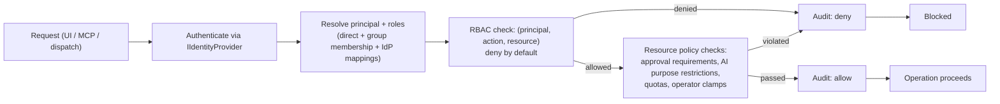

Both outcomes are always audited. The Policy Engine is a library used at every enforcement point in the Core — every REST endpoint, the Core MCP, dispatch (the Run API's trigger check), and administration operations — and the Product authorizes through the Core, so UI and MCP cannot diverge.

### Groups and group mapping

Roles reach a principal three ways, unioned deny-by-default: **direct** assignment; membership in a **first-class group** (`GroupDirectory` + `GroupRoleResolver` — a group carries members and roles, and a member inherits the group's roles); and IdP **mapping**, where an administrator maintains `(identity provider, group) → role(s)` mappings so corporate directory groups (AAD/LDAP/OIDC claims) translate to Auxilia roles at sign-in without per-user administration. A principal's **effective roles are the union of all three**. First-class groups and their role assignments are administered in the Core (REST + authenticated MCP: `create_group`, `add_group_member`, `assign_group_role`); IdP mappings are evaluated at session start and cached for the session lifetime.

### Administration

Identity administration (principals, role assignments, **groups**, group mappings, platform policy ceilings, retention, the audit-log viewer) is a **Core.Api** responsibility — surfaced through the Core admin console and the Core MCP. Workflow-domain configuration (workflow-type access lists, slot→connector bindings, operator clamps, triggers, shared dashboards) lives in **Workflow Studio**. Both authenticate against the one Core policy authority, so UI and MCP cannot diverge. These pages are surfaced by `Auxilia.AdminConsole`, a pure Core client.

---

*Document maintained in docs/ARCHITECTURE.md — update alongside major design decisions. See also docs/USE-CASES.md.*