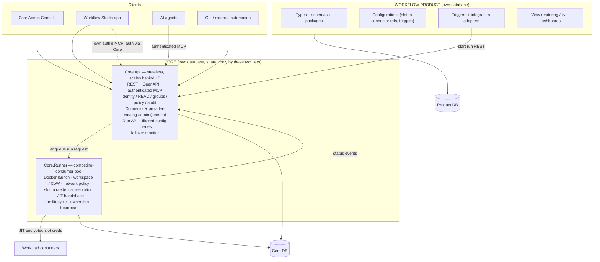

# Core Platform Separation — Design & Migration Plan

> **Status:** Draft v1 · 2026-07-24
> **Owner:** Felix Klakow
> **Scope:** Split the current Blazor monolith into a workflow-agnostic **Core** (a secure container runner + platform kernel with its own Web API) and a separate **Workflow** product that consumes it. Post-demo; the goal is a proper product, optimised for **security, separation, and scaling**.

---

## 1. Goal & guiding principles

Carve the platform into a **Core** — a "dumb" service that configures workload containers *correctly* and runs them on demand — and a **Workflow product** that owns everything domain-specific and is a pure client of the Core Web API.

Principles (these are the invariants; every decision below serves them):

1. **The Core is a secure, dumb runner.** It runs *workload* containers (one-off, long-living, configured) and configures them correctly — credentials, network policy, mounts, capability clamps, resource limits. It does **not** know what a workflow *is*.
2. **The Core is the security kernel.** Identity, RBAC/groups, policy, audit, connector credentials, and just-in-time credential delivery all live here. It is the single authentication and authorization authority for every client and both MCP surfaces.
3. **Secrets live only in the Core.** Workflow configs hold **references** to connectors; credential material never leaves the Core.
4. **The Core has its own database, isolated from all others.** No service reads or writes another service's store. Cross-service data flows only through the Core Web API (sync) or the message bus (events). (The two Core tiers — API and Runner — share the Core DB; nothing else touches it.)
5. **Workload containers only.** The Core runs the workloads it is asked to run. Platform services stay deployed by Compose/k8s, as the DevStand and system suite already do. The Core is **not** a platform supervisor.
6. **MCP is a first-class, authenticated interface** — a twin of REST on both Core and Product, never a hand-maintained mirror. Parity is generated from the same API layer.
7. **Runtime-extensible vocabularies.** Connector types, run kinds, and trigger kinds are descriptor/DI-bound catalogs, never compiled enums — the platform gains a new kind by registration, not recompilation.

---

## 2. Current state (as-is)

Today `Auxilia.BackendService` is a Blazor Server **monolith** that hosts: the whole dashboard (admin, operator, connectors, workflow editor, runs, audit), the platform MCP server (`/mcp`, API-key auth), the platform host services (scheduler, heartbeat monitor, artifact triggers, status fan-out), the mailbox integration adapter, and reads/writes **all** platform data in-process. `Auxilia.SteeringInstance` is the control plane that actually launches containers (`DockerWorkflowLauncher`, Docker socket bind-mounted), resolves + RSA-encrypts slot configs, and owns run lifecycle. The two **share one database** and communicate over RabbitMQ.

There is **no standalone Web API**: the dashboard calls in-process `Dashboard.*` services directly, and the MCP server shares those same services. Connectors, slots, and workflow config are entangled in one place. Governance has principals + four fixed roles + a policy engine, but **no first-class groups**.

The codebase is already drifting toward the target seam: instance-backed slot bindings **carry no settings of their own** — connectors hold the secrets and configs reference them by ID. This plan completes that migration.

---

## 3. Target architecture

Three deployables plus a shared contracts package. The Core is two tiers of one family.

**Deployables**

| Name (provisional) | Role | Scaling |
|---|---|---|
| `Auxilia.Core.Api` | Control plane: REST + OpenAPI, authenticated MCP, auth/RBAC/audit authority, connector + provider administration, Run API + filtered queries, failover monitor, **Core admin console** | Stateless → horizontal behind LB |
| `Auxilia.Core.Runner` | Execution plane: launches & configures workload containers, JIT credential handshake, run lifecycle/ownership | Competing consumers on the run queue |
| `Auxilia.WorkflowStudio` | The workflow product: types/schemas/packages, config editor, triggers/adapters, view rendering, **workflow app + product MCP** | Stateless client of Core |
| `Auxilia.Core.Contracts` | Shared DTOs, run-request contract, connector/provider descriptors, filter types, OpenAPI | library |

---

## 4. Ownership map (the carve)

Every current concern mapped to its target home.

| Concern | Target | Current symbols |
|---|---|---|
| Identity, RBAC, **groups (new)**, policy, audit authority | **Core.Api** | `Auxilia.Governance`, `GovernanceSeeder`, `McpApiKeyAuthenticationHandler` |
| Connector & provider-catalog administration + secrets | **Core.Api** | `ConnectorService`, `SlotInstanceService`, `ProviderCatalogService`, connect flows (Anthropic/GitHub/Gmail); `ConnectorRecord`, `SlotInstanceRecord`, `SlotProviderRecord`, `ProviderCatalogRecord` |
| Run API, filtered config queries, cancel/rerun, failover monitor | **Core.Api** | new Run API; `RunCancelService`, `WorkflowRerunService`, `HeartbeatMonitor`, `WorkflowInstanceRecord` (read) |
| Docker launch, workspace/CoW, network policy, **JIT credential handshake + per-instance encryption**, run lifecycle/ownership/heartbeat, drain | **Core.Runner** (← dissolved SteeringInstance) | `DockerWorkflowLauncher`, `WorkflowDispatcher`, `ConfigurationResolver`, `WorkflowRegistrationHandler`, `WorkspaceManager`, `WorkflowInstanceRegistry`, `SteeringHeartbeatService`, `LongLivingDrainCoordinator`, `WorkflowInstanceTokenRegistry`, `EnvironmentValidator`, `RunnerProfile` |
| Workflow types, schemas, packages, dirty detection, signals | **Product** | `WorkflowSchemaStore`, `DirtyConfigurationDetector`, `SignalHandlerStore`, `WorkflowPackageStore`, `WorkflowCatalogRecord`, `WorkflowSchemaRecord` |
| Workflow configurations (slot→connector **references**, triggers) + editor UX | **Product** | `WorkflowConfigurationEditorService`, `WorkflowConfigurationRecord` |
| Triggers + integration adapters (decide *which* workflow → call Core Run API) | **Product** | `TriggerScheduler`, `ArtifactTriggerHandler`, trigger bindings/catalog, `EmailTaskSourceAdapter`, mailbox records |
| Live view rendering / dashboards | **Product** | `ViewRenderer*`, `LiveViewBroker`, `DashboardComposer`, `ViewDataHub`, `ViewDataFanOutHandler`, `DashboardRecord`, `ViewDataRecord` |

---

## 5. Data ownership & isolation

- **Core DB** (shared only by Core.Api + Core.Runner): principals/roles/**groups**, connectors + provider catalog (**secrets, encrypted at rest**), run lifecycle/ownership, and the **audit log**.
- **Product DB** (Workflow Studio only): workflow types, schemas, packages, configurations, signal handlers, view data, dashboards, trigger/adapter records.
- **No service reads another service's DB.** The product obtains connector/identity/run data via the Core API; the runner obtains run specs from Core.Api and resolves connector secrets from the Core DB (it is a Core tier).
- **Audit is centralised in the Core** — a deliberate exception to "each service its own DB." All services emit audit events to the Core (bus/API); the Core persists the single immutable trail. Security artifacts do not fragment.
- **Mechanics:** both stores use the existing `PlatformData`/`UniversalDataAccess` abstractions with **separate backend instances** (distinct Mongo databases / JSON roots per service) — the split is configuration + entity-ownership, not a new persistence stack.

Consequence for the write path: the current `slot-configurations` fanout seed to the runner is **replaced** by run-time resolution. On dispatch, the product hands Core.Api a self-contained run spec (image + slot→connector references + network policy + inputs); Core.Runner resolves connector credentials JIT from the Core DB. This deletes a whole class of cross-service config-sync coupling.

---

## 6. Security model (why this is more secure, not just reorganised)

1. **Secrets live only in the Core**; the product holds references — completing the "instance-backed bindings carry no settings" direction already in the code.
2. **JIT per-slot delivery is preserved** and owned by Core.Runner: the one-time-token registration handshake + per-instance RSA encryption stays intact — creds reach a container only at slot activation, never at launch, never through the product.
3. **One policy authority.** Every REST call, both MCP surfaces, and every dashboard action authenticate against the Core Policy Engine — making the "MCP == UI, one API layer" principle literally true.
4. **"Configure the container correctly" is a single audited chokepoint** in Core.Runner: credentials + network policy + mounts + capability clamps + resource limits in one place.
5. **Blast-radius isolation via separate DBs:** a compromised product cannot read credentials or forge audit — it has no database path to them.

## 7. Scaling model

- **Core.Api is stateless** → horizontal scale behind a load balancer.
- **Core.Runner scales via competing consumers** on the run-request queue — the exact model SteeringInstance uses today, preserved.
- **Ownership + failover:** runners heartbeat; Core.Api's monitor re-enqueues orphaned runs (kill-and-restart; the idempotency contract is unchanged).
- **Product scales independently** as a stateless Core client.

## 8. Interface contract

- **REST + OpenAPI** with curated, typed, **filterable** query endpoints (paging + typed filters) — not a generic OData surface (smaller attack surface, tighter authz).
- **Authenticated MCP** as a first-class twin on both Core and Product, generated from / delegated to the same API layer. The Core is the token/API-key authority (principal-bound); the Product's MCP authenticates via the Core.
- The current single `AuxiliaMcpTools` **splits**: runtime/connector/identity tools → Core MCP; workflow-config tools → Product MCP.

---

## 9. Decisions & rationale (veto points)

| # | Decision | Rationale | Alternative |
|---|---|---|---|
| D1 | **Dissolve `SteeringInstance` → `Core.Runner`** | It is already "the control plane with the Docker socket"; folding launch + JIT resolution into a Core tier keeps security and running together and preserves the competing-consumer scaling model | Keep it as a separate supervised executor (rejected: implies Core supervises it, which contradicts "workload-only") |
| D2 | **Triggers + integration adapters live in the Product** | They decide *which* workflow to run — that is domain knowledge; they call the Core Run API | A generic Core "event→run" primitive (revisit later if a second product appears) |
| D3 | **Secrets in Core, product holds references** | Blast-radius isolation; completes existing direction | — |
| D4 | **Separate databases, audit centralised in Core** | Makes the API boundary load-bearing; one immutable security trail | Shared DB (rejected: the coupling we are removing) |
| D5 | **REST+OpenAPI + authenticated MCP twin** | Predictable, easy to secure, keeps AI parity automatic | Generic query language / gRPC-first (heavier for browser + AI clients) |
| D6 | **Groups** land as a Core identity extension in Phase 4 | Designed-for now, specced in the follow-up conversation | — |

---

## 10. Phased migration plan

Each phase ships independently and keeps the suite green. Test coverage follows the pyramid (`Unit` / `Component` / `System`) at every phase.

### Phase 0 — Boundary & contracts (no behaviour change)
- [ ] Create `Auxilia.Core.Contracts`: run-request contract, connector/provider descriptors, filter/paging DTOs, run-status DTOs.
- [ ] Author the Core OpenAPI surface (paths only) — REST shape for identity, connectors, provider catalog, runs, queries.
- [ ] Design the auth model: Core-issued principal-bound tokens/API keys; how both dashboards and both MCP surfaces authenticate against the Core.
- [ ] Produce the **carve sheet**: every `Dashboard.*` service, record, hosted service, and MCP tool → Core.Api / Core.Runner / Product (extends §4 to symbol granularity).
- [ ] Design the two-database split (entity ownership tables per store) and the audit-centralisation contract.
- **Exit:** contracts compile; carve sheet reviewed; no runtime change. **Tests:** contract unit tests only.

### Phase 1 — Stand up Core.Api as auth + connector + run authority (co-exists with the monolith)
- [ ] New `Auxilia.Core.Api` web service **with its own database** (separate `PlatformData` backend).
- [ ] Host Governance here → the Core becomes the auth authority; migrate principals/roles/audit into the Core DB.
- [ ] Move connector/provider administration + connect flows + their records into Core.Api; expose via REST + Core MCP.
- [ ] Expose the **Run API** (start one-off / long-living / configured; query status; cancel/rerun; filtered queries). Initially it **bridges** to the existing SteeringInstance by publishing `RunWorkflowCommand` — so the API exists before the runner is refactored.
- [ ] Build the **Core admin console** (relocate Admin, AdminIdentitySources, AdminProviderCatalog, Connectors, MySlots, OperatorSlots pages).
- [ ] Move the failover monitor (`HeartbeatMonitor`) into Core.Api.
- **Exit:** connectors, identity, and run-start work end-to-end through Core.Api; the monolith delegates these. **Tests:** unit (services), component (Core.Api via `WebApplicationFactory` + in-memory data), system (connector CRUD + run-start through the API).

### Phase 2 — SteeringInstance → Core.Runner
- [ ] Rename/refactor `SteeringInstance` → `Auxilia.Core.Runner`; it shares the Core DB.
- [ ] `ConfigurationResolver` resolves **Core connector instances** instead of inline slot settings; migrate any remaining secret-bearing slot settings into connector instances (re-encrypt; never log plaintext).
- [ ] Replace the `slot-configurations` seed path with **run-time resolution**: Core.Runner consumes run specs from Core.Api and resolves connector creds JIT.
- [ ] Preserve the one-time-token registration handshake + per-instance encryption verbatim.
- **Exit:** runs launch via Core.Runner reading Core connectors; the seed exchange is gone. **Tests:** unit (resolver against connectors), system (full dispatch: Core.Api → Core.Runner → workload container, JIT handshake) — the existing dispatch system topology adapts almost verbatim (it already calls the launcher "the control plane").

### Phase 3 — Extract the Workflow product
- [ ] New `Auxilia.WorkflowStudio` **with its own database**: move types/schemas/packages, dirty detection, signals, the config editor, triggers/adapters, and view rendering.
- [ ] Rewire the config write path: product writes configs (slot→connector **references**) to the Product DB; it fetches available connectors/providers from the **Core API**, not a shared store.
- [ ] Rewire dispatch: the product **calls the Core Run API** instead of publishing dispatch commands.
- [ ] Split `AuxiliaMcpTools` → Core MCP + Product MCP; both authenticated via the Core.
- **Exit:** the workflow app is a pure Core client on its own DB. **Tests:** unit (editor against a faked Core client), component (Studio ↔ Core.Api contract), system (configure a workflow, trigger it, watch a live view).

### Phase 4 — Finalise isolation & harden
- [ ] Retire the emptied `BackendService` shell.
- [ ] Verify **no cross-service DB access** remains; all cross-talk via API/bus; audit fully centralised in the Core.
- [ ] Land **groups** + remaining user-management as a Core identity extension.
- [ ] Harden: endpoint-granular network-policy enforcement, secret-handling audit, quota/rate limits on the Run API.
- **Exit:** three clean deployables, separate DBs, one auth+audit authority. **Tests:** system (multi-service isolation), security review of the credential + audit paths.

---

## 11. Risks & mitigations

| Risk | Mitigation |
|---|---|
| **Bus routing during co-existence** — the `slot-configurations` fanout delivers every message to every typed subscriber; Core+Product both on the bus can cross-talk | Keep the type-tag + filter discipline; verify routing against **real RabbitMQ** (the in-memory fake routes by `is T` and cannot reproduce the cross-talk) |
| **Dual-writer drift** on the shared DB before the split completes | Make the Core the **sole writer** of core-owned entities from Phase 1; move entities store-by-store, not field-by-field |
| **Auth cutover** across two dashboards + two MCP surfaces | Introduce Core-issued auth behind a flag; migrate clients one at a time; keep cookie sessions valid through the transition |
| **Secret migration** (Phase 2) | Re-encrypt inline slot settings into connector instances in a single audited step; assert no plaintext in logs/audit |
| **Scope creep into a platform supervisor** | Hold the "workload containers only" line (Principle 5); platform services stay in Compose/k8s |

## 12. Open questions

- **Groups & "other things"** — the user-management expansion (groups, and more) is specced in a dedicated follow-up; Phase 4 leaves the extension point.
- **Trigger placement (D2)** — revisit a generic Core "event→run" primitive if/when a second product consumes the Core.
- **Package/registry hosting** — whether the workflow package store stays in the Product or a shared artifact service is a Phase-3 detail.

## Appendix — naming

Names are provisional: `Auxilia.Core.Api`, `Auxilia.Core.Runner`, `Auxilia.Core.Contracts`, `Auxilia.WorkflowStudio`. The solution's `02_FrontendDomain` folder becomes the Core admin console + Studio; `03_SteeringDomain` becomes the Core runner.

---

## 13. Implementation status — ALL PHASES DELIVERED (branch `feature/core-platform-separation`)

Every phase is implemented and tested (unit + component + system, full suite green), committed
one scoped commit per step on the branch.

- **Phase 0 — Contracts ✅** — `Auxilia.Core.Contracts`: dependency-free run / configuration / connector / filter DTOs.
- **Phase 1 — Core.Api ✅** — standalone service with its **own isolated database** (Principle 4); hosts governance as the **single authentication + audit authority**; API-key bearer auth + per-action policy authorization on every REST endpoint and MCP tool; connectors with **secrets encrypted at rest, never returned by reads**; a Run API (inline "on the fly" dispatch, stored-configuration dispatch, startup static seeding, filterable queries, bus-driven run view, run **cancellation**); and **first-class authenticated MCP**. *Deferred:* the Core admin dashboard UI — the API + MCP are complete.
- **Phase 2 — Core.Runner ✅** — `Auxilia.SteeringInstance` renamed to `Auxilia.Core.Runner` (project, namespace, Dockerfile, image tag; full unit + component suite re-verified green). The runner is driven entirely by Core.Api over the bus with **no monolith involvement**, and the Core resolves configurations into a self-contained `RunWorkflowCommand` so the runner needs **no shared configuration store**; the Core authorizes and dispatches with `RequestedBy=null`. *Deferred (documented):* folding run-lifecycle/heartbeat into a shared Core DB tier + Core.Api failover monitor; moving slot-credential resolution onto Core connectors.
- **Phase 3 — Workflow Studio ✅** — `Auxilia.WorkflowStudio`: the workflow-domain product (owns workflow types + declared slots in its **own database**) authors runnable configurations (validating slot bindings against declared slots, resolving connectors) and dispatches — **purely through `Auxilia.Core.Client`** (a typed Core API client), with no bus and no shared database. *Deferred:* physically deleting the legacy config pages from `BackendService`.
- **Phase 4 — Groups + isolation ✅** — first-class **groups** (`GroupRecord`/`GroupMembershipRecord`/`GroupRoleRecord` + `GroupDirectory` + `GroupRoleResolver`); the Policy Engine unions group-derived roles with direct assignments; Core.Api exposes group administration over REST + authenticated MCP (`create_group`, `list_groups`, `add_group_member`, `assign_group_role`), authorized with `principal.administer`. Each service owns its own database (Core, Runner, Studio) and communicates only via the Core API or the bus — no cross-service DB access. *Deferred:* endpoint-granular network policy and Run-API quotas (hardening backlog).

**Acceptance ✅** — `Auxilia.SystemTestSuite/CoreApiDispatch` runs a dummy workflow to **Success through Core.Api** on real Docker, both **dynamically configured (on the fly via REST)** and **statically configured (seeded at startup)**, asserting the Core's run view recorded it. Re-verified after the Core.Runner rename.

**Deployables:** `Auxilia.Core.Api` (control plane + auth authority + MCP), `Auxilia.Core.Runner` (execution plane), `Auxilia.WorkflowStudio` (workflow-domain product), plus the `Auxilia.Core.Client` / `Auxilia.Core.Contracts` libraries. Each service has its own database; secrets live only in the Core; one authentication + audit authority; authenticated MCP; per-action policy checks.

**Remaining polish (non-blocking, documented above):** delete the legacy `BackendService` config/dashboard pages once the Studio + Core admin UIs replace them; the deeper runner↔Core DB-tier consolidation; and hardening (network-policy granularity, Run-API quotas).

**Documentation status (2026-07-25):** brought current with the separation. Every new project now carries a Rule-0 `*.project-instructions.md` (`Auxilia.Core.Api`, `Auxilia.Core.Contracts`, `Auxilia.Core.Client`, `Auxilia.WorkflowStudio`, and the two test projects); the renamed runner's instructions (`Auxilia.Core.Runner[.Tests]`) replace the stale `Auxilia.SteeringInstance*` files. `CLAUDE.md`, `docs/TestStrategy.md`, `STATS.md`, `docs/workflow-sdk-design.md`, `docs/workflow-dispatch-test-strategy.md` (incl. the stale `auxilia-steeringinstance` image tag), and the `Auxilia.Workflows[.Testing]` instructions no longer reference the old name. `docs/ARCHITECTURE.md` has been **rewritten to the three-deployable model** — topology diagram (§3), component ownership (§4), lifecycle/dispatch (§6), security (§7), deployment topology (§12), scaling (§14, "Core.Runner Scaling"), live views (§15), and governance (§16, first-class groups + Core.Api authority) — with **Transition-state** callouts wherever the as-built differs from the plan's target (Core.Api and Core.Runner keep **separate** databases today vs. the planned shared Core DB tier; the failover monitor and Core admin console are still in flight). `docs/USE-CASES.md`, `docs/governance-rbac-design.md` (authz → Core.Api; first-class groups), and `docs/view-data-design.md` (persistence + fan-out → the Product) were updated to match; `docs/goal-v1.md` is marked historical (the v1 / demo goal). Separately, the repo-wide **Rule-0 backfill is complete** — all 57 projects now carry a `*.project-instructions.md`.
