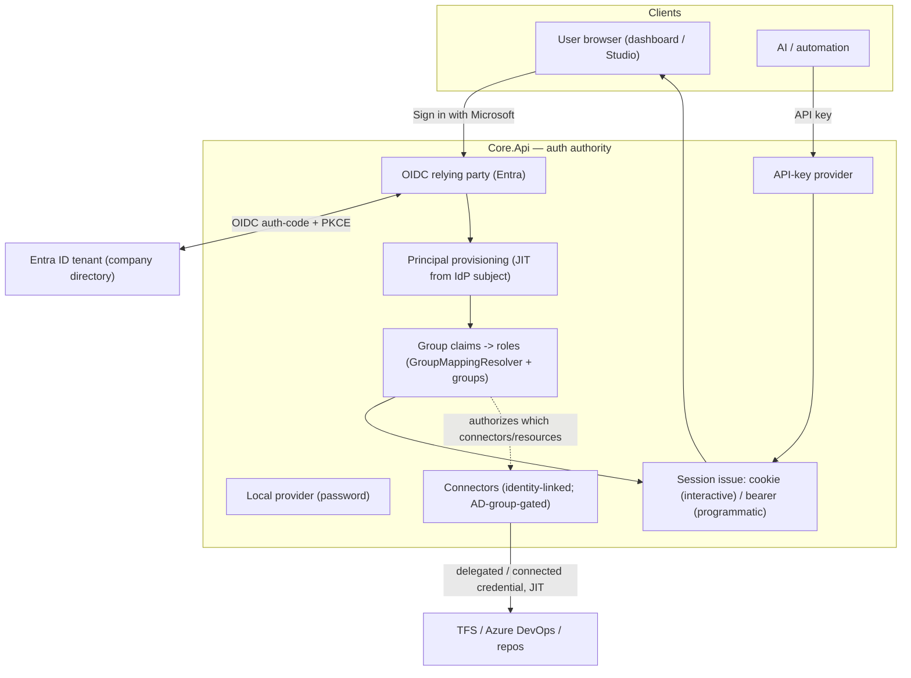

# Enterprise Login & Connected Accounts — Design

> **Status:** L4 delivered · 2026-07-25 · Full enterprise-login track live in Core.Api — Entra OIDC sign-in, JIT provisioning, directory-group→role mapping, AD-group-gated connectors, and session-lifetime OBO delegation (real-tenant verification remains manual)
> **Owner:** Felix Klakow
> **Scope:** Support the login scenarios Felix's company needs — **Microsoft/Entra ID (Azure AD) SSO**, and **"connected accounts"**: one Auxilia identity linked to the corporate directory (AD) that cascades authorized access to TFS / Azure DevOps / repositories.

---

## 1. Goal & the two scenarios

1. **Microsoft/Entra ID SSO.** Entra ID (formerly Azure AD) is Microsoft's OIDC/OAuth identity platform — the standard corporate "Sign in with Microsoft." Auxilia acts as an OIDC **relying party**: a user signs in against their company tenant, and Auxilia trusts that identity.
2. **Connected accounts (AD-linked resource access).** The user has **one** Auxilia principal, federated to the corporate directory. Their **AD group membership** (delivered as OIDC claims) both grants Auxilia **roles** and authorizes which enterprise **resources** (ADO/TFS/repos) they may reach — and workflows act with that access on their behalf.

These coexist with the two login methods that already exist: **local accounts** (password) and **API keys** (AI/service principals).

## 2. Current state

Core.Api is the single auth authority. Governance already provides the *shape* for this:
- **`IIdentityProvider`** is pluggable; only `LocalIdentityProvider` (password + API key) is implemented. OIDC/Entra/LDAP were always intended as drop-ins behind this interface.
- **`GroupMappingResolver`** already turns IdP group claims into roles; **first-class groups** (`GroupDirectory` + `GroupRoleResolver`) union direct + group + IdP-mapped roles in the Policy Engine.
- **Connectors** hold per-principal/company external-service credentials, scoped personal or company-wide, and are delivered to workflows **just-in-time, encrypted** (the credential-resolution path is built and proven).

Delivered in **L1**: the interactive OIDC login flow (Entra), JIT principal provisioning from an external identity, and browser session issuance. Delivered in **L2**: directory group claims are mapped to roles and reconciled onto the principal at every sign-in, with a Microsoft Graph fallback for group-claim overage, plus an administrator surface (REST + MCP) for the mappings. Delivered in **L3**: connectors are identity-linked (owned by a principal) and AD-group-gated, and the JIT dispatch path enforces that the triggering principal may use every connector a run binds — the AD cascade. Delivered in **L4**: session-lifetime OBO delegation — a slot can be resolved as a token minted on-behalf-of the triggering user at run time. See the implementation notes below. Remaining: an interactive OAuth authorization-code connect UI, and real-tenant/real-ADO verification (manual).

## 3. Target model

- **Entra OIDC relying party** — Core.Api runs the OIDC authorization-code + PKCE flow against the company tenant, validates the ID token, and resolves/creates the `PrincipalRecord` for the token subject (**JIT provisioning**: `ExternalSubject` on the principal, no secret stored locally). Multiple sign-in methods coexist (local password, API key, Entra); the login screen offers each configured method.

> **Implementation note (L1).** The OIDC *protocol* is handled by ASP.NET Core's battle-tested `AddOpenIdConnect` handler (registered only when `Oidc:Enabled`), which signs the validated identity into a short-lived external cookie. The Auxilia-identity half — turning validated external claims into a provisioned principal + session — is `ExternalIdentityProvisioner` in `Auxilia.Governance` (find-or-create keyed deterministically by `provider|subject`, no credential record, disabled accounts refused, direct-role session, fully audited). Core.Api wires three schemes (`AuthSchemes`): API-key bearer (programmatic default), a session `Cookie`, and the Entra `Oidc` scheme; the default authorization policy accepts API-key **or** cookie, so both resolve to the same `auxilia:principal-id` and the Policy Engine authorizes them identically. Endpoints: `GET /auth/login` (challenge), `GET /auth/callback` (provision + issue cookie), `POST /auth/logout`, `GET /auth/me`. Automated tests drive a stubbed external scheme; real Entra needs an app registration (manual).
- **Roles from the directory** — group claims from the Entra token flow through the existing `GroupMappingResolver`/group system: `(tenant, AD group) -> Auxilia role(s)`, evaluated at sign-in, unioned with any direct/first-class-group roles. No per-user role admin for directory users.

> **Implementation note (L2).** Directory roles are reconciled into `RoleAssignmentRecord`s tagged `Source = "GroupMapping"` at every sign-in inside `ExternalIdentityProvisioner`: roles the token's groups map to are granted, ones the token no longer grants are revoked, and administered (`Direct`) / imported grants are never touched. Because the Policy Engine already reads **all** assignment sources by principal id, directory roles authorize with no Policy-Engine change — a cookie session and an API key for the same principal stay identical. **Group-claim overage** (Entra omits the `groups` claim past ~200 memberships, emitting `hasgroups`/`_claim_names`) is detected by `CoreClaims.HasGroupOverage` and resolved through `IDirectoryGroupResolver`: the `GraphDirectoryGroupResolver` calls Microsoft Graph `POST /me/getMemberGroups` with the user's saved token — this requires the Entra app to request a Graph scope granting `GroupMember.Read.All`; a missing scope or Graph error degrades to no directory roles (deny-by-default, logged) rather than blocking sign-in. Mappings are administered over REST (`/api/identity/group-mappings`) and MCP (`*_group_mapping`), gated by `identity-source.manage`. Automated tests drive a stubbed directory resolver; real Graph overage is manual.
- **Sessions** — interactive sign-in issues a **cookie** (dashboard/Studio); AI/service principals keep the **API-key bearer**; both resolve to the same `PrincipalRecord` + roles through the one Policy Engine, so MCP and UI never diverge.

## 4. Connected accounts → resource access (the AD cascade)

"The same account, linked to AD, grants access to TFS/ADO/repos." Two mechanisms, presented with a recommendation:

| Mechanism | How | Trade-off |
|---|---|---|
| **A. Identity-linked connectors** (recommended first) | The user connects ADO/TFS once via an OAuth connect flow; the resulting connector is **owned by their principal** and **gated by AD group** (a group grant says which principals/groups may use which connector). Workflows get it JIT via the existing encrypted resolution path. | Reuses the built connector + JIT-credential machinery; the AD group decides eligibility. Not a live per-request delegation. |
| **B. Delegated tokens (OAuth on-behalf-of)** (later) | Core.Api exchanges the user's Entra token for a scoped ADO/TFS token (OBO), delivered JIT to the workflow so it acts **as the user** with their live entitlements. | The truest "AD linkage IS the access" cascade; but needs the Entra app to be authorized for ADO OBO, token refresh, and per-resource scopes. |

**Recommendation:** start with **A** — it lands the scenario on top of what's already built (connectors + JIT delivery + groups), with AD group membership as the authorization gate. Add **B** (OBO delegation) as a follow-up for live per-user delegation where a stored connector is not acceptable.

> **Implementation note (L3).** A Core connector now carries a `Scope` (`Company` = shared, `Personal` = identity-linked) and an `OwnerPrincipalId`; a personal connector also carries **grants** admitting other subjects — a specific principal or an AD **directory group**. Eligibility is decided by `ConnectorAccessPolicy.CanUseAsync`: company → anyone; personal → owner ∪ granted principals ∪ members of a granted directory group. The **AD cascade** works because the provisioner persists each principal's directory group ids (`PrincipalRecord.DirectoryGroupsJson`) at every sign-in, so group membership is known at dispatch even without a live session. Enforcement is at **dispatch**: `RunService` gates every connector a run's slot bindings reference against the *triggering* principal before any credential context is staged — an ineligible trigger is refused with 403 and nothing is dispatched (the runner's later token-authorized resolution trusts the pre-authorized stash, consistent with the separate-database trust model). Admin surface: `POST /api/connectors` creates a personal connector owned by the caller (company connectors need `slot-config.write`); `POST /api/connectors/{id}/grants` sets its grants (owner or a connector manager); MCP twins `create_connector` (with scope) and `set_connector_grants`. The connector's credential is whatever the owner supplies (e.g. an ADO PAT); a full interactive OAuth authorization-code connect UI and live OBO exchange are **L4**.

> **Implementation note (L4).** Session-lifetime OBO delegation, chosen over refresh-token storage so **no long-lived user secret** is kept. At sign-in (when `Oidc:EnableDelegation`), the user's access token is retained encrypted, keyed by principal, until it expires (`DelegatedTokenStore` → `DelegatedUserTokenRecord`) — refreshed each sign-in, never returned by a read endpoint, no refresh token stored. A slot binding can set `DelegatedResource` (a resource scope); at **resolution** the `SlotCredentialResolver` looks up the run's triggering principal (now recorded on the resolution record), fetches their retained token, and exchanges it on-behalf-of the user via `IDelegatedTokenExchange` (`EntraOboTokenExchange` posts the OBO grant to the tenant token endpoint; a no-op otherwise) — the downstream token is minted just-in-time, delivered as `{ accessToken }`, and **never persisted**. So the only stored secret is the user token, and delegation lapses when it expires (the user re-signs-in). Unattended / task-source runs have no retained token and fail closed — they use L3's stored connectors instead. Real Entra/ADO OBO needs the app registration consented for the downstream API and is verified manually.

Either way, **secrets/tokens still live only in the Core** and reach workflows only through the JIT, per-instance-encrypted resolution path — the connected account changes *whose* credential and *how it's provisioned/authorized*, not the delivery mechanism.

## 5. Decisions

| # | Decision | Rationale |
|---|---|---|
| L1 | **Core.Api is the OIDC relying party** (not the dashboard) | Core.Api is the single auth + audit authority; clients (Studio, dashboard, admin console) delegate login to it. |
| L2 | **JIT principal provisioning** from the IdP subject | No pre-provisioning; directory users become principals on first sign-in, `ExternalSubject`-keyed, no local secret. |
| L3 | **Roles come from directory groups** via the existing mapping | Corporate group -> Auxilia role at sign-in; no per-user admin. Unioned with first-class groups + direct grants. |
| L4 | **Connected accounts = identity-linked, AD-group-gated connectors first**, OBO delegation later | Reuses the built connector + JIT machinery; OBO is a heavier follow-up. |
| L5 | **Providers are additive behind `IIdentityProvider`** | Local + API key + Entra coexist; adding a provider is registration, not re-architecture (fits the runtime-extensible-vocabularies rule). |

## 6. Phased plan

| Phase | Work | Tests |
|---|---|---|
| **L0** | Auth-model spec: session shapes (cookie vs bearer), the login endpoints on Core.Api, provider registration, config surface (tenant/client id, redirect URIs) | design only |
| **L1** ✅ | Entra OIDC relying party + `ExternalIdentityProvisioner` (JIT) + browser session cookie; `/auth/*` endpoints; local + API-key coexist | ✅ unit (provisioning: create/idempotent/roles/disabled/audit), component (login via a stubbed OIDC provider, deny-by-default, API-key coexistence); manual (real Entra tenant) pending |
| **L2** ✅ | Directory group -> role at sign-in through `GroupMappingResolver` (reconciled onto the principal, `Source="GroupMapping"`); group-claim overage → Microsoft Graph fallback; REST + MCP admin surface for the mappings | ✅ unit (claim mapping/reconcile/revoke/audit, overage detection), component (roles from group claims, overage fallback, mapping admin); manual (real Graph overage) pending |
| **L3** ✅ | Connected accounts (mechanism A): identity-linked connectors (owner + `Scope`) + AD-group/principal gating; dispatch-time enforcement against the triggering principal; REST + MCP admin for connectors and grants | ✅ unit (`ConnectorAccessPolicy`: company/owner/principal-grant/directory-group-grant/deny; sign-in persists directory groups), component (gated dispatch 403 vs. allowed, create-as-personal, grants admin); system (a run uses a connected ADO connector) + interactive OAuth connect UI pending |
| **L4** ✅ | Session-lifetime OBO delegation (mechanism B): retain the user's token encrypted at sign-in, exchange it on-behalf-of the user JIT at resolution for a `DelegatedResource` slot; no refresh token, fails closed for unattended runs | ✅ unit (`DelegatedTokenStore` retain/expiry/encrypt-at-rest, resolver OBO branch + fail-without-token), component (sign-in retains token); real Entra/ADO OBO + interactive connect UI pending (manual) |

## 7. Open questions

- **Multi-tenant** — one Auxilia deployment serving several companies' Entra tenants, or one tenant per deployment? (`TenantId` already rides every resource.)
- ~~**OBO vs connect-flow** for ADO/TFS delegation (decision L4) — revisit once L3 is in use.~~ Resolved: both ship — L3 stored connectors (mechanism A) for unattended/async, L4 **session-lifetime OBO** (mechanism B) for live "act as me now"; refresh-token-backed OBO was declined to avoid a long-lived user secret at rest.
- ~~**Group-claim overage** — Entra omits group claims past ~200; needs a Microsoft Graph fallback to read memberships.~~ Resolved in L2 (`GraphDirectoryGroupResolver`); requires a Graph `GroupMember.Read.All` scope on the app registration for over-quota users.
- **Local-account coexistence** — keep local admin accounts for break-glass even when Entra is the primary IdP.
- **Testing without a tenant** — L1/L2 use a stubbed OIDC provider for automated tests; a real Entra app registration is needed only for manual verification.

## 8. Security notes

- Auth is validated only by the Core (the single authority); every login and role resolution is audited.
- No external identity secret is stored on the principal (`ExternalSubject` only); connector/delegated tokens stay encrypted in the Core and reach workflows only via the JIT per-instance-encrypted path.
- Directory groups drive access deny-by-default through the same Policy Engine as everything else.
