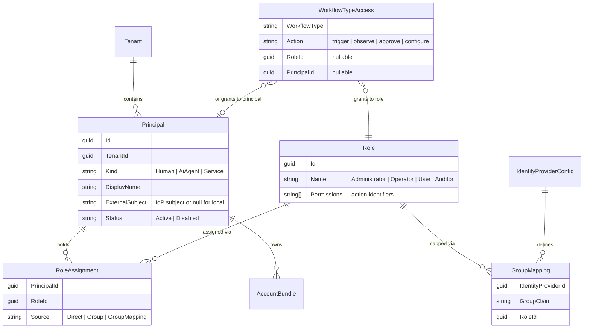

# Governance & RBAC – Implementation Plan

> Status: **Approved design** (Task #3) · **Updated for the Core separation** — the Policy Engine + identity now live in **Core.Api** (the single auth authority) and **groups are first-class**.
> Cross-reference: docs/ARCHITECTURE.md §16 (the model), docs/delivered/goal-v1.md (scope)

This document turns the governance model of docs/ARCHITECTURE.md §16 into a concrete implementation plan: data model, components, project layout, and test strategy. Implementation is Task #7 (Phase 3), consuming the persistence layer from Task #6 (Phase 2).

---

## 1. Data model

All entities carry `TenantId` (v1: the single default tenant) and audit timestamps.



Notes:
- **Roles are seeded**, not user-editable in v1 — the `Permissions` list per role is fixed in code and written to the store at startup (idempotent seed). Custom roles later = removing the seed-only restriction.
- **Local credentials** (password hash for local accounts, API keys for AI/service principals) live in a separate credential table owned by the Local identity provider — never on `Principal` itself, so external-IdP principals carry no secret material.
- **AccountBundle** already exists conceptually (docs/ARCHITECTURE.md §11); governance adds the ownership link and bundle-level constraints (purpose restrictions, quotas for AI bundles). The concrete credential store is the Core **connector** (encrypted at rest).
- **Groups are first-class** (added in the Core separation): `GroupRecord` + `GroupMembershipRecord` + `GroupRoleRecord`, resolved by `GroupDirectory` + `GroupRoleResolver`. A principal's **effective roles are the union** of its direct assignments, its group memberships' roles, and IdP group mappings — hence `RoleAssignment.Source` = `Direct | Group | GroupMapping`.

## 2. Components and project layout

```
Auxilia.Governance/                      ← new project (repo root, like Auxilia.Workflows)
  Principals/        Principal, PrincipalKind, PrincipalStatus
  Roles/             Role, RoleAssignment, BuiltInRoles (seed), PermissionActions (constants)
  Policy/            IPolicyEngine, PolicyDecision, PolicyContext, PolicyEngine
  Identity/          IIdentityProvider, LocalIdentityProvider, IdentitySession,
                     GroupMapping, IGroupMappingResolver
  Access/            WorkflowTypeAccess, IWorkflowTypeAccessStore
  Stores/            IPrincipalStore, IRoleStore, ICredentialStore (interfaces only —
                     implementations come from the persistence layer, Task #6)
Auxilia.Governance.Tests/                ← unit + component tests
```

Component responsibilities:

- **`IPolicyEngine.EvaluateAsync(PolicyContext)`** — the single authorization entry point: `(principal, action, resource)` + resource-policy inputs → `PolicyDecision { Allowed, Reason }`. Always emits an audit record (allow *and* deny) before returning. Hosted in **Core.Api** and used at every enforcement point there — every REST endpoint, the Core MCP, the Run API's dispatch check, and admin operations — with the Product authorizing through the Core. (Historically split across the Backend Service and the Steering Instance.)
- **`IIdentityProvider`** — `AuthenticateAsync(credentials) → IdentitySession` (principal + raw group claims). v1 ships `LocalIdentityProvider` (username/password for humans, API key for AI/service principals). OIDC/AAD/LDAP providers are later drop-ins behind the same interface.
- **`IGroupMappingResolver`** — translates an `IdentitySession`'s IdP group claims into role assignments at session start; merged with direct assignments; cached per session.
- **`GroupDirectory` + `GroupRoleResolver`** — first-class group membership → roles, unioned with direct and IdP-mapped assignments inside the Policy Engine.
- **Retry/resilience** for store access lives inside the store implementations (project rule — no caller-side retry).

## 3. Enforcement points (wiring map)

| Point | Host | Action examples |
|---|---|---|
| REST endpoint filter | Core.Api | every control-plane operation |
| MCP tool invocation filter | Core.Api (Core MCP) | every AI operation — same authority as REST |
| Dispatch pre-flight | Core.Api (Run API) | `workflow.trigger` for the requesting principal |
| View subscription / replay | Workflow Studio | `view.subscribe` per view, follows owning workflow |
| Artifact input resolution | Core.Runner (at dispatch) | `artifact.consume` |
| Admin / identity configuration | Core.Api | `principal.administer`, `slot-config.write`, … |

The gateway and MCP filters share one implementation so parity is structural (docs/ARCHITECTURE.md decision #11).

## 4. Implementation order (within Task #7)

1. `Auxilia.Governance` project: domain types, `PermissionActions`, `BuiltInRoles`, `PolicyEngine` with in-memory store fakes; unit tests.
2. `LocalIdentityProvider` + credential store interface + session issuance (cookie for dashboard, bearer token for MCP); unit tests.
3. Store implementations on the persistence layer (Task #6); component tests with real DI host.
4. Enforcement filters (Core.Api REST + Core MCP shared filter, dispatch check in the Run API); component tests proving allow/deny + audit records.
5. Seed pipeline: default tenant, built-in roles, initial administrator account (bootstrap credential via configuration, forced rotation on first login); system test.

## 5. Test strategy

- **Unit**: PolicyEngine truth table (role × action × resource scope chain, deny-by-default, AI purpose restriction, quota exhaustion); group-mapping resolution; seed idempotency.
- **Component**: real DI host, fake stores — end-to-end authorization of representative API/MCP calls including audit record emission on deny.
- **System**: bootstrap administrator → create operator + user + AI principal → configure workflow-type access → verify trigger allowed/denied accordingly via real bus dispatch; audit log contains every decision.
