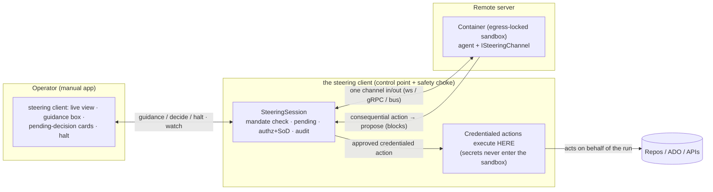

# Human Steering of AI Workflows — Design

> **⚠️ SUPERSEDED (2026-07-26) by [`steering-client-integration.md`](../steering-client-integration.md).**
> Read that document, not this one, for the current architecture. This draft's **spectrum** (S1–S5) remains valid, but three framing decisions here are **now wrong**:
> 1. *"Auxilia is a reference/predecessor, not the target."* → **The Auxilia Core *is* the server**: it launches the egress-locked containers, over RabbitMQ, and deploys the whole thing. The steering client is only a **client**.
> 2. *"The the steering client implements P1–P3 behind seams."* → **The steering mechanism is workflow-bound, not product-hosted.** The Core is a dumb pipe that carries **opaque** input/output between a client and a running run and audits it; the workflow owns the decision logic and the hold; the steering client is a pure `Auxilia.Core.Client` consumer. There is **no** websocket, `SteeringSession`, mandate, or decision store in the product.
> 3. *"Credentials never enter the sandbox; credentialed actions run in the Hub."* → **Not Auxilia's model.** A signature-trusted workflow **does** receive scoped, per-instance-encrypted credentials just-in-time and uses them inside the container under egress policy (only the initial repo-clone token is stripped Core-side). See §4 of the source of truth.
>
> Kept below for history and for the still-valid spectrum + reference-primitive map (§9).
>
> ---
>
> **Status:** Draft / design exploration · 2026-07-25 · **superseded — see banner above.**
> **Owner:** Felix Klakow

---

## 0. Context — what the steering client is

The the steering client is a **manual** application: a human operator drives it. It **starts remote containers on a server**, runs an **AI agent** inside each, and keeps everything safe by **container isolation**. The operator uses the Hub as a **steering client** to watch and steer the agent.

Safety is **topological, not aspirational**: each container is **egress-locked** — its only channel in or out is the Hub — so the Hub is the single control point *and* the safety choke point, and **credentials never enter the sandbox**. A mis-steered or prompt-injected agent therefore cannot reach the network or exfiltrate a secret; it can only *ask* the Hub, which the human governs.

## 1. Thesis — steering is a spectrum, not an approval queue

"A human approves every AI action" is the wrong center of gravity: high-friction, unscalable, and not where human–AI collaboration is heading. Steering spans a spectrum:

```
mandate (before)  →  interrupt (during)  →  escalate (on boundary)  →  gate (checkpoint)  →  review (after)
   most work here ───────────────────────────────────────────────────────────► least, highest-friction
```

*(The picture is ordered by **when** in the run's life the human touches it, not by the S-numbers in §3 — so "interrupt" and "escalate" read left-to-right by timing, not by number.)*

The design's center of gravity is a **pre-authorized mandate**: the agent runs autonomously *within bounds*, and the human touches the loop only at the **boundary**. Approval-at-a-checkpoint (the whole of the earlier approval-queue draft) is just one narrow mode.

## 2. Layering — the Core stays dumb; steering is a product concern

The (Auxilia-style) **Core is semantics-blind by design**. Its responsibilities:

- **Security** — identity, RBAC/authorization (Policy Engine), **audit**, the **network-egress policy ceiling**, and **just-in-time credential resolution**.
- **Account management** — principals, groups, connectors (encrypted secrets), grants.
- **Containers** — running workload containers correctly (dispatch/launch/lifecycle).
- **Workflow configuration** — stored run configs + slot bindings, as *opaque* data.
- **Workflow startup** — dispatch.
- **(Later) signing / trust root** — signing workflows/slots is the *same trust hat* the Core already wears for identity + secrets, so it belongs here (a "signing instance" folded into the Core).

The Core does **not** know what a workflow *means* — workflows are dynamic, defined by the product. Therefore an approval/steering service that understands decision points, escalation, autonomy dials, or **channels like email/Slack** is **product-layer**, not Core.

What the Core owes *any* steering system is small and generic — **three primitives, all semantics-free**:

| # | Core primitive | Why it's generic | Auxilia reference (this repo) |
|---|---|---|---|
| P1 | **Authorize a decision** — "may principal P perform action A?", incl. "may P steer/decide run R" with **segregation-of-duties** (P ≠ the run's requester) | it's just policy over ids | `Policy Engine`, `workflow.approve`, `CoreRunResolutionRecord.TriggeredByPrincipalId` (§9) |
| P2 | **Deliver authorized, audited input to a *running* run** — an opaque blob a principal is authorized to inject; the runner routes it as a signal | the blob is opaque to the Core | signals (`SignalDispatcher`), `run.provide-input` (§9) |
| P3 | **Hold an action until an authorized release** — the resource-proxy can park an action *tagged* by the workflow and require an authorized release | the Core sees a *tag*, not the meaning | `ResourceProxyHandler` (§9) — release delivered via P2 |

Everything domain-specific — the queue, "approve this PR", quorum, escalation, **email**, the steering client UI, the autonomy dial — is built **on top** of P1–P3 in the steering client product. The Core never learns any of it.

## 3. The steering spectrum — modes, flows, layering

| Mode | Agent (in container) does | Hub / human does | Core primitives used |
|---|---|---|---|
| **S1 · mandate** | proposes an action, e.g. `repo.branch` | if within the granted mandate → **auto-approve**, no prompt | (mandate = P1 grants: connectors, egress, budget) |
| **S2 · escalate** | hits its mandate boundary → `RequestScope("prod-egress", reason)`; **blocks** | human grants/denies extra scope *for this run* | P1 (grant), P2 (deliver decision) |
| **S3 · interrupt** | streams output; `Receive()` folds `Guidance` into context, stops on `Halt` | types guidance / hits halt **any time** | P2 |
| **S4 · gate** (the narrow "approval") | `Propose("pr.merge", diff)`; **blocks** until decided | **approve / edit / reject** (a card in the steering client) | P3 (hold), P1 (authorize), P2 (release) |
| **S5 · review** | just emits everything | reviews the stream *after*; rolls back reversible work | audit + event stream |

Approval (S4) is one composition, kept narrow. The high-value modes are **S1** (autonomy) and **S3** (live steering — a conversation, not approve/reject), with **S2** (the agent asks when *it* hits a wall) as the elegant escalation, because the boundary that triggers the human is already a Core denial.

## 4. Architecture — steering client + remote sandbox



**The load-bearing safety pattern:** approved **credentialed** actions execute in the **Hub**, not the container. The agent *proposes* "merge PR"; the human approves; the **Hub** performs it with the token (the `PROXY` box). The secret never enters the sandbox, so even a fully-compromised agent cannot exfiltrate it — it can only ask, and asking is governed. This mirrors Auxilia's Resource Proxy (§9).

## 5. The portable model

The the steering client implements P1–P3 behind three seams (full code in **Appendix A**):

- **`IHubTransport`** — the wire between Hub and container. Recommended default: the **container dials home over a websocket** (works through NAT/firewalls, one door, egress can be locked to only the Hub). SignalR if the Hub is ASP.NET; a message bus if one already exists.
- **`IDecisionAuthorizer`** — "may this operator make this decision?", given the operator *and the run's launcher* so it can enforce **segregation-of-duties** (operator ≠ launcher). Async (`MayDecideAsync`) so it can call the steering client's identity/authz or a Core Policy-Engine (`EvaluateAsync`).
- **`Mandate`** — the S1 autonomy envelope (allowed action kinds / egress hosts / budget). Start strict (read + branch + open-PR free; merge/deploy/prod-egress always gated) and loosen per trust tier.

The `SteeringSession` (Hub-side) is the state machine: in-mandate proposals auto-approve (S1); out-of-mandate proposals and scope requests surface as pending decisions the human resolves (S4/S2); guidance/halt pass straight through (S3). `ISteeringChannel` (agent-side, in-container) is what the agent calls: `Emit`, `Propose` (blocks), `RequestScope` (blocks), `Receive` (live commands).

## 6. Security invariants

- **Topological isolation** — the container's only I/O is the Hub channel; it is egress-locked and holds **no credentials**. Approved credentialed actions run in the Hub.
- **Nothing irreversible without mandate or decision** — every consequential action is a `Propose` that either matches a mandate or **blocks** for a human.
- **Authorization + segregation-of-duties** enforced Hub-side (the operator deciding ≠ the principal who launched the run, unless policy allows).
- **Fail-closed** — a blocked action with no decision (timeout / channel down) never proceeds.
- **Audit** the security-relevant fact (*who decided what, when, why, edited?*) — the compliance trail for "a human steered the AI here."
- **Non-secret payloads** — decisions render business content (diffs/plans); a secret is referenced, never shown.

## 7. Decisions

| # | Decision | Rationale |
|---|---|---|
| D1 | **Steering is a spectrum; approval (S4) is one narrow mode** | "approve everything" is high-friction and not the future; mandate-first, human-at-the-boundary. |
| D2 | **The steering mechanism lives in the product (the steering client), not the Core** | the Core is semantics-blind; it only exposes generic P1–P3. |
| D3 | **The Hub is the safety choke point; credentialed actions run in the Hub** | topological safety — the sandbox can't reach out or hold secrets. |
| D4 | **Edit is a first-class decision outcome** | steering is usually "yes, but narrower" — return a modified plan/action. |
| D5 | **Segregation-of-duties + fail-closed** | an AI action approved by its own launcher isn't control; silence ≠ yes. |
| D6 | **Signing/trust-root is a Core facet** | same trust hat as identity + secrets. |

## 8. Open questions & next steps (what a fresh session should decide/build)

**Open questions**
- **Transport** — websocket (recommended) vs SignalR vs bus. Affects reconnection/durability.
- **Wait durability** — hold the container alive during a blocked `Propose` (simple; fine for minutes–hours) vs. **durable suspend/resume** (checkpoint + exit + resume) for day-long waits. Start with in-container hold; note the upgrade.
- **Which modes ship first** — recommend **S1 (mandate) + S3 (interrupt) + S4 (gate)** as the minimum useful loop; add **S2 (escalate)** next; **S5 (review)** rides the event stream.
- **Where the credentialed-action proxy lives** in the steering client (its own resource-proxy component).
- **Trust tiers / mandate templates** — how mandates are named, granted, and widened.

**Suggested first slice (in the steering client)**
1. `IHubTransport` over websocket + the container-side `ISteeringChannel`.
2. `SteeringSession` (Appendix A) wired to a minimal steering client: live view (S3 out), guidance box (S3 in), halt, and pending-decision cards (S4).
3. A strict default `Mandate` + `IDecisionAuthorizer` bound to the steering client's identity with segregation-of-duties.
4. The credentialed-action-in-Hub proxy for one real action (e.g. open/merge PR).
5. Audit each decision.

## 9. Reference primitives in Auxilia (this repo) to reuse/adapt

A fresh session can inspect these as proven, adaptable references (this repo, not the steering client):

- **Signals / input to a running run (P2):** `Source/Platform/Auxilia.Core.Runner/Workflows/SignalDispatcher.cs`, `SignalHandlerStore` (in `…/Workflows/Storage/`); permission `PermissionActions.RunProvideInput` (`run.provide-input`); per-instance token in `WorkflowInstanceTokenRegistry` (`…/Workflows/Storage/`).
- **Resource Proxy / action choke point (P3):** `Source/Platform/Auxilia.Core.Runner/Workflows/ResourceProxyHandler.cs` (ARCHITECTURE §8) — the audited path through which a workflow reaches external systems.
- **Authorization + SoD (P1):** `Source/Libraries/Auxilia.Governance/Policy/PolicyEngine.cs`; `PermissionActions.WorkflowApprove`; the run's triggering principal is stashed at dispatch on `CoreRunResolutionRecord.TriggeredByPrincipalId` (used for connector gating; the same value enforces approver ≠ requester).
- **JIT credentials, never in the container:** `Source/Platform/Auxilia.Core.Api/Services/SlotCredentialResolver.cs` + `ICoreCredentialClient` (defined in **Core.Runner**, `…/Workflows/CoreCredentialClient.cs`); connectors (`ConnectorService` in **Core.Api**/Services — a same-named class also exists under BackendService/Dashboard; `ConnectorAccessPolicy`); the per-run repo auth path (`RepositoryAuthResolver`) is the closest analogue to "the Hub holds the credential, the sandbox never sees it."
- **Live + persisted views / status:** `IViewPublisher`, `WorkflowStatusEvent` — the model for streaming the agent's turns to the steering client.
- **Egress ceiling:** `Source/Platform/Auxilia.Core.Runner/Workflows/NetworkPolicyResolver.cs`; `RequiresNetworkEndpoint` (a builder method on `IWorkflowBuilder`); `AllowAllNetworkPermitted` (a setting on `…/Workflows/WorkflowDispatcherSettings.cs`) — default-deny, the "egress-locked container".
- **Audit:** `Source/Libraries/Auxilia.PlatformData/AuditLog.cs`.
- **Container launch:** `IWorkflowLauncher` / `WorkflowDispatcher` (`Source/Platform/Auxilia.Core.Runner/Workflows/`).

---

## Appendix A — portable steering skeleton (C#)

`System.*` only; adapt transport / persistence / authz / channels to the steering client. Agent-side: `ISteeringChannel`. Hub-side: `SteeringSession` + seams.

```csharp
namespace steering client.Steering;

// ── wire contracts (agent ⇄ hub) ──
public abstract record AgentEvent(string SessionId);
public sealed record AgentOutput(string SessionId, string Role, string Text) : AgentEvent(SessionId);          // live turns
public sealed record ActionProposed(string SessionId, string ActionId, string Kind, string Summary, string? PayloadJson) : AgentEvent(SessionId); // S4
public sealed record ScopeRequested(string SessionId, string RequestId, string Scope, string Reason) : AgentEvent(SessionId);                     // S2
public sealed record SessionEnded(string SessionId, bool Success, string? Error) : AgentEvent(SessionId);

public enum DecisionOutcome { Approve, Reject }
public abstract record HubCommand(string SessionId);
public sealed record Guidance(string SessionId, string Text) : HubCommand(SessionId);                                                            // S3
public sealed record ActionDecision(string SessionId, string ActionId, DecisionOutcome Outcome, string? EditedPayloadJson, string? Rationale) : HubCommand(SessionId);
public sealed record ScopeDecision(string SessionId, string RequestId, bool Granted, string? Rationale) : HubCommand(SessionId);
public sealed record Halt(string SessionId, string Reason) : HubCommand(SessionId);

// ── agent side (inside the container) ──
// Never reaches the outside world directly: every consequential action goes through Propose/RequestScope,
// so nothing irreversible happens without a mandate or a human decision. The Hub holds credentials.
public interface ISteeringChannel
{
    Task EmitAsync(AgentEvent e, CancellationToken ct = default);
    Task<ActionDecision> ProposeAsync(ActionProposed proposal, CancellationToken ct = default);    // blocks (S4)
    Task<ScopeDecision> RequestScopeAsync(ScopeRequested request, CancellationToken ct = default);  // blocks (S2)
    IAsyncEnumerable<HubCommand> ReceiveAsync(CancellationToken ct = default);                       // guidance / halt (S3)
}

// ── hub side (the steering client's control point) ──
public sealed record Mandate(                                   // what the container may do WITHOUT asking (S1)
    IReadOnlySet<string> AllowedActionKinds,                    // e.g. { "repo.read","repo.branch","pr.open" } — NOT "pr.merge","deploy"
    IReadOnlySet<string> AllowedEgressHosts,
    decimal BudgetUsd);

public interface IDecisionAuthorizer                            // "may THIS operator make THIS decision?" + SoD
{
    // launchedByPrincipalId is passed so the implementation can enforce segregation-of-duties
    // (operator != the principal who launched the run). Async so it can call a Core Policy Engine.
    Task<bool> MayDecideAsync(string operatorPrincipalId, string launchedByPrincipalId, PendingDecision decision, CancellationToken ct = default);
}

public sealed record PendingDecision(string Id, string Kind, string Summary, string? PayloadJson, DateTimeOffset At);

public interface IHubTransport                                 // the only door in/out of the egress-locked container
{
    IAsyncEnumerable<AgentEvent> EventsAsync(CancellationToken ct);
    Task SendAsync(HubCommand command, CancellationToken ct);
}

public sealed class SteeringSession(
    string sessionId, IHubTransport transport, IDecisionAuthorizer authz, Mandate mandate, string launchedByPrincipalId)
{
    private readonly Dictionary<string, PendingDecision> _pending = new(StringComparer.Ordinal);

    public event Action<AgentOutput>? OnOutput;
    public event Action<PendingDecision>? OnPendingDecision;    // show a card; call DecideAsync when the human acts
    public event Action<bool, string?>? OnEnded;

    public async Task RunAsync(CancellationToken ct = default)  // pump agent events until the session ends
    {
        await foreach (var e in transport.EventsAsync(ct))
        {
            switch (e)
            {
                case AgentOutput o:
                    OnOutput?.Invoke(o);
                    break;
                case ActionProposed a when mandate.AllowedActionKinds.Contains(a.Kind):   // S1: within mandate → proceed
                    await transport.SendAsync(new ActionDecision(sessionId, a.ActionId, DecisionOutcome.Approve, null, "within mandate"), ct);
                    break;
                case ActionProposed a:                                                    // S4: needs a human
                    Surface(new PendingDecision(a.ActionId, a.Kind, a.Summary, a.PayloadJson, DateTimeOffset.UtcNow));
                    break;
                case ScopeRequested s:                                                    // S2: needs a human
                    Surface(new PendingDecision(s.RequestId, "scope:" + s.Scope, s.Reason, null, DateTimeOffset.UtcNow));
                    break;
                case SessionEnded end:
                    OnEnded?.Invoke(end.Success, end.Error);
                    return;
            }
        }
    }

    private void Surface(PendingDecision p) { _pending[p.Id] = p; OnPendingDecision?.Invoke(p); }

    public Task SendGuidanceAsync(string text, CancellationToken ct = default)             // S3
        => transport.SendAsync(new Guidance(sessionId, text), ct);
    public Task HaltAsync(string reason, CancellationToken ct = default)
        => transport.SendAsync(new Halt(sessionId, reason), ct);

    public async Task DecideAsync(string operatorPrincipalId, string id, DecisionOutcome outcome,
        string? editedPayloadJson = null, string? rationale = null, CancellationToken ct = default)
    {
        if (!_pending.TryGetValue(id, out var p)) return;
        // authorize + enforce segregation-of-duties (operator != launcher) before releasing the action.
        if (!await authz.MayDecideAsync(operatorPrincipalId, launchedByPrincipalId, p, ct))
            throw new UnauthorizedAccessException("not authorized to decide");
        _pending.Remove(id);
        // AUDIT HERE: operatorPrincipalId, id, p.Kind, outcome, rationale, editedPayloadJson != null
        if (p.Kind.StartsWith("scope:", StringComparison.Ordinal))
            await transport.SendAsync(new ScopeDecision(sessionId, id, outcome == DecisionOutcome.Approve, rationale), ct);
        else
            await transport.SendAsync(new ActionDecision(sessionId, id, outcome, editedPayloadJson, rationale), ct);
    }

    public IReadOnlyCollection<PendingDecision> Pending => _pending.Values;
}
```
