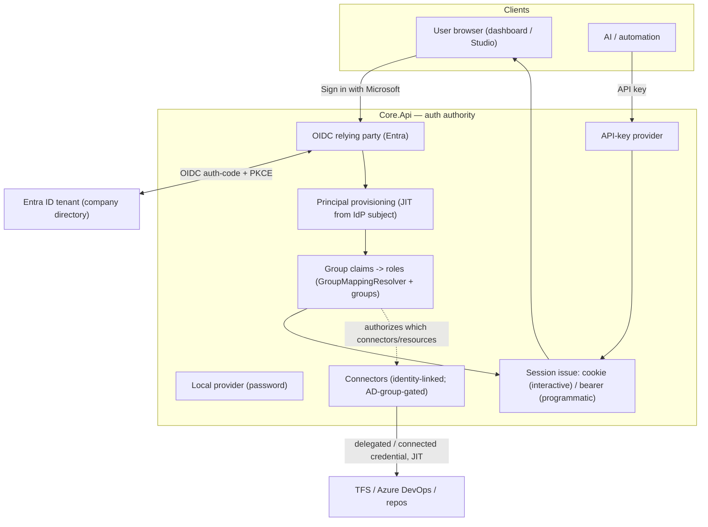

# Enterprise Login & Connected Accounts — Design

> **Status:** Design · 2026-07-25 · not yet implemented
> **Owner:** Felix Klakow
> **Scope:** Support the login scenarios Felix's company needs — **Microsoft/Entra ID (Azure AD) SSO**, and **"connected accounts"**: one Auxilia identity linked to the corporate directory (AD) that cascades authorized access to TFS / Azure DevOps / repositories.

---

## 1. Goal & the two scenarios

1. **Microsoft/Entra ID SSO.** Entra ID (formerly Azure AD) is Microsoft's OIDC/OAuth identity platform — the standard corporate "Sign in with Microsoft." Auxilia acts as an OIDC **relying party**: a user signs in against their company tenant, and Auxilia trusts that identity.
2. **Connected accounts (AD-linked resource access).** The user has **one** Auxilia principal, federated to the corporate directory. Their **AD group membership** (delivered as OIDC claims) both grants Auxilia **roles** and authorizes which enterprise **resources** (ADO/TFS/repos) they may reach — and workflows act with that access on their behalf.

These coexist with the two login methods that already exist: **local accounts** (password) and **API keys** (AI/service principals).

## 2. Current state

Core.Api is the single auth authority. Governance already provides the *shape* for this:
- **`IIdentityProvider`** is pluggable; only `LocalIdentityProvider` (password + API key) is implemented. OIDC/Entra/LDAP were always intended as drop-ins behind this interface.
- **`GroupMappingResolver`** already turns IdP group claims into roles; **first-class groups** (`GroupDirectory` + `GroupRoleResolver`) union direct + group + IdP-mapped roles in the Policy Engine.
- **Connectors** hold per-principal/company external-service credentials, scoped personal or company-wide, and are delivered to workflows **just-in-time, encrypted** (the credential-resolution path is built and proven).

Missing: the interactive OIDC login flow, JIT principal provisioning from an external identity, browser session issuance, and the identity→resource-access (ADO/TFS/repo) linkage.

## 3. Target model

- **`OidcIdentityProvider` (Entra)** — Core.Api runs the OIDC authorization-code + PKCE flow against the company tenant, validates the ID token, and resolves/creates the `PrincipalRecord` for the token subject (**JIT provisioning**: `ExternalSubject` on the principal, no secret stored locally). Multiple identity providers coexist behind `IIdentityProvider`; the login screen offers each configured method.
- **Roles from the directory** — group claims from the Entra token flow through the existing `GroupMappingResolver`/group system: `(tenant, AD group) -> Auxilia role(s)`, evaluated at sign-in, unioned with any direct/first-class-group roles. No per-user role admin for directory users.
- **Sessions** — interactive sign-in issues a **cookie** (dashboard/Studio); AI/service principals keep the **API-key bearer**; both resolve to the same `PrincipalRecord` + roles through the one Policy Engine, so MCP and UI never diverge.

## 4. Connected accounts → resource access (the AD cascade)

"The same account, linked to AD, grants access to TFS/ADO/repos." Two mechanisms, presented with a recommendation:

| Mechanism | How | Trade-off |
|---|---|---|
| **A. Identity-linked connectors** (recommended first) | The user connects ADO/TFS once via an OAuth connect flow; the resulting connector is **owned by their principal** and **gated by AD group** (a group grant says which principals/groups may use which connector). Workflows get it JIT via the existing encrypted resolution path. | Reuses the built connector + JIT-credential machinery; the AD group decides eligibility. Not a live per-request delegation. |
| **B. Delegated tokens (OAuth on-behalf-of)** (later) | Core.Api exchanges the user's Entra token for a scoped ADO/TFS token (OBO), delivered JIT to the workflow so it acts **as the user** with their live entitlements. | The truest "AD linkage IS the access" cascade; but needs the Entra app to be authorized for ADO OBO, token refresh, and per-resource scopes. |

**Recommendation:** start with **A** — it lands the scenario on top of what's already built (connectors + JIT delivery + groups), with AD group membership as the authorization gate. Add **B** (OBO delegation) as a follow-up for live per-user delegation where a stored connector is not acceptable.

Either way, **secrets/tokens still live only in the Core** and reach workflows only through the JIT, per-instance-encrypted resolution path — the connected account changes *whose* credential and *how it's provisioned/authorized*, not the delivery mechanism.

## 5. Decisions

| # | Decision | Rationale |
|---|---|---|
| L1 | **Core.Api is the OIDC relying party** (not the dashboard) | Core.Api is the single auth + audit authority; clients (Studio, dashboard, admin console) delegate login to it. |
| L2 | **JIT principal provisioning** from the IdP subject | No pre-provisioning; directory users become principals on first sign-in, `ExternalSubject`-keyed, no local secret. |
| L3 | **Roles come from directory groups** via the existing mapping | Corporate group -> Auxilia role at sign-in; no per-user admin. Unioned with first-class groups + direct grants. |
| L4 | **Connected accounts = identity-linked, AD-group-gated connectors first**, OBO delegation later | Reuses the built connector + JIT machinery; OBO is a heavier follow-up. |
| L5 | **Providers are additive behind `IIdentityProvider`** | Local + API key + Entra coexist; adding a provider is registration, not re-architecture (fits the runtime-extensible-vocabularies rule). |

## 6. Phased plan

| Phase | Work | Tests |
|---|---|---|
| **L0** | Auth-model spec: session shapes (cookie vs bearer), the login endpoints on Core.Api, provider registration, config surface (tenant/client id, redirect URIs) | design only |
| **L1** | `OidcIdentityProvider` (Entra) + JIT principal provisioning + browser session issuance; login endpoints; local + API-key coexist | unit (token validation, provisioning), component (Core.Api login via a stubbed OIDC provider), manual (real Entra tenant) |
| **L2** | Directory group -> role at sign-in through `GroupMappingResolver`; group-claim overage fallback (Entra caps group claims — fall back to Graph) | unit (claim mapping, overage), component (roles resolved from group claims) |
| **L3** | Connected accounts (mechanism A): identity-linked connectors + AD-group gating; connect flow for ADO/TFS/repos; workflows resolve them JIT | component (gated resolution), system (a run uses a connected ADO connector) |
| **L4** | (Optional) OBO delegation (mechanism B) for live per-user ADO/TFS tokens | component + manual |

## 7. Open questions

- **Multi-tenant** — one Auxilia deployment serving several companies' Entra tenants, or one tenant per deployment? (`TenantId` already rides every resource.)
- **OBO vs connect-flow** for ADO/TFS delegation (decision L4) — revisit once L3 is in use.
- **Group-claim overage** — Entra omits group claims past ~200; needs a Microsoft Graph fallback to read memberships.
- **Local-account coexistence** — keep local admin accounts for break-glass even when Entra is the primary IdP.
- **Testing without a tenant** — L1/L2 use a stubbed OIDC provider for automated tests; a real Entra app registration is needed only for manual verification.

## 8. Security notes

- Auth is validated only by the Core (the single authority); every login and role resolution is audited.
- No external identity secret is stored on the principal (`ExternalSubject` only); connector/delegated tokens stay encrypted in the Core and reach workflows only via the JIT per-instance-encrypted path.
- Directory groups drive access deny-by-default through the same Policy Engine as everything else.
