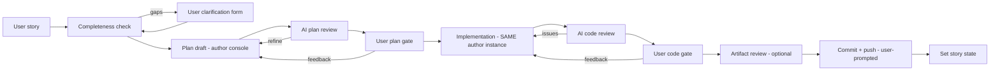

# Implementation Workflow — design

Workflow type `implementation` (long-living): takes a USER STORY (TFS/Azure DevOps or mail),
plans, implements, reviews (AI + human), pushes, and closes the story — a full assisted
delivery loop with the operator gating every consequential step from the steering client.
Decided with Felix 2026-07-28.

## Pipeline



Every loop is bounded (`max-ai-review-rounds`, default 2); every user gate rides the existing
steering surface (forms / decision cards / attention cues); the run's terminal shows the live
author console throughout.

## Session model — the DRIVEN console

The author agent is ONE interactive CLI instance in tmux+ttyd for the whole run (context is
never lost between plan and implementation; the operator can watch — and, in the feedback
phases, type — through the run terminal):

- Prompts are DRIVEN by the workflow: `tmux send-keys` into the session
  (`ISessionHost.SendTextAsync`).
- Turn completion is signaled by the provider's console event source (Claude: the Stop hook —
  already built). The workflow awaits `turn-ended` between drives.
- The plan file is written by the agent to a workflow-designated path in the workspace
  (`.auxilia/plan.md`), published as the `implementation-plan` artifact and re-published on
  every refinement.

## Reviewer — configurable per run

Input `reviewer-mode`: `headless` (default; second agent instance in stream-json/SDK mode,
verdict via typed result sink — never "respond with JSON") or `console` (a SECOND tmux
session, driven the same way, verdict parsed from its plan file/transcript tail). The
reviewer binds its own `review-agent` slot (any `coding-agent` provider), so CC can review
Copilot or vice versa.

## Slots

- `work-items` (required): the story source — `IWorkItemAccess`; TFS/AzDO via `tfs-account`.
- `coding-agent` (required): the author CLI (claude-code-cli or github-copilot-cli).
- `review-agent` (optional; defaults to the author's provider/binding): the reviewer.
- `repository` (required, AllowPush): the per-run clone the work happens in.

## Step configuration (run inputs, all toggles)

`completeness-check` (bool, default on), `ai-review` (bool, on) + `max-ai-review-rounds`
(number, 2), `user-plan-gate` (bool, on), `user-code-gate` (bool, on), `artifact-review`
(bool, off), `push-mode` (choice: prompt/auto/skip, default prompt), `target-state`
(choice, populated at the gate from the story source's ACTUAL state vocabulary — never a
hardcoded list).

## Platform surface to add

1. **`IWorkItemAccess` states**: `GetStatesAsync(workItemId)` (the story type's state
   vocabulary, from the source) and `SetStateAsync(workItemId, state)`. TFS/AzDO provider
   implements via the Work Item REST API; the mail provider reports none (state step skips).
2. **`ISessionHost.SendTextAsync(text)`**: `tmux send-keys` delivery of a driven prompt.
3. **Copilot console + events parity**: `github-copilot-cli` gets an `IConsoleSessionPreparer`
   (GH token into the CLI's interactive auth) and an `IConsoleSessionEventSource`. The Copilot
   CLI has NO hook system — events come from tailing its session log directory (best effort:
   turn/tool detection); where the log yields nothing, console mode still works but only
   lifecycle events fire (documented degradation).
4. **Diff bundle artifact**: `review-bundle` output — full `git diff` + changed-file list +
   plan + AI verdicts as markdown, produced before the artifact-review/user code gates.

## Base prompts (adaptive per provider)

Every agent role can carry BASE INSTRUCTIONS configured per workflow configuration/run:
`base-prompt` on the plain agent workflows, `author-base-prompt`/`reviewer-base-prompt`
here. Delivery adapts to the provider (`CodingAgentCredentials.SystemPromptCliArgument`):
Claude appends them to the SYSTEM prompt (`--append-system-prompt`, headless and console —
riding the session environment, never a log); providers without a system-prompt seam
(Copilot) get them prepended to the session's first prompt. The base prompt is instructions,
not secrets — argv exposure is acceptable where a provider needs it.

## Gate rendering: markdown and mermaid

Gate details carry `DetailFormat` (open vocabulary): `"markdown"` renders through the native
markdown renderer in the steering client's decision cards (plans, review bundles); null/`"code"`
stays monospace (permission tool inputs). ```mermaid fences inside any markdown surface
(details, chat) render as REAL diagrams — AgentView.Wpf exposes a host-pluggable
`MarkdownViewer.FenceRenderer`, and the steering client registers an offline WebView2+mermaid.js
renderer. Plans should use mermaid for diagrams, per the repo convention.

## The step flow (declared view data + runtime states)

The pipeline's shape is the `flow` view's DECLARED DATA (renderer key `step-flow`, one
source: `ImplementationFlow.Steps`): workspace → completeness → plan → implement →
finalization (commit/push + story state combined), with a data-driven skip hint
(completeness-check=false) and each step naming the inputs AND capability slots it owns.
The steering client's configuration and run panels render the stage view before any run exists —
steps dim live as toggles change, a skipped step's exclusive inputs drop out of the form
(gating inputs stay), and SELECTING a step filters the whole form down to exactly what that
step owns (its inputs and its slots; click again to clear). At run time the pipeline
publishes FULL state snapshots on the same view (`WorkflowStepFlow` = per-step `Id`+`State`);
the steering client joins them onto the declared steps by id above the run surface. Any workflow can
adopt the same mechanism; states are an open vocabulary. (See docs/view-data-design.md,
"Declared view data".)

## Idle gates and token economics

A user gate can stay open for hours; the author console's context would then be re-read into
the provider's prompt cache at full input price on resume (cache TTL long expired) — and it
re-expires on every slow exchange. Mitigation, input `gate-idle-compaction` (minutes,
default 10, 0 = off): when a gate has been awaiting the operator longer than the threshold,
the workflow DRIVES a compaction in the author console (Claude: `/compact` via send-keys,
awaiting its completion like any turn) so the surviving context is small — resuming after
that costs a small re-read instead of the full transcript. The state that must survive
compaction verbatim lives OUTSIDE the context by design: the plan file, the review verdicts,
and the diff are files/artifacts the workflow re-injects into the next driven prompt. If a
provider has no compaction command, the fallback is the same files-based handoff: end the
instance at the idle threshold and start a fresh one from plan + verdicts + diff when the
operator answers ("the next agent picks up without recaching").

## Commit / push / story state

After the final gate the WORKFLOW (not the agent) commits (`ProcessGitRunner`, provisioned
commit identity) and pushes through the AllowPush binding; `push-mode=prompt` raises a
decision card first. Then the story-state gate asks the operator to pick from the
source-reported vocabulary (pre-selecting `target-state` if set) and calls `SetStateAsync`.

## Relation to the OLD Auxilia.ImplementationWorkflow

An older-generation `Source/Auxilia.ImplementationWorkflow` exists (headless `IAiAgent`
orchestrators, result-sink reviewer, PR step satisfied only by fakes, no user gates, no
console). The new `implementation` workflow REPLACES it (greenfield rule — no coexistence),
salvaging: `BranchNamingService`, the signal records, `WriteBackService` (comment + status
write-back over `ITaskSourceAccess.UpdateStatusAsync` — the state-SET half already exists;
the state VOCABULARY read (`GetStatesAsync`) is new), and the reviewer result-sink pattern
(`ImplementationReviewResultSinkMcpTools`) for the headless reviewer mode. The old project,
its fakes (`Auxilia.FakeSlots.Implementation.*`), and its tests are dissolved into the new
one as P2 lands. P1 must also verify WHICH provider actually implements
`ITaskSourceAccess`/`IWorkItemAccess` for `tfs-account` and unify state set/read there.

## Build phases

- **P0** Copilot console+events parity (independent deliverable).
- **P1** Platform primitives: `IWorkItemAccess` states + TFS impl, `SendTextAsync`,
  driven-console turn awaiting.
- **P2** `Auxilia.Implementation.Workflow`: pipeline, gates, loops, plan/diff artifacts,
  commit/push, state set; Docker image bundling BOTH CLIs + tmux/ttyd.
- **P3** steering client polish (plan-gate rendering of the markdown artifact, bundle viewer) +
  system test with stub CLIs.
