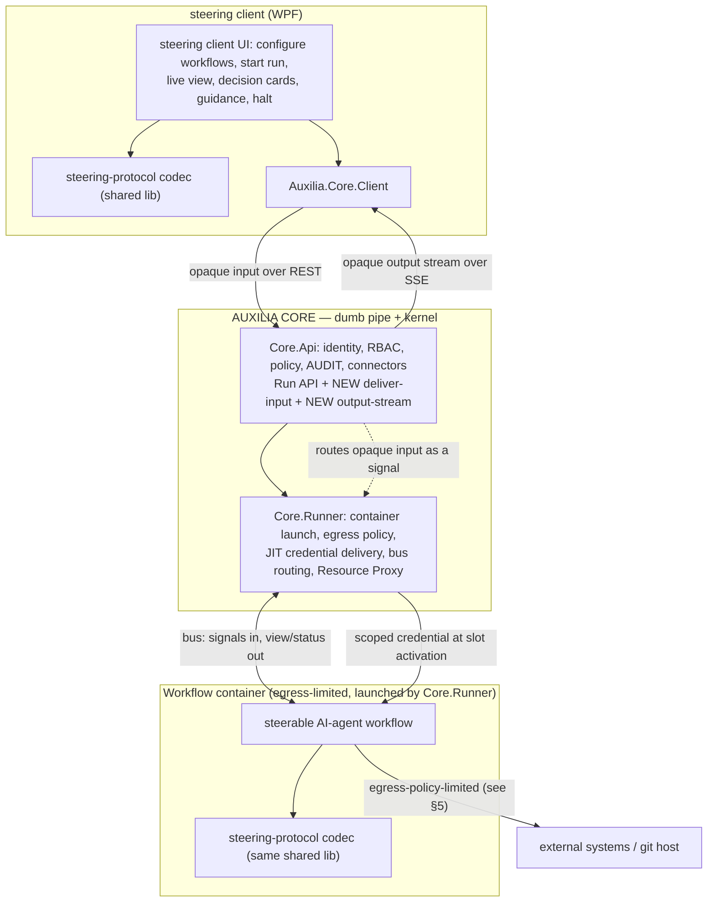
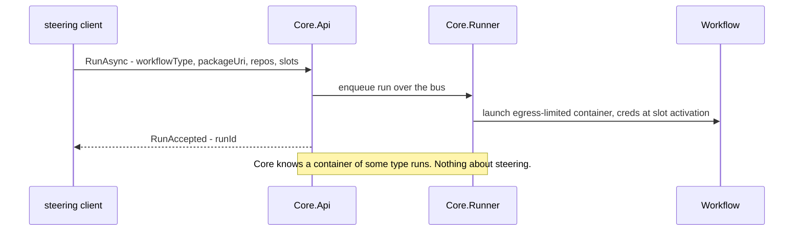
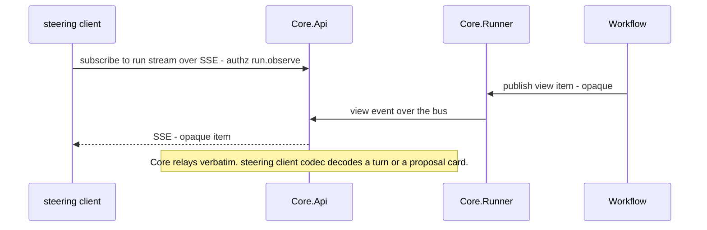
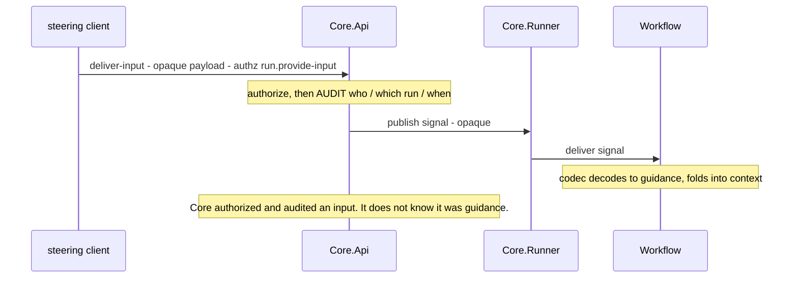
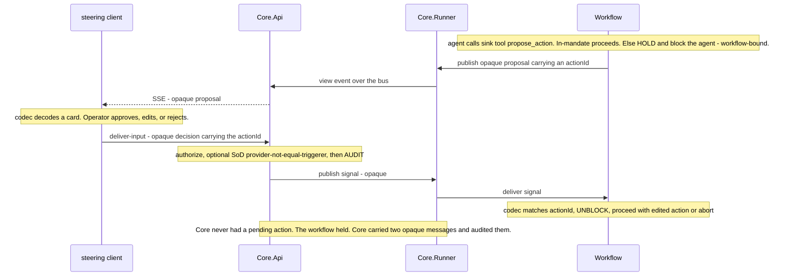
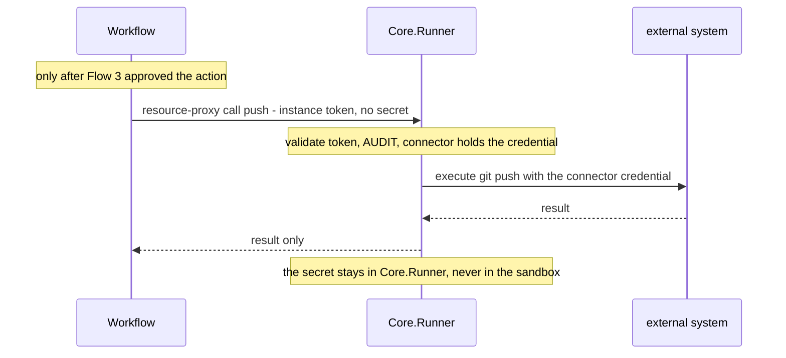
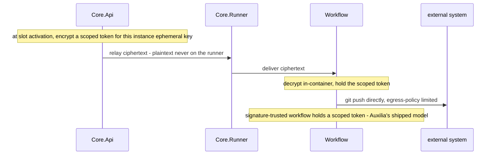

# steering client ⇄ Auxilia Core — Steering Integration (Corrected Architecture)

> **Status:** For confirmation · 2026-07-26 · Felix Klakow
> **Single source of truth for steering.** Supersedes `delivered/human-steering-design.md` (kept for history) and replaces my overnight the steering client build, which put the steering server in the wrong place over the wrong transport.

---

## 1. The differentiation (read this first)

Three layers, and the Core is the **dumb** one:

| Layer | Knows about | Responsibilities |
|---|---|---|
| **Core** (Api + Runner) | containers, principals, connectors, policy, audit — **not workflows** | Configure & start/stop containers correctly (egress policy, mounts, capability clamps, JIT credential delivery). Administer slots/connectors and enable/disable them per user & group. Own identity, RBAC, **policy, audit**. **It never interprets a workflow's process and never influences it.** |
| **Core *API*** | the *connection* between a client and a running run | A **broker**: it lets an authorized client (a) deliver an **opaque** input to a running run and (b) subscribe to a run's **opaque** output stream. It carries payloads it does **not** understand. This is what "allows the steering scenario" without the Core knowing what steering is. |
| **Workflow** (a container) | its own domain + the steering **semantics** | Decides what's in-mandate, what to propose, when to block for a human. Emits proposals/output as opaque items; blocks awaiting an opaque decision. **The decision logic and the "hold" live here.** |
| **steering client** (the steering client) | the steering **UX** | A pure **`Auxilia.Core.Client`** consumer. It speaks to the Core *only* through that library; it uses a shared steering-protocol codec to encode/decode the opaque payloads Core.Client carries. |

**What the Core does NOT get:** no `/pending-actions` endpoint, no `/decide` endpoint, no decision store, no "mandate," no approval semantics. **Decisions are workflow-bound.** The Core moves opaque bytes between a client and a run, authorizes *who* may do so, and audits it.

So your Q2 instinct holds: the **hold is workflow-bound**. The Core needs only two generic primitives — *deliver-opaque-input* and *stream-opaque-output*.

---

## 2. Topology

The **steering protocol** (proposal / decision / guidance / scope shapes) is a small **product-neutral library shared by the workflow and the steering client**, and it is **opaque to the Core**. The steering client reaches the Core *only* through `Auxilia.Core.Client`; the codec is what turns Core.Client's opaque payloads into cards and turns. This is where my overnight `Auxilia.Steering` message records belong — as the workflow⇄steering client contract, not as a server.

---

## 3. The flows (judge the split here)

Participants: **steering client** (the steering client) · **Core.Api** · **Core.Runner** · **Workflow**. Watch the **opaque** notes — everywhere the Core touches a steering payload, it carries bytes it does not interpret.

### Flow 0 — Start a steering run (already exists in the Core)

### Flow 1 — Live output (S3-out / S5) · opaque stream

### Flow 2 — Guidance (S3-in) · opaque input

### Flow 3 — Gate / approval (S4) · the hold is inside the Workflow

**Judgement points:** the only Core-steering surface is **deliver-opaque-input** (Flow 2/3) + **opaque output-stream** (Flow 1); both are generic. The **hold, the mandate, the what-needs-approval** all live in the **workflow**. The Core has no decision concept.

---

## 4. Correction: credentials and the sandbox (your Flow 4 question)

**You were right.** My earlier "credentials never enter the sandbox" was wrong for Auxilia. Auxilia's actual, shipped security posture (`docs/ARCHITECTURE.md:218`) is: a workflow is **signature-trusted**, so it **is** allowed to hold **scoped** credentials — the protection is *who gets a credential and when* (JIT, per-slot, per-instance-encrypted, egress-limited), **not** hiding it from the workflow. The only credential kept out of the container is the initial **clone** token (Workspace Manager clones Core-side and strips it before mounting). There is **no** Workspace-Manager push-back, and **no real git-push path exists yet** — the write/PR interfaces are present but backed by fakes.

So for "push my commits," a credential **must** reach whatever pushes. Two models, and choosing one for the *AI agent* is a real security decision (an LLM agent is less trustworthy than a deterministic signed workflow):

### Model A — topological (Resource Proxy): the token stays Core-side

Safest for an LLM agent. **Cost:** needs real `IResourceConnector` implementations built (today the proxy path is scaffolding — no production connector).

### Model B — Auxilia-native (slot): a scoped token is injected into the sandbox

Matches what's shipped and needs no new proxy connectors. **Cost:** the LLM-driven container holds a (scoped, short-lived) token.

**My lean:** Model A for the *AI-agent* steering workflow specifically — the whole point of the gate is that we don't fully trust the agent, so keeping the credential Core-side and executing the approved action through the proxy is the coherent choice. Building one real `IResourceConnector` (git push) is the price. **Your call — this is the key security decision.**

---

## 5. What must actually be built

**Core (generic, semantics-blind):**
| # | Addition | Where |
|---|---|---|
| 1 | ✅ **Delivered 2026-07-26.** Deliver-input: `POST /api/runs/{id}/inputs` — authorizes `run.provide-input`, audits, publishes `WorkflowInputMessage` to the instance's response queue. `ICoreClient.ProvideInputAsync`; contract `ProvideRunInput` in `RunContracts`. (SoD still open.) | Core.Api + Client + Contracts |
| 2 | Output-stream: `GET /api/runs/{id}/stream` (SSE) relaying view/status events. `ICoreClient.StreamRunAsync` → `IAsyncEnumerable`. | Core.Api + Client |
| 3 | ✅ **Delivered 2026-07-26.** `IWorkflowInputs.ReceiveAsync` — channel-fed from the instance's response-queue subscription, DI-registered by the WorkflowBuilder. Demo: `echo-decision-workflow` (propose → hold → decide → echo) speaking the raw wire protocol. | `Auxilia.Workflows` |
| 4 | *(Model A only)* one real `IResourceConnector` for git push. | Core.Runner + a connector |

**No** decision store/endpoint/mandate in the Core.

**Steering protocol library** (product-neutral, shared, opaque to Core): the message shapes with `actionId` correlation — salvaged from the overnight build; referenced by the workflow and the steering client.

**Steering workflow** (ordinary Auxilia workflow, packaged `docker://`): `RequiresAiAgent`, egress policy, `DeclaresView("steering")`; result-sink tools `propose_action`/`request_scope` that publish a proposal and **block on P2-receive** (the hold); mandate check in-workflow; first behavior = gather-repo-info.

**steering client** (pure Core client): reference `Auxilia.Core.Client` + the protocol lib; configure workflows, start run, consume the SSE stream, send guidance/decisions via `ProvideInputAsync`. **Delete** the Kestrel host, websocket, `SteeringService` Docker orchestration, in-app session/mandate/authorizer, agent Dockerfile/entrypoint, the `steering-agent:dev` image + its test.

---

## 6. Plan (Core-first)

1. Core primitives — §5 items 1–3 (input endpoint, stream endpoint, SDK receive). *Tests: unit + component (`WebApplicationFactory`) + system (real bus/Docker).*
2. Steering protocol lib — the shared opaque contract.
3. Steering workflow — propose/hold/stream; (Model A) the git-push connector.
4. steering client — rebind to `ICoreClient`; delete the old server stack.

---

## 7. Open items for you

- **Q1 — Streaming:** confirmed — Core.Api SSE endpoint (§5.2). ✅
- **Q2 — Hold:** resolved — **workflow-bound** (Flow 3). Confirm it matches your intent.
- **Credential model (§4):** **Model A** (proxy, token Core-side, build one connector) or **Model B** (scoped token in-sandbox, no new connector)? *My lean: A for the AI agent.* ← the key decision.
- **SoD:** should the Core optionally enforce *input-provider ≠ run-triggerer* on `run.provide-input`? Generic authorization, off by default. *My lean: yes.*
- **Protocol-lib home:** shared across repos — standalone package both consume, or define-in-Auxilia + vendor a copy into the steering client?
