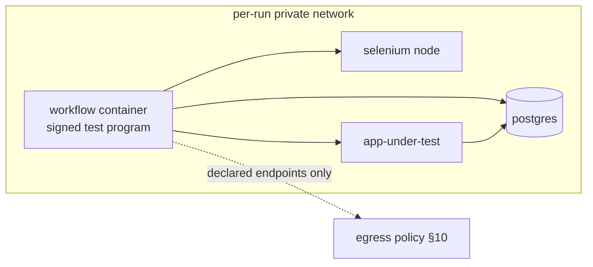
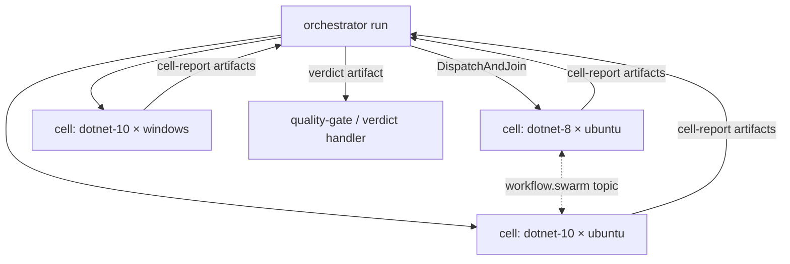

# Test Fabric & Agent Swarms — Design Sketch

> Target-state design for two programs that extend the platform along its existing grain:
> **A. Run pods** — declared multi-container topologies per run, making Auxilia a governed
> test infrastructure (app-under-test + database + browser in one isolated run), and
> **B. Swarm primitives** — fan-out/join, run groups, and a low-latency peer channel that
> turn choreographed multi-agent runs into a first-class construct.
> Status: P0 IMPLEMENTED 2026-08-15 (declared companions end to end: SDK `RequiresCompanion`
> surface, signed schema/manifest `Companions`, registry gate + spawn summary on the schema
> DTO, runner pod materialization with per-run `--internal` network, DAG start, scale
> inputs, placeholder resolution, pod volumes, teardown/re-adoption/orphan sweep, companion
> log artifacts — unit/component covered). Readiness is currently INSPECT-based (Running +
> Docker health when the image defines one); an in-network TCP/HTTP prober is the known
> follow-up. Docker system tests are green (see below) and the console/MCP spawn-summary
> surface is shipped (2026-08-16).
> **The POD CONTROLLER is IMPLEMENTED 2026-08-15 as well** (see §"Runtime-spawned
> companions"): `RequiresPodControl` envelope in the signed schema, `IPodController` over a
> resource-proxy-style authenticated queue, runner-side clamping/audit, and the base
> catalog decision — **environment bases optionally carry a digest-pinned
> `ImageReference`**, and the run's CONFIGURATION pins its spawnable set via the dispatch
> context key `pod-bases` (default-deny when absent), snapshotted into the command at
> dispatch. Runner restarts are covered: re-adoption rebuilds pod-control state before
> handlers resume, so re-adopted runs can keep spawning (`PodReadoptionSystemTests`, green
> 2026-08-16).
> **The worked example below runs as a REAL Docker system test**
> (`Tests/System/Auxilia.SystemTestSuite/PodFabric/PodScenarioSystemTests`, green
> 2026-08-15): declared pod + runtime fleet growth/shrink + availability handshake +
> zipped-log artifacts + full teardown, end to end. The simulated distributed system it
> exercises is `Tests/System/Auxilia.SimStack` — one image whose `ROLE` env var selects
> machine / fleet-manager / coordinator. Still design-only:
> layer-composed companions + setup scripts, declared tunnels, pod profiles, and all swarm
> primitives. Cross-references: `ARCHITECTURE.md` §9 (workspace),
> §10 (network isolation), §6 (lifecycle, platform events), §14.2 (runner scaling).

## Why these two, and why together

A test run already *is* a workflow run: a signed program in an isolated container, a per-run
copy of the repository, a composed toolchain (environment layers — matrix cells like
`{dotnet-8, dotnet-9, dotnet-10} × {ubuntu, windows}` are just distinct configurations),
default-deny egress, interval/work-item/event triggers, and artifacts + live views for
results. What a test run *cannot* do today is span containers: one run composes exactly one
image, and there is deliberately no Docker socket inside workflow containers. Program A adds
the missing topology without puncturing that isolation model.

A swarm already *is* a choreography of runs: any run emits platform events and typed
artifacts; other types trigger on them; each member gets its own container, JIT-scoped
credentials, egress policy, and audit trail. What is missing is orchestration ergonomics:
dispatching N children and awaiting their results is hand-wired through event triggers today,
tight agent-to-agent negotiation has no low-latency channel, and nothing groups the runs.
Program B adds the sugar without adding a new execution model.

The two compose: a swarm orchestrator fanning out one child per matrix cell, each child a pod
(app + db + browser), joined into one aggregate verdict artifact — that is the "governed test
infrastructure" end state.

---

## A. Run pods — declared multi-container topologies

### Declaration (SDK, signed manifest)

Companions are declared on `IWorkflowBuilder` exactly like network endpoints, repositories,
and the interactive terminal are today — schema-declared, signed, policy-clamped at dispatch:

```csharp
.RequiresCompanion("postgres", image: "postgres@sha256:…",
    configure: c => c
        .WithEnvironment("POSTGRES_PASSWORD", CompanionValue.RunSecret())  // minted per run
        .WithReadinessProbe(tcpPort: 5432)
        .WithResourceCaps(memoryMb: 512, cpus: 1))
.RequiresCompanion("selenium", image: "selenium/standalone-chromium@sha256:…",
    configure: c => c.WithReadinessProbe(httpPath: "/wd/hub/status", port: 4444)
        // Dynamic instantiation: the run input "browser-nodes" picks the count at
        // dispatch, clamped to the signed bounds; 0 = the template stays inactive.
        .WithScale(minInstances: 0, maxInstances: 8, countInput: "browser-nodes"))
```

`WorkflowSchema`/`WorkflowManifest` gain a `Companions` list (name, image reference or
layer composition, readiness probe, env template, caps, scale bounds, tunnels). Like
everything else in the manifest, the topology is part of what gets signed and what the
registry approval reviews.

**Static bounds, dynamic instantiation.** The manifest fixes the companion *templates*; the
run picks the *instantiation* — instance counts (and thereby which optional templates
activate) come from declared run inputs, resolved by the runner before any container starts
and clamped to the signed `min/maxInstances`. Scaled templates materialize as indexed
members (`selenium-1` … `selenium-4`) on the pod network, announced to the workflow as an
enumerable (`Workflow__Companion__selenium__Count` + per-index endpoints). This is the same
declared-bounds/per-run-choice split as the interactive-terminal gate and per-run
repositories: approval reviews what a run *may* materialize, the dispatch decides what it
*does* — dynamic test topologies without a manifest change.

Three further declaration facets round out real topologies:

- **Start ordering** — `WithStartAfter("rabbit", "machine-a")` declares dependencies among
  companions; the runner starts the pod as a DAG, each node gated on its dependencies'
  readiness probes (cycles are refused at registration). The workflow container remains the
  last node always.
- **Topology facts in env templates** — instance counts are only known at dispatch, so
  companion env values may use resolvable placeholders:
  `CompanionValue.InstanceCount("machine-a")`, `CompanionValue.InstanceEndpoints("machine-a",
  port: 9000)` (a separator-joined endpoint list), and `CompanionValue.RunSecret()` as
  above. Resolution happens runner-side before any container starts — companions need no
  discovery protocol to find each other.
- **Shared pod volume** — `WithPodVolume("logs", mountPath: "/var/log/app")` declares a
  run-scoped scratch volume mounted into the naming companions and the workflow container
  (under `/workspace/pod/<name>`). It exists for files stdout capture cannot reach —
  application log files, dumps, coverage output — so the workflow can collect and emit them
  as artifacts. Created empty per run, deleted with the run root; never host-backed by
  anything shared across runs (the same leak-proofing stance as workspaces, §9).

### Materialization (runner-only; the Core stays semantics-blind)

The Core validates companion declarations structurally and stores/forwards them opaquely
(they ride `RunWorkflowCommand.SchemaJson` like the rest of the schema). All semantics live
in `Core.Runner`, which already owns image composition, the per-run network, and container
lifecycle:

1. **Per-run private network.** The runner creates one network per run (it already creates
   `--internal` networks for the no-egress case). Companions and the workflow container join
   it; companions are resolvable by their declared name (`postgres:5432`) via Docker DNS
   aliases. Companions get NO egress — outside data reaches them only via the workflow's
   application-level relay or a declared tunnel (see "Isolation domain and declared
   tunnels").
2. **Ordered start.** Companions start as the declared dependency DAG (`WithStartAfter`),
   each gated on its dependencies' readiness probes (fail-fast: a companion that never
   becomes ready fails the run before the workflow launches — same contract as repository
   setup scripts). The workflow container starts last.
3. **Run-scoped secrets.** `CompanionValue.RunSecret()` mints a random per-run value,
   injected into the companion's env and announced to the workflow via
   `Workflow__Companion__<name>__<key>` — nothing is shared across runs, nothing is stored.
4. **Lifecycle unity.** Companions carry the same run labels as the workflow container:
   terminal state tears the whole pod down, re-adoption on runner restart re-adopts the pod
   or clean-kills it as a unit, and the failover monitor's redispatch materializes a fresh
   pod. Companion stdout/stderr are captured as run artifacts (`companion-logs/<name>.log`)
   for post-mortem.



### Trust: where companion images come from

The workflow image is registry-governed and signature-verified; companion images must not
become an unreviewed side door. Decision: **companion images are pinned by digest in the
signed manifest** (`image@sha256:…` required; bare tags are refused at registration). Trust
is then exactly the existing model — the approval act covers the topology, and a repointed
tag cannot swap code (the same reasoning as the "pin the docker package digest at approval"
backlog item). No new admin catalog is needed; the registry review IS the gate. Runners pull
companion digests on demand like any image; air-gapped fleets preload them.

### The spawn grant — surfacing pods at approval

Spawning containers is a capability an admin consciously grants, not a detail buried in a
manifest — but reviewing every test topology per workflow would drown the signing
authority. Trust therefore splits into two tiers, mirroring how slots already work:

1. **Approval grants the envelope, once.** The schema carries an aggregated **spawn
   summary** — the hard container cap, the pod's aggregate resource budget, whether tunnels
   and runtime pod control are permitted, and any *inline* templates with their images —
   rendered as its own
   prominent block in the registry approval UI ("this workflow may spawn pods of up to 64
   containers: …"). A workflow whose manifest declares no spawn capability can never start
   a companion; widening the envelope is a manifest change through re-approval. Concrete
   topologies bound via profiles (below) are NOT expanded here — that review lives in tier 2.
2. **Catalog curation reviews the topologies.** Pod profiles are admin-authored platform
   resources; curating a profile (its images/layers, probes, bounds) IS the topology review
   — done once per fleet definition, reused by every configuration that binds it, governed
   by grants at dispatch like any catalog resource.

Optionally, a platform setting can additionally restrict *registering* spawning workflow
types to a permission (`workflow-type.register-spawning`), for fleets that want a second
gate before the signing authority even sees such a package.

### Provisioned companions — installing software dynamically

Companions need not ship as finished images. A template may instead be **composed** the way
workflow images already are — from a registered environment base plus admin-authored,
signed capability layers:

```csharp
.RequiresCompanion("machine-a",
    c => c.FromEnvironment(baseName: "ubuntu-24",
              layers: ["dotnet-10", "sim-machine-runtime"])
          .WithSetupScript("machine-a/provision.sh")   // runs in the companion before readiness
          .WithReadinessProbe(tcpPort: 9000)
          .WithScale(0, 32, countInput: "machines-a"))
```

The runner composes and caches the image with the exact machinery it uses for workflow
images (same signing verification, same build-time-hardening posture and its future levers).
The setup script runs *inside the started companion* before its readiness probe is
consulted, under the pod's egress policy — so package downloads either go through the
package proxy or a declared endpoint, never ambient internet. "Dynamically installed
software" is thereby still governed twice: layers are admin-authored and signed, and the
script text is part of the signed manifest the approval reviewed.

### Runtime-spawned companions — the pod controller

Declared templates suit tests that know their topology up front. The fleet-simulation case
is the opposite: **the test itself decides, while running, how many machines of which kind
exist** — spawning, reconfiguring, and stopping them as the test case demands. Only the
base images come from the outside. The workflow declares the capability, not a topology:

```csharp
.RequiresPodControl(maxContainers: 64,
    "Spawns simulated hardware machines from granted base images as the test case demands")
```

and receives an `IPodController` via DI at runtime — **runner-mediated over the
resource-proxy seam** (an audited request/response queue; the container still never sees a
Docker socket or daemon API):

```csharp
var machine = await pod.SpawnAsync(new CompanionSpec("machine-07",
    baseImage: "sim-base-ubuntu",                 // must resolve in the granted base catalog
    command: ["/workspace/pod/bin/sim-machine", "--type", "A", "--port", "9000"],
    podVolumes: ["bin"],                          // staged by the workflow before the spawn
    readiness: Probe.Tcp(9000)));
// machine.Endpoint → "machine-07:9000" on the pod network
…
await pod.StopAsync(machine.Name);                // or leave it; teardown catches everything
```

What keeps this governed without any topology review:

- **Images only from the catalog, pinned by configuration.** (As built:) an environment
  base may carry a digest-pinned `ImageReference` — those bases are the runtime-spawnable
  vocabulary. The run's configuration selects its subset via the context key `pod-bases`
  (comma-separated base refs, fixable in the stored configuration like any input); the Core
  resolves exactly those refs into the dispatch command, and the runner refuses every base
  outside that per-run snapshot. No selection = no spawns (default-deny); a catalog edit
  never changes an in-flight run.
- **The envelope clamps every call.** The live **runtime-spawned** count is checked
  against the approved `maxContainers` on each spawn (declared templates are separately
  signed topology and never consume the envelope — the pod's total stays bounded at
  templates + envelope, exactly the advertised spawn summary); exceeding it is a refused
  request, not a policy hole. Every spawn/stop is audited with its full spec, and pod
  control only stops runtime-spawned companions — declared topology is not its to kill.
- **Software rides the pod volume, not an exec channel.** The workflow stages binaries and
  configuration into a pod volume (from its own signed image or its declared repositories)
  and the spec mounts it — the machine's *software* is the reviewed workflow's own payload,
  its *OS* is the curated base. There is deliberately no exec-into-companion API.
- **Same pod, same rules.** Runtime-spawned companions join the pod network with zero
  egress, carry the run labels (teardown, re-adoption, stdout capture as
  `companion-logs/<name>.log`), and die with the run at the latest.

Declared templates, profile bindings, and pod control compose freely — a run can start with
a declared rabbit + central pieces and let the test logic grow the machine fleet
imperatively underneath them.

### Isolation domain and declared tunnels

The pod is an **isolation domain**: its network belongs to exactly one run, companions join
no other network, and the manifest's aggregate resource budget is clamped by runner
configuration — a pod can degrade only its own run, never a neighboring environment or the
runner itself. Within the domain, exactly one member sits on the governed path to the
outside: the workflow container, under the run's egress policy (§10).

Companions have **zero egress, no exceptions** — the earlier per-companion-egress idea is
dropped in favor of this harder line. When a companion genuinely needs external data, two
paths exist:

- **Application-level relay** (default, no mechanism): the workflow fetches through its own
  declared endpoints and feeds the companion over the pod network — the test program stays
  the visible, auditable importer.
- **Declared tunnel** (opt-in): `WithTunnel("machine-a", endpoint: "telemetry.vendor.com:443",
  purpose: "…")` — the runner forwards exactly this companion to exactly this endpoint
  through the run's egress layer. Each tunnel is part of the signed manifest, listed in the
  approval's spawn summary, and audited at materialization. No tunnel, no path.

### Pod profiles — fixed topology from the outside

Inlined templates suit a workflow that owns its topology; a *reusable* fleet ("our standard
factory simulation: two central pieces + machine swarm") belongs in the platform, defined
once by an admin and referenced by many workflows. **Pod profiles** are a Core-stored
catalog with exactly the mechanics of environment bases/layers — versioned, admin-managed
(`provider-catalog.manage`), grants-governed (`GrantsJson`, default-deny posture applies),
opaque to the Core (validated structurally, interpreted only by the runner):

```
profile "factory-sim@1"                       — the fleet Felix sketched:
  ├─ central_piece_0: fleet-manager template  —   central pieces at the top,
  ├─ central_piece_1: coordinator template    —   sub-profiles as machine swarms
  ├─ swarm environments_0 = profile "machines-basic@2"   (machine-a ×0–32, machine-b ×0–32)
  └─ swarm environments_1 = profile "machines-extended@1"
```

Profiles compose sub-profiles (one level of nesting to start); every leaf is an ordinary
companion template — digest-pinned or layer-composed, with scale bounds, probes, volumes.

**Binding happens at configuration, not in the manifest** — the slot pattern applied to
topology. The workflow declares only the *shape* it accepts:

```csharp
.RequiresPodProfile("system-under-test",
    "The fleet this test exercises — any granted profile fits",
    maxContainers: 64)          // clamps whatever profile gets bound
```

and each **stored configuration** binds a concrete profile (version-pinned there, for
reproducible runs) plus values for the profile's open parameters. Grants govern the binding
at dispatch exactly like slot providers and environment layers; the workflow itself never
knows which machines or types it got — it enumerates the materialized pod via the announced
topology facts and drives the test generically.

**Open parameters make profiles sweepable.** A profile template may leave facets open for
the configuration to fill — most importantly its *environment-layer selection*:

```
profile "factory-sim@1"
  ├─ central_piece_0: fleet-manager   — layers: OPEN (param "cp0-env"), base: ubuntu-24
  ├─ central_piece_1: coordinator     — layers: OPEN (param "cp1-env")
  └─ swarm: profile "machines-basic@2"  — counts open as usual (machines-a/-b inputs)
```

The two sweep dimensions are now orthogonal and both live *outside* the workflow AND
outside the manifest: environment combinations for the central pieces are configuration
values (`cp0-env = [dotnet-8]` vs `[dotnet-10]` …), machine mixes are profile choice +
count inputs. A large system-test campaign is then: **one approved workflow × a handful of
curated profiles × N cheap stored configurations** (one per combination, taggable, shareable,
grants-governed), dispatched by interval triggers for nightly farms or fanned out by a P1
orchestrator that generates the combination matrix and joins the verdict artifacts. Nothing
in that loop touches the registry — scale lives entirely in the configuration plane.

### Worked example — distributed system with simulated hardware

The scenario that shaped the facets above: a system of two central services — one speaking
over its own RabbitMQ, one over raw TCP, talking to each other — managing a fleet of
simulated "hardware" machines of several types. The workflow drives the test case and ships
the collected logs as one artifact.

```csharp
.RequiresCompanion("rabbit", image: "rabbitmq@sha256:…",
    c => c.WithReadinessProbe(tcpPort: 5672)
          .WithEnvironment("RABBITMQ_DEFAULT_PASS", CompanionValue.RunSecret()))
// Simulated hardware — heterogeneous, counts chosen per dispatch:
.RequiresCompanion("machine-a", image: "registry.local/sim-machine-a@sha256:…",
    c => c.WithReadinessProbe(tcpPort: 9000)
          .WithScale(minInstances: 0, maxInstances: 32, countInput: "machines-a"))
.RequiresCompanion("machine-b", image: "registry.local/sim-machine-b@sha256:…",
    c => c.WithReadinessProbe(tcpPort: 9000)
          .WithScale(minInstances: 0, maxInstances: 32, countInput: "machines-b"))
// Central piece A: manages the machines, announces availability over the pod rabbit.
.RequiresCompanion("fleet-manager", image: "registry.local/fleet-manager@sha256:…",
    c => c.WithStartAfter("rabbit", "machine-a", "machine-b")
          .WithEnvironment("BUS_URI", "amqp://rabbit:5672")
          .WithEnvironment("MACHINES",
              CompanionValue.InstanceEndpoints("machine-a", 9000),
              CompanionValue.InstanceEndpoints("machine-b", 9000))
          .WithPodVolume("logs", mountPath: "/var/log/app")
          .WithReadinessProbe(httpPath: "/health", port: 8080))
// Central piece B: TCP service, learns availability from A via the pod rabbit.
.RequiresCompanion("coordinator", image: "registry.local/coordinator@sha256:…",
    c => c.WithStartAfter("rabbit")
          .WithEnvironment("BUS_URI", "amqp://rabbit:5672")
          .WithPodVolume("logs", mountPath: "/var/log/app")
          .WithReadinessProbe(tcpPort: 7000))
.RequiresInput("machines-a", "Type-A machines", required: true)
.RequiresInput("machines-b", "Type-B machines", required: true)
.DeclaresOutput("test-logs", "logs.zip", "All pod service logs, zipped")
.DeclaresOutput("test-report", "report.json", "Per-case verdicts")
```

The run's flow: the runner materializes the pod DAG (rabbit + machines → fleet-manager +
coordinator → workflow), the workflow drives the test case against `coordinator:7000` and
`fleet-manager:8080` (asserting, e.g., that availability notifications for exactly the
dispatched machine counts arrive), then zips `/workspace/pod/logs` into `logs.zip` and
writes its verdicts — both picked up as declared output artifacts. Companion stdout is
captured additionally (`companion-logs/<name>.log`) without any workflow involvement.
Note the pod's RabbitMQ is the *system under test's* bus, a plain companion on the private
network — it has no relation to the platform's message bus, which the workflow reaches
through `IMessageBusClient` as ever. Different machine mixes are just different dispatch
inputs (or stored configurations — one per standard fleet profile), and a matrix over mixes
is a P1 fan-out.

### What falls out

- Testcontainers-style suites (app + db + broker + browser) as governed runs — without a
  Docker socket, without any test being able to reach production (default-deny egress).
- Nightly farms and PR gates: interval/event triggers dispatch the suite; matrix = one
  stored configuration per environment-layer cell; results are typed artifacts a
  verdict/quality-gate workflow consumes (`ConsumesArtifact`).
- The coding-agent workflows can *run the product they just changed* against real
  dependencies inside their own run — review with evidence.

### Explicit non-goals

- No Docker socket in any container, ever — the pod is declared, not imperative.
- No imperative Docker access: dynamic topology exists ONLY through the pod controller —
  an audited, runner-mediated, envelope-clamped API restricted to catalog base images.
  There is no exec-into-companion channel and no raw container API of any kind.
- No re-approval for topology variation: new *inline* templates mean a manifest change
  through registration/approval; profile-bound and pod-controlled topologies vary through
  catalog curation, configurations, and run logic — always inside the approved envelope.
- Companions are not workflows: no bus identity, no slots, no views — they are inert
  services the one signed program exercises.

---

## B. Swarm primitives — fan-out/join, run groups, peer channel

### B1. Run groups (the spine everything else hangs on)

A new optional `GroupId` (+ `ParentRunId`) on the run record, stamped by the Core when a run
dispatches children. Everything else derives from it:

- **UI**: AdminConsole and the steering client render a run tree (group node → member runs,
  aggregate status), instead of N unrelated rows.
- **Cancellation cascade**: cancelling the group (or the parent) cancels members — an
  operator can stop a runaway swarm with one action.
- **Quotas**: `CoreApi:RunQuotas` gains `MaxRunsPerGroup` and group-aware dispatch
  accounting, so a buggy orchestrator cannot fork-bomb the fleet.
- **Audit**: every member's trail carries the group id — "what did this swarm do" is one
  filtered query.

### B2. Fan-out/join (orchestrator as a workflow)

An orchestrator is itself a workflow — dispatching children through the Core's Run API with
full governance (policy engine, quotas, default-deny resource access), never through any
side channel. Two pieces make it first-class:

- **Declared dispatch capability.** `DeclaresDispatch("cell-runner", ofType: "test-cell")`
  in the manifest: which child types an orchestrator may start is signed and reviewable, and
  the Core refuses dispatches outside the declaration. Children are dispatched on behalf of
  the run's originating principal (the existing `run.on-behalf-of` seam), so a swarm never
  escalates beyond what its human could do.
- **SDK coordinator.** Delivered into the workflow via DI (riding the existing resource-proxy
  seam — the container still never holds Core credentials):

```csharp
var results = await coordinator.DispatchAndJoinAsync(
    cells.Select(c => new ChildRun("test-cell", inputs: c.ToInputs())),
    joinOn: JoinCriteria.ResultArtifact("cell-report"),
    perChildTimeout: TimeSpan.FromMinutes(30),
    cancellationToken);
```

Under the hood the join is nothing new: the coordinator awaits the children's `run.*`
lifecycle events and their declared result artifacts over the Core's filtered streams — the
same machinery `ArtifactChainingEngine` and `EventTriggerEngine` use, packaged as one call.
Partial failure is a first-class result (per-child status, not an all-or-nothing throw);
the orchestrator decides whether three red cells fail the gate.

### B3. Swarm peer channel (tight negotiation)

Artifact/event chaining is async, persisted, and audited — right for handoffs, clunky for
agent-to-agent negotiation. The peer channel is a **bus-backed, schema-declared, run-scoped
topic** following the selective-routing design:

- Exchange `workflow.swarm`, routing key `{groupId}.{channel}` — the same
  topic-exchange + narrow-binding scheme as `workflow.status`/`views`/`artifacts` (the fakes
  will over-deliver by design; real-RabbitMQ system tests own the routing proof).
- Declared in the manifest: `DeclaresSwarmChannel<TNegotiation>("planning")` — the payload
  schema is published, membership is the run group, and an instance can only bind channels
  its group owns. (Hard membership *enforcement* on the bus shares the known dependency of
  the event-spoofing residual: per-container bus credentials. Until that program lands, the
  channel has the same trust level as the rest of the in-container bus surface — acceptable
  because every member is a signed, approved program.)
- Ephemeral by default (not persisted, not a view); an optional mirror flag copies traffic
  into a run view for observability when an operator wants to watch the negotiation.

### B4. Shared work (a documented convention, not a mechanism)

Per-run workspace snapshots isolate members by construction — the right default. For
collaborating on one repository the blessed pattern is **branch-per-agent + a merge run**:
each member pushes its work to `swarm/{groupId}/{runId}` via the existing push-scoped-token
interception, and a designated merge child (or the orchestrator's final phase) integrates,
resolves, and produces the result artifact. No shared mutable mount: a group-shared
workspace would reintroduce exactly the cross-run leak channel the workspace design closed
(see the persistent-workspace reset note in the backlog), so it stays out until a real case
forces it — and then as re-materialized copies, never a shared bind mount.



---

## Phasing

| Phase | Scope | Unlocks |
|---|---|---|
| **P0** | Run pods: manifest `Companions` + spawn summary at approval, runner materialization (DAG start, scale inputs, pod volumes), digest pinning, pod lifecycle + logs | Multi-container testing; the flagship "governed test infrastructure" story |
| **P0.5** | Pod controller (runtime spawn/stop, base-image catalog gate); layer-composed companions + setup scripts; declared tunnels; pod-profile catalog | Test-driven dynamic fleets, dynamic software install, reusable admin-defined fleets, governed external data paths |
| **P1** | Run groups + declared dispatch + SDK `DispatchAndJoinAsync`; group quotas, cascade cancel, run-tree UI | Matrix fan-out, orchestrated swarms, PR gates with one aggregate verdict |
| **P2** | Swarm peer channel (`workflow.swarm` topic, schema-declared, optional mirror) | Tight multi-agent negotiation (planner/critic loops across containers) |
| **P3** | Shared-work pattern documentation + a reference swarm workflow (matrix test orchestrator) shipping in `Source/Workflows` | Copy-paste starting point; proves the whole stack end to end |

P0 and P1 are independent and could land in either order; P2 is meaningless before P1 (the
channel is scoped to groups). Every phase keeps the two invariants that make the platform
what it is: **the Core stays semantics-blind** (topology and orchestration are declared data
and governed dispatch, never Core-side vendor/workflow logic), and **trust rides the signed
manifest** (what a run may reach, start, or talk to is reviewable before it ever runs).

## Client-surface & packaging impact

Every phase touches the published library family — the parity rule (REST = MCP = client)
and "docs travel with the feature" apply as everywhere:

- **`Auxilia.Core.Contracts`** — `WorkflowSchema`/`WorkflowManifest` gain `Companions`,
  `PodControl` (envelope), `Tunnels`, and the derived spawn summary; pod-profile catalog
  DTOs (profile, template, open parameters, grants); run records gain `GroupId`/
  `ParentRunId`; run-status DTOs gain the pod view (live members, per-companion state).
  Additive → minor version bumps.
- **`Auxilia.Core.Client` (`ICoreClient`)** — pod-profile administration
  (`ListPodProfilesAsync`/`Upsert…`/`Delete…`/`SetPodProfileGrantsAsync`, same shape as the
  environment-layer surface); run-group queries (`GetRunGroupAsync` → tree + aggregate
  status) and cascade cancel; the workflow-type detail exposes the spawn summary so client
  UIs can render the approval block. Covered by `CoreClientSurface` system tests like the
  rest of the surface.
- **MCP parity** — matching tools per the existing pattern: `list/upsert/delete_pod_profile`,
  `set_pod_profile_grants` (gated `provider-catalog.manage`), `get_run_group`,
  `cancel_run_group`; the spawn summary rides the existing workflow-type tools so an AI
  reviewer can read it during approval.
- **`Auxilia.Workflows` (SDK)** — the builder surface (`RequiresCompanion`, `WithScale`,
  `WithStartAfter`, `WithPodVolume`, `WithTunnel`, `RequiresPodProfile`,
  `RequiresPodControl`), `IPodController` + `CompanionSpec`, a typed topology-facts accessor
  over the announced env (`IPodTopology`), and the P1 `ISwarmCoordinator`. Fakes for all of
  them so workflow unit tests stay bus-free.
- **`Auxilia.Workflows.Client`** — authoring support for configurations that bind pod
  profiles and fill open parameters (schema-driven, like slot bindings today); a
  matrix-generation helper (cells → stored configurations / dispatches) for campaign
  authoring from any client, including the steering client.
- **AdminConsole** — profile catalog page (+ Sharing drawer, posture-aware), the spawn
  summary block in the registry detail, the run-tree/pod view on RunDetail.
- **Packaging** — additive minor bumps across the family, gallery readmes updated in the
  same change (`PackageReadmeFile` rule), plus the affected `*.project-instructions.md`
  and `ARCHITECTURE.md` sections (§6, §9, §10) when implementation lands.

## Test strategy notes

- Pod materialization, readiness fail-fast, teardown/re-adoption as a unit: Docker system
  tests beside `ReAdoptionSystemTests` (real daemon, real networks).
- `workflow.swarm` routing narrowness: real-RabbitMQ tests beside
  `MessageBusTopicRoutingSystemTests` — the fake bus routes by type and cannot prove
  group-key isolation.
- Fan-out/join: component tests over the coordinator against the fake bus/streams; one
  `CoreClientSurface`-style system test driving a real 3-child join incl. one failing child.
