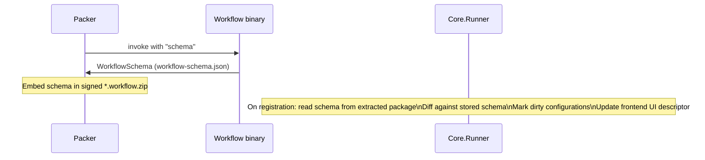

# Auxilia Workflow SDK – Design Plan

> Status: **Draft / Idea**  
> This document describes a proposed SDK for defining and bootstrapping Auxilia workflows declaratively.

---

## 1. Goals

- Workflows declare their **capability requirements** upfront in code (builder pattern).
- On startup the workflow node sends its requirements to the **Core.Runner** via RabbitMQ.
- The **Core.Api** resolves which concrete connector instance satisfies each slot and RSA-encrypts that slot's configuration for the workflow instance's ephemeral public key; the **Core.Runner only relays the ciphertext** (it never sees plaintext connector settings) and the workflow boots with fully-resolved dependencies.
- New workflow types can be added without touching the Core.Runner core – it only needs to know about capability contracts, not concrete workflow logic.
- Workflows are **one-shot by default**: they run exactly once and always shut down afterwards to prevent data leaks and maximise security. A manifest-declared **long-living** lifetime exists for service-style workflows (standing agents, monitors) — declared via `.WithLifetime(WorkflowLifetime.LongLiving)`, which requires operator approval on the Core.Runner (`WorkflowDispatcher:ApprovedLongLivingWorkflowTypes`). Long-living instances receive a `WorkflowDrainSignal` via DI; when its token fires (stored configuration changed or a new version registered) the application must finish in-flight work and return — the Core.Runner marks the run `Draining` and starts a replacement with the fresh configuration once it exits. See docs/ARCHITECTURE.md §6 for the full lifetime model (credential expiry + re-request arrives with per-slot JIT delivery).
- Workflows operate in two modes driven by **command-line arguments**: `run` (execute business logic) and `schema` (emit a JSON schema — invoked by the Packer at packaging time so the signed package always carries a current schema and the frontend can render a typed configuration UI).
- **Environment requirements** are first-class – a workflow can declare what must be present in its execution environment (tools, ports, OS). Multi-container orchestration is deferred to a future iteration.

---

## 2. Core Concepts

| Concept | Description |
|---|---|
| **Capability** | A typed descriptor expressing _what_ a slot requires, not _which_ provider satisfies it. Capabilities have **required** and **optional** fields. |
| **Slot** | An explicitly named dependency a workflow declares it needs. Every slot carries a name and an optional human-readable description. Multiple slots of the same interface type are supported. |
| **EnvironmentRequirement** | A typed descriptor of what the execution environment must provide (installed tools, exposed ports, OS constraints). |
| **WorkflowManifest** | The serialisable output of the builder – sent to the Core.Runner in `run` mode. |
| **WorkflowSchema** | The JSON schema emitted in `schema` mode – describes all slots, their capabilities, and environment requirements so the Core.Runner and frontend stay in sync. |
| **WorkflowConfiguration** | The resolved, encrypted answer for a slot – resolved and RSA-encrypted by the Core.Api and relayed by the Core.Runner; contains connection details and secrets per slot. |
| **WorkflowBootstrapper** | Receives the `WorkflowConfiguration`, decrypts it, and wires up real DI services. |

---

## 3. Proposed Builder API

The builder is the single entry point. `.Run(args)` terminates the chain – the SDK reads `args` to determine the mode and either performs the handshake or emits the schema and exits.

Each known slot interface (e.g. `ITaskSource`, `IAiAgent`, `ISourceControl`) ships a **typed extension method** on the builder. This keeps the call site readable and self-documenting, and removes the need for a generic type parameter at every slot declaration. DI wiring for all other services is done normally inside the workflow's own `ConfigureServices`.

```csharp
// In a workflow's Program.cs / startup
await WorkflowBuilder.Create("code-review-workflow")
    .RequiresTaskSource("task-source",
        new TaskSourceCapabilities { SupportedItemTypes = [ItemType.PullRequest] },
        description: "Provides the pull requests this workflow will review.")
    .RequiresAiAgent("ai-agent",
        new AiCapabilities
        {
            MinContextWindow = 128_000,
            SupportedModalities = [Modality.Text, Modality.Image]
        },
        description: "Primary model used for code analysis.")
    // Two slots of the same type – distinguished by name
    .RequiresSourceControl("source-control-reader",
        new SourceControlCapabilities { RequiredPermissions = [Permission.Read] },
        description: "Read access to the repository under review.")
    .RequiresSourceControl("source-control-writer",
        new SourceControlCapabilities { RequiredPermissions = [Permission.Read, Permission.Write] },
        description: "Write access for posting review comments.")
    .RequiresEnvironment(env => env
        .RequiresTool(Tool.Git)
        .RequiresTool(Tool.DotNetSdk, minVersion: "10.0")
        .RequiresOs(OsConstraint.Linux))
    .WithMetadata(meta =>
    {
        meta.Version = "1.2.0";
        meta.Tags = ["code-review", "ai"];
    })
    .Run(args); // args drives mode: "run" | "schema"
```

### Slot extension methods

Each slot interface declares its typed extension method alongside its capability type, in its own package (e.g. `Auxilia.Workflows.TaskSource`). All extension methods share the same signature shape:

```csharp
// Defined in Auxilia.Workflows.AiAgent
public static class AiAgentWorkflowBuilderExtensions
{
    public static IWorkflowBuilder RequiresAiAgent(
        this IWorkflowBuilder builder,
        string name,
        AiCapabilities capabilities,
        string? description = null)
        => builder.Requires<IAiAgent>(name, capabilities, description);
}
```

| Parameter | Required | Purpose |
|---|---|---|
| `name` | ✓ | Unique slot key within this workflow; used as the identifier in messages and emitted schema. |
| `capabilities` | ✓ | Typed capability record describing what the provider must satisfy. |
| `description` | — | Human-readable hint shown in the frontend configuration UI. |

All five shipped slot packages follow the same pattern:

| Package | Extension method | Capabilities type | Service type |
|---------|-----------------|-------------------|-------------|
| `Auxilia.Workflows.AiAgent` | `RequiresAiAgent` | `AiCapabilities` | `IAiAgent` |
| `Auxilia.Workflows.TaskSource` | `RequiresTaskSource` | `TaskSourceCapabilities` | `ITaskSourceAccess` |
| `Auxilia.Workflows.SourceControl` | `RequiresSourceControl` | `SourceControlCapabilities` | `ISourceControlAccess` |
| `Auxilia.Workflows.PullRequestAccess` | `RequiresPullRequestAccess` | `PullRequestAccessCapabilities` | `IPullRequestAccess` |
| `Auxilia.Workflows.TestRunner` | `RequiresTestRunner` | `TestRunnerCapabilities` | `ITestRunner` |

---

## 4. Capability Records

Capabilities express requirements only – never preferences for a specific provider. Each field is either **required** (non-nullable / value type) or **optional** (nullable). The Core.Runner uses these fields to determine whether a stored configuration satisfies the manifest. If a new required field is added to a capability, existing stored configurations are automatically marked **dirty** and must be reconfigured via the frontend.

```csharp
public interface ICapability { }

// Required fields → non-nullable. Optional fields → nullable.
public record AiCapabilities : ICapability
{
    public required int MinContextWindow { get; init; }
    public required Modality[] SupportedModalities { get; init; }
    public int? MaxOutputTokens { get; init; }          // optional

    [JsonExtensionData]
    public IDictionary<string, JsonElement>? Extensions { get; init; }
}

public record SourceControlCapabilities : ICapability
{
    public required Permission[] RequiredPermissions { get; init; }
    public string[]? SupportedHostTypes { get; init; }  // optional

    [JsonExtensionData]
    public IDictionary<string, JsonElement>? Extensions { get; init; }
}

public record TaskSourceCapabilities : ICapability
{
    public required ItemType[] SupportedItemTypes { get; init; }

    [JsonExtensionData]
    public IDictionary<string, JsonElement>? Extensions { get; init; }
}

// Marker – use when a slot needs no capability constraints
public record NoCapabilities : ICapability;
```

All capability records carry `[JsonExtensionData]` to tolerate unknown fields from newer workflow versions arriving at an older Core.Runner.

---

## 5. Environment Requirements

Environment requirements are declared via a fluent sub-builder on `.RequiresEnvironment(...)` and are included in both the `WorkflowManifest` and the emitted `WorkflowSchema`. The Core.Runner uses them to validate that the target runner satisfies the workflow's prerequisites before dispatching.

The fluent style avoids tying the API to a specific field shape (e.g. `MinimumDotNetVersion`) – each requirement is a discrete, versioned assertion:

```csharp
.RequiresEnvironment(env => env
    .RequiresTool(Tool.Git)
    .RequiresTool(Tool.DotNetSdk, minVersion: "10.0")
    .RequiresOs(OsConstraint.Linux)
    .RequiresPort(5432))   // e.g. a sidecar DB exposed on this port (future)
```

Internally each call appends a typed `IEnvironmentRequirement` entry, keeping the model open for new requirement kinds without breaking the top-level record:

```csharp
public interface IEnvironmentRequirement { }

public record ToolRequirement(Tool Tool, string? MinVersion = null) : IEnvironmentRequirement;
public record OsRequirement(OsConstraint Os) : IEnvironmentRequirement;
public record PortRequirement(int Port) : IEnvironmentRequirement;
```

Adding a new `IEnvironmentRequirement` kind marks all stored runner registrations that do not declare that kind as dirty.

> **Multi-container support** (e.g. sidecar services) is explicitly out of scope for v1. See section 13 for what would need to change to enable it.

---

## 6. Workflow Modes (driven by command-line args)

The mode is not declared in code – it is derived from the command-line arguments passed to `.Run(args)`. This means the same binary serves both purposes without any conditional compilation or DI reconfiguration.

| Argument | Mode | Behaviour |
|---|---|---|
| `run` | **Run** | Performs the full registration handshake, receives encrypted configuration, boots DI, executes business logic, exits. |
| `schema` | **Schema** | Serialises the builder state to a `WorkflowSchema` (JSON) and prints it to stdout for the Packer to embed in the signed package, then exits. No secrets involved. |

```csharp
// Entrypoint – the SDK reads args[0]
await WorkflowBuilder.Create("code-review-workflow")
    // ... slot and environment declarations ...
    .Run(args);
```

Schema mode is invoked at **packaging time** by `Auxilia.Workflows.Packer`: the emitted `workflow-schema.json` is embedded in the signed `*.workflow.zip`. At registration the Core.Runner (`WorkflowAnnouncementHandler`) reads the schema directly from the extracted package — there is **no runtime schema round-trip** against a running container. When a new version is registered, the Core.Runner diffs the embedded schema against the stored one to detect dirty configurations.

---

## 7. Bootstrap / Configuration Handshake (via RabbitMQ)

```mermaid
sequenceDiagram
    participant W as Workflow node
    participant S as Core.Runner

    W->>S: WorkflowRegistrationRequest\n{ manifest, publicKey, responseTopic }
    Note over S: Validate environment requirements against runner\n(Core.Api resolves the connector + encrypts each SlotConfiguration\nwith W's public key; runner relays ciphertext)
    S->>W: WorkflowConfigurationResponse\n{ encryptedSlots, success, errorMessage }
    Note over W: Decrypt with private key\nBootstrapper wires up DI\nWorkflow runs → exits
```

- The workflow generates an **ephemeral asymmetric key pair** on each startup.
- The public key is included in `WorkflowRegistrationRequest`.
- The Core.Runner validates `EnvironmentRequirements` against the registered runner profile. **Slot resolution and encryption happen in the Core.Api** (`SlotCredentialResolver`): it resolves each slot's connector settings and RSA-encrypts them for the instance's public key, and the runner relays that ciphertext — plaintext connector settings never enter the runner process.
- The workflow decrypts with its private key inside the SDK.
- Once the workflow exits the private key is discarded.

**Trust and credential-delivery model:**

- The workflow is **trusted by signature** — the signing authority is responsible for verifying that the workflow is correct and trustworthy before signing. A signature-verified workflow is therefore permitted to hold the scoped credentials its slots resolve to; the SDK keeping decrypted settings out of application code is defence in depth, not the trust boundary.
- The invariant is **just-in-time delivery**: a workflow holds *no* credentials prior to configuration. Registration only *validates* that every slot is configured; the response carries no secrets. Each slot's configuration is delivered on a `SlotActivationRequest` when the workflow first resolves the slot (keyed DI factories route through the SDK's `SlotActivator`), encrypted for the instance's ephemeral key and answered only on the pre-created response queue. Delivered credentials carry an `ExpiresUtc`; the activator transparently re-requests after expiry, so long-living instances never hold indefinitely valid secrets. The instance token authenticates activations and dies with the run. (The test harness may still deliver all slots eagerly in the registration response — the SDK supports both.)
- Operator-configured operation limits (e.g. allowed branch patterns, PR-only, no force-push for source control) are enforced in **two layers**: the credential delivered in the `SlotConfiguration` is scoped to the limits wherever the provider supports it, and the slot handler enforces the same limits uniformly before executing any operation. The credential scope is the hard backstop; the handler check provides provider-independent behaviour and clear errors.
- The handshake is **authenticated**, not just encrypted — an ephemeral public key proves nothing about who is asking. The dispatcher issues an **instance token** per launch (env vars `Workflow__InstanceId` / `Workflow__InstanceToken`) and pre-creates the instance's **exclusive response queue** (`workflow-response-{instanceId}`); announcements, the registration (single-use — duplicates are rejected), and every slot activation carry the token (constant-time comparison; the issuance lifetime bounds only the launch→registration window, and the token dies when the run reaches a terminal state). All responses go only to the pre-created queue, ignoring the self-declared `ResponseTopic`. When the env vars are absent the SDK self-generates an identity — accepted only by a Core.Runner configured with `RequireInstanceToken=false` (trusted-operator dev mode).

### Schema flow (packaging time)



### Message shapes

```csharp
// Workflow → Core.Runner (run mode)
public record WorkflowRegistrationRequest(
    Guid WorkflowInstanceId,   // platform-assigned at launch (env), self-generated only in dev
    WorkflowManifest Manifest,
    string PublicKey,          // Base64 DER – ephemeral per instance
    string ResponseTopic,      // ignored in authenticated mode — the pre-created queue is used
    string? InstanceToken = null); // one-time launch token; required unless RequireInstanceToken=false

// Core.Runner → Workflow (run mode)
public record WorkflowConfigurationResponse(
    Guid WorkflowInstanceId,
    bool Success,
    string? ErrorMessage,
    IReadOnlyDictionary<string, EncryptedSlotConfiguration> Slots);

public record EncryptedSlotConfiguration(
    string ProviderType,
    string EncryptedSettings); // JSON encrypted with the workflow's public key

// Decrypted by the SDK – never exposed to workflow code
internal record SlotConfiguration(
    string ProviderType,
    IReadOnlyDictionary<string, string> Settings);
```

### 7.1 End-to-end slot → implementation loading flow

The sequence below shows a full run from builder call-site through plugin discovery, slot decryption, and DI registration, ending with the workflow receiving a ready `IServiceProvider`.

```mermaid
sequenceDiagram
    participant App as Workflow Program.cs
    participant Builder as WorkflowBuilder
    participant Bus as RabbitMQ
    participant SI as Core.Runner
    participant Boot as WorkflowBootstrapper
    participant PL as PluginLoader
    participant Handler as ISlotHandler (plugin)
    participant DI as IServiceCollection

    App->>Builder: Create(name)<br/>.RequiresAiAgent("ai-agent", caps)<br/>.RequiresSourceControl("sc", caps)
    Note over Builder: SlotDefinition list built

    App->>Builder: Run(args)
    Builder->>Bus: Publish WorkflowAnnouncementMessage<br/>(instanceId, workflowName, publicKey, responseTopic)
    Bus->>Builder: WorkflowDirective (Run)

    Builder->>Bus: Publish WorkflowRegistrationRequest<br/>(instanceId, manifest, publicKey, responseTopic)
    Note over SI: Validate environment requirements<br/>(Core.Api resolves the connector + encrypts SlotConfiguration<br/>with workflow's public key; runner relays ciphertext)
    SI->>Bus: WorkflowConfigurationResponse<br/>(encryptedSlots per slot name)
    Bus->>Builder: WorkflowConfigurationResponse

    Builder->>PL: Load(DiscoverPlugins(AppContext.BaseDirectory))
    Note over PL: Verify manifest signature<br/>Load assembly, reflect ISlotHandler<br/>Register handler in ISlotHandlerResolver by providerType

    Builder->>Boot: new WorkflowBootstrapper(response, keyPair, resolver, slotDefinitions)
    Boot->>Boot: Apply(services)
    loop for each slot in response.Slots
        Boot->>Boot: Decrypt EncryptedSlotConfiguration → SlotConfiguration
        Boot->>Handler: Register(services, slotName, serviceType, configuration)
        Handler->>DI: services.AddKeyedSingleton<TService>(slotName, implementation)
    end

    Builder->>DI: BuildServiceProvider()
    Builder->>App: Run workflow body with resolved IServiceProvider
    Note over App: Workflow executes → exits<br/>Private key discarded
```

**Stage-by-stage description:**

1. **Builder call-site** – The workflow's `Program.cs` calls typed extension methods (e.g. `RequiresAiAgent`), each of which calls `builder.Requires<TService>(name, capabilities, description)`. The builder accumulates a `SlotDefinition` list.
2. **Announcement / directive** – On `Run(args)`, the builder publishes a `WorkflowAnnouncementMessage`; the Core.Runner responds with a `WorkflowDirective` confirming it should proceed.
3. **Registration request** – The builder sends a `WorkflowRegistrationRequest` carrying the manifest and an ephemeral public key. The Core.Runner validates environment requirements; the **Core.Api** resolves the appropriate connector for each slot and encrypts its settings under the workflow's public key, and the runner relays that ciphertext in the `WorkflowConfigurationResponse` (or per-slot activation).
4. **Plugin loading** – `PluginLoader` discovers `*.slothandler.dll` files under `AppContext.BaseDirectory` via `FileSystemPluginDiscovery`, verifies each manifest signature, loads the assembly, locates the single `ISlotHandler` implementation by reflection, and registers it in `ISlotHandlerResolver` keyed by `providerType` string.
5. **Bootstrapping** – `WorkflowBootstrapper.Apply` iterates over the response slots, decrypts each `EncryptedSlotConfiguration` with the private key, resolves the matching `ISlotHandler`, and calls `Register(services, slotName, serviceType, configuration)`. Each handler registers keyed DI services using `slotName` as the key so multiple slots of the same interface type can coexist.
6. **Execution** – The `IServiceProvider` is built and the workflow body runs. On exit the private key is discarded.

---

## 8. WorkflowBootstrapper (sketch)

After decrypting the response, the bootstrapper translates each `SlotConfiguration` into real DI registrations:

```csharp
// Constructor
public sealed class WorkflowBootstrapper(
    WorkflowConfigurationResponse response,
    EphemeralKeyPair keyPair,
    ISlotHandlerResolver resolver,
    IReadOnlyList<SlotDefinition> slotDefinitions,
    Guid instanceId = default)
{
    public void Apply(IServiceCollection services)
    {
        foreach (var (slotName, encryptedSlot) in response.Slots)
        {
            var definition = slotDefinitions.FirstOrDefault(d => d.SlotName == slotName)
                ?? throw new InvalidOperationException($"No SlotDefinition found for slot '{slotName}'.");
            var config = SlotConfigurationCrypto.Decrypt(encryptedSlot, keyPair);
            var handler = resolver.Resolve(config.ProviderType);
            handler.Register(services, slotName, definition.ServiceType, config);
        }

        services.AddSingleton(new WorkflowInstanceContext(...));
    }
}
```

Each `ISlotHandler` implementation already knows its target service interface and registers keyed services using the `slotName` as the key, allowing multiple slots of the same interface type to be resolved independently by name.

---

## 9. Timeout / Failure

- The workflow waits for `WorkflowConfigurationResponse` with a configurable timeout (default 30 s).
- If the timeout expires or `Success == false`, the workflow logs the error and exits with a failure status. The Core.Runner — which launched the instance and owns its lifecycle — marks the run `Failed` (or `PreFlightFailed`) and surfaces it in the dashboard. Re-dispatch is an explicit dispatcher decision per retry policy, **not** an external container restart loop: uncontrolled restarts would produce duplicate announcements and untracked instances.
- No complex retry logic needed in v1 beyond this; failures are visible, restarts are deliberate.
- Because each workflow is one-shot, there is no concept of dynamic reconfiguration after boot.
- **No resumability (v1):** a restart is always from scratch — there is no checkpointing. Workflows must therefore make every external write **idempotent or guarded** (branch-exists check, find-or-create PR, deduplicated comments); a restarted run must converge to the same outcome, not duplicate side effects.
- Every failure and restart is published as a status event so the Core.Runner can surface it in the dashboard — restarts are never silent.

---

## 10. Core.Runner responsibilities

1. On new workflow type registration: read the embedded `workflow-schema.json` from the verified package, store the `WorkflowSchema`.
2. On `WorkflowRegistrationRequest` (`run` mode):
   - Validate `EnvironmentRequirements` against the runner's registered profile; reject if unsatisfied.
   - **Relay** each slot's ciphertext: the runner calls the Core.Api's token-authenticated resolve-slot endpoint, which resolves the slot's connector and RSA-encrypts its settings for the instance's public key, then forwards the returned `EncryptedSlotConfiguration` on the instance's response queue (per-slot JIT activation). The runner never resolves connectors or holds plaintext secrets.
3. Track `WorkflowInstanceId` → manifest for monitoring dashboards.

The **Core owns the workflow schema registry.** At registration the Core.Runner stores each workflow type's embedded `WorkflowSchema` in `WorkflowSchemaStore`, so the Core knows which workflow types exist. The Core keeps the schema because it **validates every client-submitted configuration against it** — the client cannot self-certify. A **client** (Workflow Studio, the steering client) **fetches a schema from the Core** to render a typed configuration UI and build a valid configuration; the Core.Api owns connector instances and secrets. Deciding which stored configurations are stale after a schema change (dirty-detection) is a client concern.

---

## 11. Capability Versioning

The Core.Runner operates purely on the communication contract – it never knows provider implementation details. Versioning concerns are limited to the schema:

- New **optional** capability field → existing stored configurations remain valid.
- New **required** capability field → Core.Runner marks affected configurations **dirty**; frontend must reconfigure before the next workflow run succeeds.
- Unknown fields in a capability are preserved via `[JsonExtensionData]` and passed through unchanged, ensuring forward compatibility.

---

## 12. Suggested Project Structure

```
Source/
  Auxilia.Workflows/                       ← core SDK, no slot-specific knowledge
    WorkflowBuilder.cs
    IWorkflowBuilder.cs
    WorkflowManifest.cs
    WorkflowSchema.cs
    WorkflowBootstrapper.cs
    Capabilities/
      ICapability.cs
      NoCapabilities.cs
    Environment/
      IEnvironmentRequirement.cs
      ToolRequirement.cs
      OsRequirement.cs
      PortRequirement.cs
      Tool.cs
      OsConstraint.cs
    Crypto/
      EphemeralKeyPair.cs
      SlotConfigurationCrypto.cs
    Messaging/
      Messages/
        WorkflowRegistrationRequest.cs
        WorkflowConfigurationResponse.cs
        EncryptedSlotConfiguration.cs

  Auxilia.Workflows.TaskSource/            ← slot package: capability + extension method
    TaskSourceCapabilities.cs
    TaskSourceWorkflowBuilderExtensions.cs

  Auxilia.Workflows.AiAgent/
    AiCapabilities.cs
    Modality.cs
    AiAgentWorkflowBuilderExtensions.cs

  Auxilia.Workflows.SourceControl/
    SourceControlCapabilities.cs
    Permission.cs
    SourceControlWorkflowBuilderExtensions.cs

Source/
  Auxilia.Core.Runner/
    Workflows/
      WorkflowRegistrationHandler.cs      ← mirrors IdentificationRequestHandler
      SlotActivationHandler.cs            ← relays per-slot ciphertext from Core.Api
      CoreCredentialClient.cs             ← HTTP client to Core.Api's resolve-slot endpoint
      Storage/WorkflowSchemaStore.cs
      EnvironmentValidator.cs
    (slot resolution + encryption live in Auxilia.Core.Api/Services/SlotCredentialResolver.cs)
```

---

## 13. Multi-container support (future consideration)

Some workflows may require sidecar services in their execution environment (e.g. a local database, a mock API). Single-container environment requirements (tools, ports, OS) are fully supported from v1 via `EnvironmentRequirements`. To extend this to multi-container scenarios the following changes would be needed:

- **`EnvironmentRequirements` extension** – add a `SidecarServices` collection describing additional containers (image, ports, health-check).
- **Core.Runner scheduler** – must orchestrate a pod/compose group rather than a single container, and wait for all sidecars to be healthy before dispatching the workflow.
- **Runner abstraction** – the current implicit single-container runner model would need to be replaced with a pluggable `IRunnerOrchestrator` (Docker Compose, Kubernetes Job, etc.).

This is a significant scope increase and is explicitly deferred beyond v1.


## Operator steering channel (2026-07-27)

`Auxilia.Workflows.Steering.OperatorChannel` is the SDK's standard steer-back surface — any
workflow gets the full operator loop without touching the wire protocol:

- `StartAsync(views, inputs)` announces the run's capabilities (`guidance`, `form-answer`,
  `halt`, `setting`) on the `steering` view and pumps the instance's dedicated input queue
  (`workflow-response-{id}-inputs`; NEVER the main response queue — a standing subscriber
  there would compete for slot-activation/configuration responses).
- `AskAsync(questions)` raises a steering client form (radio/checkbox/free-text per question, plus an
  optional preformatted `Detail` block — e.g. a permission request's tool input) and blocks
  until answered; consumed forms are resolved so no stale card survives a replay.
- `WaitForGuidanceAsync` yields operator guidance; `WaitForSettingAsync` yields live
  session-setting changes (`OperatorSetting` key/value — opaque to the channel);
  `HaltToken` cancels on a steering client halt; `EndSessionAsync` closes the steering surface.

The coding-agent session engine (`Auxilia.Workflows.AiAgent.CodingAgent.AgentSessionApplication`,
shared by `claude-code` and `github-copilot`) bridges `IAgentInteraction` questions from the
agent provider onto this channel — e.g. the Claude CLI's `can_use_tool` control requests become
operator permission forms. Session semantics on top of the channel (2026-07-27):

- **Permission modes** — `permission-mode` (ask-operator / auto-allow) governs tool-permission
  requests; **per-action policies** override it per action kind: `push-policy` governs
  `git push` independently ("auto-approve edits, confirm each push"). Both are declared
  Choice inputs AND live-changeable via the `setting` channel (`AgentSettingKeys`).
- **Permission decisions are first-class**: the tool input renders as the question's `Detail`,
  and the CLI's `permission_suggestions` become selectable outcomes answered back as
  `updatedPermissions` ("Always allow Write(x)", mode switches).
- **AskUserQuestion is a question, not a permission**: it surfaces in EVERY mode and its
  answers return as `updatedInput{questions, answers}` per the documented contract — a bare
  allow runs the tool answerless.
- **Plan view** — agents publish full snapshots of their current plan (`AgentPlanUpdate` on the
  `plan` view, via `CodingAgentRequest.OnPlanUpdate`): Claude from TodoWrite (auto-approved
  bookkeeping, never a decision card), Copilot from markdown-checklist output lines.

Schema declarations also grew generically: `Requires<T>(..., allowMultiple: true)` lets one slot
carry several bindings (multi-repository runs); `Requires<T>(..., providerTypes: [...])` narrows
the contract match to the providers the workflow's package can actually execute (enforced at
dispatch by the Core); an optional multi-binding `environment` slot selects environment
capabilities (see ARCHITECTURE §9); and `RequiresInput(WorkflowInputDescriptor)` declares typed
inputs (`Kind` = Text/Multiline/Boolean/Choice/Number, `DefaultValue`, `Choices`,
`ChoiceLabels`) that editors render without knowing the workflow.
