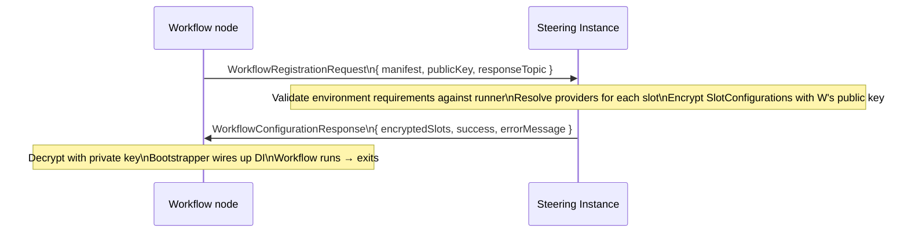
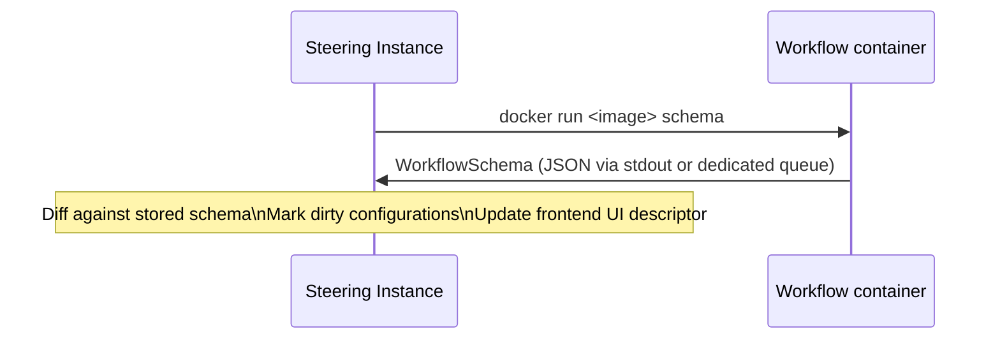
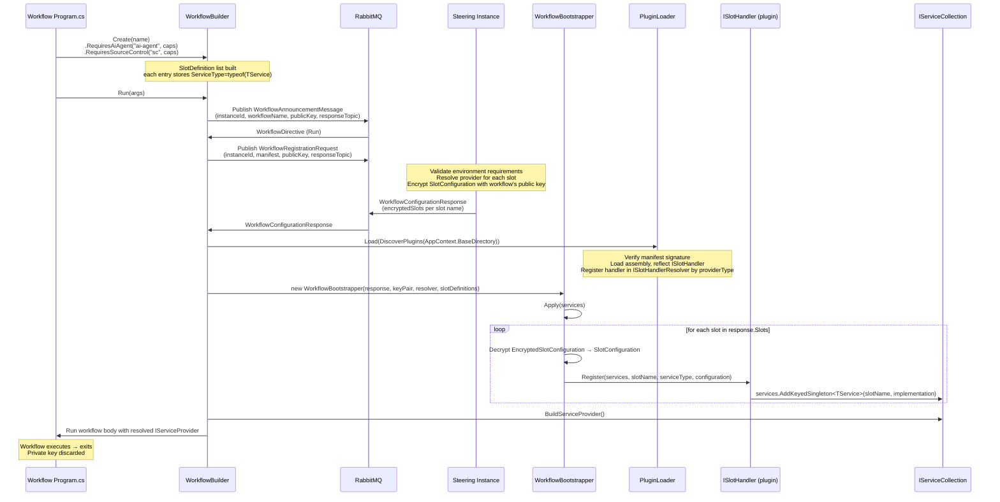

# Auxilia Workflow SDK – Design Plan

> Status: **Draft / Idea**  
> This document describes a proposed SDK for defining and bootstrapping Auxilia workflows declaratively.

---

## 1. Goals

- Workflows declare their **capability requirements** upfront in code (builder pattern).
- On startup the workflow node sends its requirements to the **Steering Instance** via RabbitMQ.
- The Steering Instance resolves which concrete providers satisfy each requirement, pushes back an encrypted **configuration envelope**, and the workflow boots with fully-resolved dependencies.
- New workflow types can be added without touching the Steering Instance core – it only needs to know about capability contracts, not concrete workflow logic.
- Each workflow is **one-shot**: it runs exactly once and always shuts down afterwards to prevent data leaks and maximise security.
- Workflows operate in two modes driven by **command-line arguments**: `run` (execute business logic) and `schema` (emit a JSON schema so the Steering Instance always holds a current schema and the frontend can render a typed configuration UI).
- **Environment requirements** are first-class – a workflow can declare what must be present in its execution environment (tools, ports, OS). Multi-container orchestration is deferred to a future iteration.

---

## 2. Core Concepts

| Concept | Description |
|---|---|
| **Capability** | A typed descriptor expressing _what_ a slot requires, not _which_ provider satisfies it. Capabilities have **required** and **optional** fields. |
| **Slot** | An explicitly named dependency a workflow declares it needs. Every slot carries a name and an optional human-readable description. Multiple slots of the same interface type are supported. |
| **EnvironmentRequirement** | A typed descriptor of what the execution environment must provide (installed tools, exposed ports, OS constraints). |
| **WorkflowManifest** | The serialisable output of the builder – sent to the Steering Instance in `run` mode. |
| **WorkflowSchema** | The JSON schema emitted in `schema` mode – describes all slots, their capabilities, and environment requirements so the Steering Instance and frontend stay in sync. |
| **WorkflowConfiguration** | The resolved, encrypted answer from the Steering Instance – contains connection details and secrets per slot. |
| **WorkflowBootstrapper** | Receives the `WorkflowConfiguration`, decrypts it, and wires up real DI services. |

---

## 3. Proposed Builder API

The builder is the single entry point. `.Run(args)` terminates the chain – the SDK reads `args` to determine the mode and either performs the handshake or emits the schema and exits.

Each known slot interface (e.g. `ITaskSource`, `IAiAgent`, `ISourceControl`) ships a **typed extension method** on the builder. This keeps the call site readable and self-documenting, and removes the need for a generic type parameter at every slot declaration. DI wiring for all other services is done normally inside the workflow's own `ConfigureServices`.

```csharp
// In a workflow's Program.cs / startup
await WorkflowBuilder.Create("code-review-workflow")
    .RequiresTaskSource("task-source",
        new TaskSourceCapabilities { SupportedItemTypes = [ItemType.PullRequest] },
        description: "Provides the pull requests this workflow will review.")
    .RequiresAiAgent("ai-agent",
        new AiCapabilities
        {
            MinContextWindow = 128_000,
            SupportedModalities = [Modality.Text, Modality.Image]
        },
        description: "Primary model used for code analysis.")
    // Two slots of the same type – distinguished by name
    .RequiresSourceControl("source-control-reader",
        new SourceControlCapabilities { RequiredPermissions = [Permission.Read] },
        description: "Read access to the repository under review.")
    .RequiresSourceControl("source-control-writer",
        new SourceControlCapabilities { RequiredPermissions = [Permission.Read, Permission.Write] },
        description: "Write access for posting review comments.")
    .RequiresEnvironment(env => env
        .RequiresTool(Tool.Git)
        .RequiresTool(Tool.DotNetSdk, minVersion: "10.0")
        .RequiresOs(OsConstraint.Linux))
    .WithMetadata(meta =>
    {
        meta.Version = "1.2.0";
        meta.Tags = ["code-review", "ai"];
    })
    .Run(args); // args drives mode: "run" | "schema"
```

### Slot extension methods

Each slot interface declares its typed extension method alongside its capability type, in its own package (e.g. `Auxilia.Workflows.TaskSource`). All extension methods share the same signature shape:

```csharp
// Defined in Auxilia.Workflows.AiAgent
public static class AiAgentWorkflowBuilderExtensions
{
    public static IWorkflowBuilder RequiresAiAgent(
        this IWorkflowBuilder builder,
        string name,
        AiCapabilities capabilities,
        string? description = null)
        => builder.Requires<IAiAgent>(name, capabilities, description);
}
```

| Parameter | Required | Purpose |
|---|---|---|
| `name` | ✓ | Unique slot key within this workflow; used as the identifier in messages and emitted schema. |
| `capabilities` | ✓ | Typed capability record describing what the provider must satisfy. |
| `description` | — | Human-readable hint shown in the frontend configuration UI. |

All five shipped slot packages follow the same pattern:

| Package | Extension method | Capabilities type | Service type |
|---------|-----------------|-------------------|-------------|
| `Auxilia.Workflows.AiAgent` | `RequiresAiAgent` | `AiCapabilities` | `IAiAgent` |
| `Auxilia.Workflows.TaskSource` | `RequiresTaskSource` | `TaskSourceCapabilities` | `ITaskSourceAccess` |
| `Auxilia.Workflows.SourceControl` | `RequiresSourceControl` | `SourceControlCapabilities` | `ISourceControlAccess` |
| `Auxilia.Workflows.PullRequestAccess` | `RequiresPullRequestAccess` | `PullRequestAccessCapabilities` | `IPullRequestAccess` |
| `Auxilia.Workflows.TestRunner` | `RequiresTestRunner` | `TestRunnerCapabilities` | `ITestRunner` |

---

## 4. Capability Records

Capabilities express requirements only – never preferences for a specific provider. Each field is either **required** (non-nullable / value type) or **optional** (nullable). The Steering Instance uses these fields to determine whether a stored configuration satisfies the manifest. If a new required field is added to a capability, existing stored configurations are automatically marked **dirty** and must be reconfigured via the frontend.

```csharp
public interface ICapability { }

// Required fields → non-nullable. Optional fields → nullable.
public record AiCapabilities : ICapability
{
    public required int MinContextWindow { get; init; }
    public required Modality[] SupportedModalities { get; init; }
    public int? MaxOutputTokens { get; init; }          // optional

    [JsonExtensionData]
    public IDictionary<string, JsonElement>? Extensions { get; init; }
}

public record SourceControlCapabilities : ICapability
{
    public required Permission[] RequiredPermissions { get; init; }
    public string[]? SupportedHostTypes { get; init; }  // optional

    [JsonExtensionData]
    public IDictionary<string, JsonElement>? Extensions { get; init; }
}

public record TaskSourceCapabilities : ICapability
{
    public required ItemType[] SupportedItemTypes { get; init; }

    [JsonExtensionData]
    public IDictionary<string, JsonElement>? Extensions { get; init; }
}

// Marker – use when a slot needs no capability constraints
public record NoCapabilities : ICapability;
```

All capability records carry `[JsonExtensionData]` to tolerate unknown fields from newer workflow versions arriving at an older Steering Instance.

---

## 5. Environment Requirements

Environment requirements are declared via a fluent sub-builder on `.RequiresEnvironment(...)` and are included in both the `WorkflowManifest` and the emitted `WorkflowSchema`. The Steering Instance uses them to validate that the target runner satisfies the workflow's prerequisites before dispatching.

The fluent style avoids tying the API to a specific field shape (e.g. `MinimumDotNetVersion`) – each requirement is a discrete, versioned assertion:

```csharp
.RequiresEnvironment(env => env
    .RequiresTool(Tool.Git)
    .RequiresTool(Tool.DotNetSdk, minVersion: "10.0")
    .RequiresOs(OsConstraint.Linux)
    .RequiresPort(5432))   // e.g. a sidecar DB exposed on this port (future)
```

Internally each call appends a typed `IEnvironmentRequirement` entry, keeping the model open for new requirement kinds without breaking the top-level record:

```csharp
public interface IEnvironmentRequirement { }

public record ToolRequirement(Tool Tool, string? MinVersion = null) : IEnvironmentRequirement;
public record OsRequirement(OsConstraint Os) : IEnvironmentRequirement;
public record PortRequirement(int Port) : IEnvironmentRequirement;
```

Adding a new `IEnvironmentRequirement` kind marks all stored runner registrations that do not declare that kind as dirty.

> **Multi-container support** (e.g. sidecar services) is explicitly out of scope for v1. See section 13 for what would need to change to enable it.

---

## 6. Workflow Modes (driven by command-line args)

The mode is not declared in code – it is derived from the command-line arguments passed to `.Run(args)`. This means the same binary serves both purposes without any conditional compilation or DI reconfiguration.

| Argument | Mode | Behaviour |
|---|---|---|
| `run` | **Run** | Performs the full registration handshake, receives encrypted configuration, boots DI, executes business logic, exits. |
| `schema` | **Schema** | Serialises the builder state to a `WorkflowSchema` (JSON), prints it to stdout or pushes it to the Steering Instance, then exits. No secrets involved. |

```csharp
// Entrypoint – the SDK reads args[0]
await WorkflowBuilder.Create("code-review-workflow")
    // ... slot and environment declarations ...
    .Run(args);
```

The Steering Instance invokes the workflow container with `schema` during registration of a new workflow type. Whenever a new version is deployed, `schema` is called again and the Steering Instance diffs the new schema against the stored one to detect dirty configurations.

---

## 7. Bootstrap / Configuration Handshake (via RabbitMQ)



- The workflow generates an **ephemeral asymmetric key pair** on each startup.
- The public key is included in `WorkflowRegistrationRequest`.
- The Steering Instance validates `EnvironmentRequirements` against the registered runner profile, then encrypts each `SlotConfiguration` payload with the public key.
- The workflow decrypts with its private key inside the SDK – secret values are **never visible to workflow application code**.
- Once the workflow exits the private key is discarded.

### Schema mode flow



### Message shapes

```csharp
// Workflow → Steering (run mode)
public record WorkflowRegistrationRequest(
    Guid WorkflowInstanceId,
    WorkflowManifest Manifest,
    string PublicKey,      // Base64 DER – ephemeral per instance
    string ResponseTopic); // one-time reply queue

// Steering → Workflow (run mode)
public record WorkflowConfigurationResponse(
    Guid WorkflowInstanceId,
    bool Success,
    string? ErrorMessage,
    IReadOnlyDictionary<string, EncryptedSlotConfiguration> Slots);

public record EncryptedSlotConfiguration(
    string ProviderType,
    string EncryptedSettings); // JSON encrypted with the workflow's public key

// Decrypted by the SDK – never exposed to workflow code
internal record SlotConfiguration(
    string ProviderType,
    IReadOnlyDictionary<string, string> Settings);
```

### 7.1 End-to-end slot → implementation loading flow

The sequence below shows a full run from builder call-site through plugin discovery, slot decryption, and DI registration, ending with the workflow receiving a ready `IServiceProvider`.



**Stage-by-stage description:**

1. **Builder call-site** – The workflow's `Program.cs` calls typed extension methods (e.g. `RequiresAiAgent`), each of which calls `builder.Requires<TService>(name, capabilities, description)`. The builder accumulates a `SlotDefinition` list where each entry captures the service interface type.
2. **Announcement / directive** – On `Run(args)`, the builder publishes a `WorkflowAnnouncementMessage`; the Steering Instance responds with a `WorkflowDirective` confirming it should proceed.
3. **Registration request** – The builder sends a `WorkflowRegistrationRequest` carrying the manifest and an ephemeral public key. The Steering Instance validates environment requirements, resolves the appropriate provider for each slot, and returns a `WorkflowConfigurationResponse` with each slot's settings encrypted under the workflow's public key.
4. **Plugin loading** – `PluginLoader` discovers `*.slothandler.dll` files under `AppContext.BaseDirectory` via `FileSystemPluginDiscovery`, verifies each manifest signature, loads the assembly, locates the single `ISlotHandler` implementation by reflection, and registers it in `ISlotHandlerResolver` keyed by `providerType` string.
5. **Bootstrapping** – `WorkflowBootstrapper.Apply` iterates over the response slots, decrypts each `EncryptedSlotConfiguration` with the private key, resolves the matching `ISlotHandler`, and calls `Register(services, slotName, serviceType, configuration)`. Each handler registers keyed DI services using `slotName` as the key so multiple slots of the same interface type can coexist.
6. **Execution** – The `IServiceProvider` is built and the workflow body runs. On exit the private key is discarded.

---

## 8. WorkflowBootstrapper (sketch)

After decrypting the response, the bootstrapper translates each `SlotConfiguration` into real DI registrations:

```csharp
// Constructor
public sealed class WorkflowBootstrapper(
    WorkflowConfigurationResponse response,
    EphemeralKeyPair keyPair,
    ISlotHandlerResolver resolver,
    IReadOnlyList<SlotDefinition> slotDefinitions,
    Guid instanceId = default)
{
    public void Apply(IServiceCollection services)
    {
        foreach (var (slotName, encryptedSlot) in response.Slots)
        {
            var config = SlotConfigurationCrypto.Decrypt(encryptedSlot, keyPair);
            var handler = resolver.Resolve(config.ProviderType);
            handler.Register(services, slotName, definition.ServiceType, config);
        }

        services.AddSingleton(new WorkflowInstanceContext(...));
    }
}
```

Each `ISlotHandler` implementation already knows its target service interface and registers keyed services using the `slotName` as the key, allowing multiple slots of the same interface type to be resolved independently by name.

---

## 9. Timeout / Failure

- The workflow waits for `WorkflowConfigurationResponse` with a configurable timeout (default 30 s).
- If the timeout expires or `Success == false`, the workflow logs the error and exits – the orchestrator (Kubernetes / Docker Compose) will restart it, giving the Steering Instance time to catch up.
- No complex retry logic needed in v1; the restart loop is sufficient.
- Because each workflow is one-shot, there is no concept of dynamic reconfiguration after boot.

---

## 10. Steering Instance responsibilities

1. On new workflow type registration: invoke the container in `schema` mode, store the emitted `WorkflowSchema`.
2. On each new deployment: re-invoke `schema`, diff against stored schema, mark affected configurations dirty.
3. On `WorkflowRegistrationRequest` (`run` mode):
   - Validate `EnvironmentRequirements` against the runner's registered profile; reject if unsatisfied.
   - Look up the stored configuration for the workflow type; reject if dirty.
   - Encrypt each `SlotConfiguration` with the workflow's `PublicKey`.
   - Publish `WorkflowConfigurationResponse` to `request.ResponseTopic`.
4. Track `WorkflowInstanceId` → manifest for monitoring dashboards.

Frontend reads `WorkflowSchema` to render a typed configuration UI. The Steering Instance reads stored provider mappings on demand.

---

## 11. Capability Versioning

The Steering Instance operates purely on the communication contract – it never knows provider implementation details. Versioning concerns are limited to the schema:

- New **optional** capability field → existing stored configurations remain valid.
- New **required** capability field → Steering Instance marks affected configurations **dirty**; frontend must reconfigure before the next workflow run succeeds.
- Unknown fields in a capability are preserved via `[JsonExtensionData]` and passed through unchanged, ensuring forward compatibility.

---

## 12. Suggested Project Structure

```
Source/
  Auxilia.Workflows/                       ← core SDK, no slot-specific knowledge
    WorkflowBuilder.cs
    IWorkflowBuilder.cs
    WorkflowManifest.cs
    WorkflowSchema.cs
    WorkflowBootstrapper.cs
    Capabilities/
      ICapability.cs
      NoCapabilities.cs
    Environment/
      IEnvironmentRequirement.cs
      ToolRequirement.cs
      OsRequirement.cs
      PortRequirement.cs
      Tool.cs
      OsConstraint.cs
    Crypto/
      EphemeralKeyPair.cs
      SlotConfigurationCrypto.cs
    Messaging/
      Messages/
        WorkflowRegistrationRequest.cs
        WorkflowConfigurationResponse.cs
        EncryptedSlotConfiguration.cs

  Auxilia.Workflows.TaskSource/            ← slot package: capability + extension method
    TaskSourceCapabilities.cs
    TaskSourceWorkflowBuilderExtensions.cs

  Auxilia.Workflows.AiAgent/
    AiCapabilities.cs
    Modality.cs
    AiAgentWorkflowBuilderExtensions.cs

  Auxilia.Workflows.SourceControl/
    SourceControlCapabilities.cs
    Permission.cs
    SourceControlWorkflowBuilderExtensions.cs

Source/
  Auxilia.SteeringInstance/
    Workflows/
      WorkflowRegistrationHandler.cs      ← mirrors IdentificationRequestHandler
      WorkflowSchemaStore.cs
      ConfigurationResolver.cs
      DirtyConfigurationDetector.cs
      EnvironmentValidator.cs
```

---

## 13. Multi-container support (future consideration)

Some workflows may require sidecar services in their execution environment (e.g. a local database, a mock API). Single-container environment requirements (tools, ports, OS) are fully supported from v1 via `EnvironmentRequirements`. To extend this to multi-container scenarios the following changes would be needed:

- **`EnvironmentRequirements` extension** – add a `SidecarServices` collection describing additional containers (image, ports, health-check).
- **Steering Instance scheduler** – must orchestrate a pod/compose group rather than a single container, and wait for all sidecars to be healthy before dispatching the workflow.
- **Runner abstraction** – the current implicit single-container runner model would need to be replaced with a pluggable `IRunnerOrchestrator` (Docker Compose, Kubernetes Job, etc.).

This is a significant scope increase and is explicitly deferred beyond v1.
